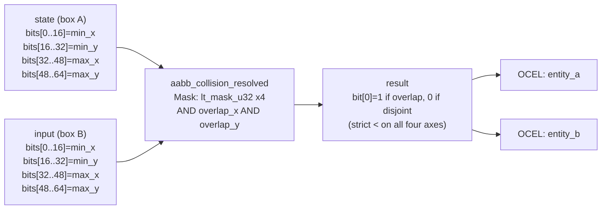

<!-- SCAFFOLDED BY ggen — fill in Context/Forces/Solution/Consequences below, then commit. -->
<!-- Source: ggen/schema/patterns.ttl (aabb_collision_resolved). Re-scaffold: `ggen sync`. -->

# Pattern: AabbCollisionResolved

> **Family:** Core Sim & Combat · **Kernel:** `aabb_collision_resolved` · **Lowering:** `Mask` · **Id:** 5

Resolve AABB overlap via the separating-axis test, ANDing four lt-masks.

---

## Context

Axis-aligned bounding box collision is the most frequent spatial query in 2D and 3D games: every projectile, trigger zone, and physics body tests against every nearby object each frame. The separating-axis test for two AABBs requires all four strict-less-than comparisons to hold — `A.left < B.right`, `B.left < A.right`, `A.top < B.bottom`, `B.top < A.bottom` — and the naïve implementation branches on each. In a scene with 500 active entities, that is up to 250 000 pairwise tests per frame, each branching on four conditions whose outcomes are data-dependent and unpredictable. A single missed edge-touching case (using `<=` instead of `<`) also causes ghost collisions at tile boundaries. This pattern resolves all four axis tests branchlessly by AND-ing four `lt_mask_u32` results and returning a single bit.

## Forces

- **Branch misprediction:** Four conditional comparisons per AABB pair at up to 250 000 pairs per frame means up to 1 000 000 branch predictions needed; the spatial layout of entities makes the branch outcomes data-dependent, so the predictor's accuracy is bounded by the scene's regularity.
- **Deterministic latency:** The Mask lowering reduces all four axis tests to bitwise AND of four `lt_mask_u32` values (each producing `0xFFFFFFFF` or `0x00`), giving strict O(1) time for all box configurations.
- **Edge-touching correctness:** Two boxes whose boundaries merely touch (A.max_x == B.min_x) must not report a collision; the strict `<` semantics of `lt_mask_u32` enforce this without a special-case branch, and the proptest corpus explicitly covers the edge case.
- **Packed bit-field layout:** Both boxes must be communicated in a single 64-bit word each; the kernel packs `[min_x, min_y, max_x, max_y]` as four u16 lanes in `state` (box A) and `input` (box B), and callers must extract each lane with the appropriate shift and mask.
- **OCEL auditability:** Event code `17` ties every collision test to two object kinds (`entity_a` and `entity_b`) in the OCEL trace, so replay tools can reconstruct exactly which entity pairs were tested and which reported a hit on each tick.

## Solution

The kernel unpacks four u16 lanes from `state` (box A: `min_x, min_y, max_x, max_y` at shifts 0, 16, 32, 48) and four from `input` (box B at the same shifts). It then computes two mask words — `overlap_x = lt_mask_u32(a_min_x, b_max_x) & lt_mask_u32(b_min_x, a_max_x)` and `overlap_y = lt_mask_u32(a_min_y, b_max_y) & lt_mask_u32(b_min_y, a_max_y)` — and ANDs them to `overlap`. The result in bit[0] is `1` if both axes overlap, `0` otherwise. Mask was the right lowering because the separating-axis test is a conjunction of four strict-less-than predicates: each predicate maps directly onto a `lt_mask_u32` call, and the conjunction becomes bitwise AND of the mask words — no table, no saturation, no fold.

**Branchless primitive:** `bcinr_logic::mask::lt_mask_u32`

## Consequences

**Gains:** All 250 000 AABB tests per frame execute in identical time with no branch misprediction regardless of spatial layout. The strict-`<` semantics prevent ghost collisions at tile boundaries without any special-case code. Both entity objects are recorded in the OCEL trace via event code `17`, enabling replay-based collision audits.

**Costs:** Callers must pack each bounding box as four u16 lane values into a u64 before calling; boxes with coordinates exceeding 65 535 world units are not representable without scaling. The result is a single collision bit — no penetration depth, no contact normal, no impulse. Callers that need those quantities must compose this kernel with a separate resolution pass.

**Composes naturally with:** `object_spawned` (spawned objects enter the collision system immediately), `damage_applied` (a collision between a projectile and a target triggers the damage kernel with the projectile's damage payload), `entity_state_transitioned` (a collision result can carry a `hit` or `kill` event symbol to the entity lifecycle DFA).

---

## Structure Diagram



---

## Evidence Model

| Field | Value |
|---|---|
| OCEL activity | `AabbCollisionResolved` |
| Event code | `17` |
| OTEL span | `17` |
| Object kinds | `entity_a`, `entity_b` |
| Required status | `4` |
| Refusal status | `7` |
| Authority | oracle predicate: matches aabb_collision_resolved_reference for all inputs |

---

## Metadata

| Field | Value |
|---|---|
| Pattern id | 5 |
| Family | Core Sim & Combat |
| Lowering | `Mask` |
| State cardinality | 2 |
| Primitive | `bcinr_logic::mask::lt_mask_u32` |
| Kernel signature | `aabb_collision_resolved(state: u64, input: u64) -> u64` |
| Source kernel | `src/patterns/aabb_collision_resolved.rs` |

---

## How to Use

```rust
use wasm4games::patterns::aabb_collision_resolved;

// Pack state and input into u64 fields as documented in the kernel source.
let result = aabb_collision_resolved(state, input);
```

The kernel is a pure `fn(u64, u64) -> u64` — no side effects, no allocation, no branches.
Pair with the evidence layer to emit OCEL events, OTEL spans, and receipt folds:

```rust
use wasm4games::evidence::{ocel::OcelEvent, otel};

let result = aabb_collision_resolved(state, input);
otel::emit(17);
let ev = OcelEvent::new(17, logical_tick, admission_status);
```

---

## Related Patterns

- [ObjectSpawned](object_spawned.md) — spawned objects register their initial bounding box into the collision system; this kernel tests that box against all other active boxes starting from the next tick.
- [DamageApplied](damage_applied.md) — a positive collision result (bit[0] = 1) triggers `damage_applied` with the projectile's damage payload and crit flag targeting the hit entity's HP.
- [EntityStateTransitioned](entity_state_transitioned.md) — the collision result feeds a `hit` or `kill` event symbol into the entity lifecycle DFA for both the attacker (projectile consumed) and the target (HP reduced).
