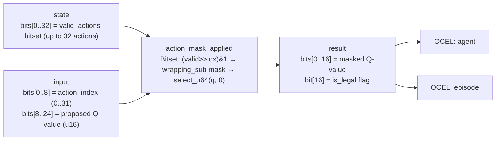

<!-- SCAFFOLDED BY ggen — fill in Context/Forces/Solution/Consequences below, then commit. -->
<!-- Source: ggen/schema/patterns.ttl (action_mask_applied). Re-scaffold: `ggen sync`. -->

# Pattern: ActionMaskApplied

> **Family:** AI Agent / Benchmark · **Kernel:** `action_mask_applied` · **Lowering:** `Bitset` · **Id:** 69

Apply an action mask to a policy output — zero out Q-values for illegal actions via a branchless legality select.

---

## Context

RL environments with structured constraints — "can't attack while reloading," "can't move while stunned" — maintain a bitset of which actions are legal at each step. When the policy selects the argmax over Q-values without first zeroing illegal Q-values, the agent may execute a physically impossible action, violating environment invariants and causing undefined state transitions. The naive guard is `if (valid >> idx) & 1 == 0 { q = 0 }`, which branches on a data-dependent legality bit — at thousands of action checks per rollout batch, every bit that flips state causes a misprediction.

## Forces

- **Branch misprediction** — the legality check `if illegal { zero Q-value }` branches on a per-action-per-step bit that changes as constraints come and go during episode, causing high misprediction rates in constrained environments.
- **Deterministic latency** — the Bitset lowering extracts the legality bit with a shift and AND, forms a full-word mask with a wrapping negation (`0u64.wrapping_sub(legal_bit)`), and applies it with `select_u64` — all O(1) with no data-dependent control flow.
- **Correctness by construction** — zeroing the Q-value before argmax rather than after selection means the policy can never commit to an illegal action; the constraint is enforced at the signal level, not post-hoc.
- **Legality flag transparency** — the kernel returns both the masked Q-value (bits[0..16]) and the raw legality flag (bit[16]), so downstream callers can distinguish "Q=0 because action is illegal" from "Q=0 because the policy genuinely assigns zero value."
- **OCEL auditability** — OCEL event code `131` ties each mask application to both the `agent` and `episode` object traces, enabling audit of which actions were masked at each step and why.

## Solution

The kernel resolves the forces via bitset rank and branchless select. The packed-u64 ABI places the 32-bit valid-actions bitset in `state` bits[0..32], the action index in `input` bits[0..8] (masked to 5 bits for safe shifting into a 32-bit word), and the proposed Q-value in bits[8..24]. The legality bit is extracted as `(valid >> idx) & 1`. The full-word legality mask is `0u64.wrapping_sub(legal_bit)` — a branchless negation that produces `0xFFFF...FFFF` if legal and `0` if illegal. `select_u64(legal_mask, q_val, 0)` then passes the Q-value through or zeros it in one instruction. The return value packs the masked Q in bits[0..16] and the legality flag in bit[16]. The Bitset lowering was chosen because the core operation is a single-bit rank from a bitset, the defining operation of the Bitset family.

**Branchless primitive:** `bcinr_logic::mask::select_u64`

## Consequences

**Gains:** Action legality enforcement costs identical cycles regardless of whether the action is legal or illegal — no misprediction tax even in heavily constrained environments. The legality flag in the result gives downstream selectors a clean signal rather than inferring legality from a zero Q-value. OCEL events `131` span both `agent` and `episode` objects, supporting multi-object-centric constraint audits. **Costs:** The valid-actions bitset is limited to 32 actions (bits[0..31] of state); environments with larger action spaces require a wider kernel. The action index is truncated to 5 bits (0..31) for shift safety — indices ≥32 are silently masked, which may misidentify an out-of-range index as index `idx & 31`. **Compositions:** This kernel feeds its masked Q-values directly into [PolicyActionSelected](policy_action_selected.md) and [AiActionSelected](ai_action_selected.md); the same bitset rank idiom appears in [CapabilityFlagEvaluated](capability_flag_evaluated.md).

---

## Structure Diagram



---

## Evidence Model

| Field | Value |
|---|---|
| OCEL activity | `ActionMaskApplied` |
| Event code | `131` |
| OTEL span | `131` |
| Object kinds | `agent`, `episode` |
| Required status | `4` |
| Refusal status | `7` |
| Authority | oracle predicate: matches action_mask_applied_reference for all inputs |

---

## Metadata

| Field | Value |
|---|---|
| Pattern id | 69 |
| Family | AI Agent / Benchmark |
| Lowering | `Bitset` |
| State cardinality | 32 |
| Primitive | `bcinr_logic::mask::select_u64` |
| Kernel signature | `action_mask_applied(state: u64, input: u64) -> u64` |
| Source kernel | `src/patterns/action_mask_applied.rs` |

---

## How to Use

```rust
use wasm4games::patterns::action_mask_applied;

// Pack state and input into u64 fields as documented in the kernel source.
let result = action_mask_applied(state, input);
```

The kernel is a pure `fn(u64, u64) -> u64` — no side effects, no allocation, no branches.
Pair with the evidence layer to emit OCEL events, OTEL spans, and receipt folds:

```rust
use wasm4games::evidence::{ocel::OcelEvent, otel};

let result = action_mask_applied(state, input);
otel::emit(131);
let ev = OcelEvent::new(131, logical_tick, admission_status);
```

---

## Related Patterns

- [PolicyActionSelected](policy_action_selected.md) — masked Q-values from this kernel feed the policy argmax
- [AiActionSelected](ai_action_selected.md) — NPC utility scores benefit from the same pre-argmax masking
- [CapabilityFlagEvaluated](capability_flag_evaluated.md) — shares the same bitset rank idiom for single-bit capability checks
