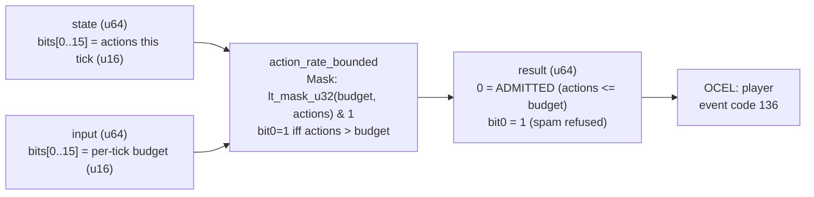

<!-- SCAFFOLDED BY ggen — fill in Context/Forces/Solution/Consequences below, then commit. -->
<!-- Source: ggen/schema/patterns.ttl (action_rate_bounded). Re-scaffold: `ggen sync`. -->

# Pattern: ActionRateBounded

> **Family:** Anti-Cheat · **Kernel:** `action_rate_bounded` · **Lowering:** `Mask` · **Id:** 74

Verdict bit0 set iff actions issued this tick strictly exceed the per-tick budget (action-spam/macro cheat).

---

## Context

Macro and action-spam cheats issue more actions per game tick than human hand speed allows — clicking at 60 Hz on a system that enforces 10 actions per tick, or flooding server inputs during a lag spike. The server counts actions received per tick and refuses the tick's input if the count exceeds the per-tick budget. A naïve conditional `if actions > budget { refuse }` branch on the comparison leaks timing information: an adversary can measure whether their action count causes a branch-taken or branch-not-taken path, probing the exact budget value through timing differentials without being visibly refused.

## Forces

- **Branch misprediction** — a conditional branch on `actions > budget` leaks timing variation correlated with the budget boundary, enabling side-channel probing.
- **Deterministic latency** — the Mask lowering via `lt_mask_u32` gives O(1) constant time; the verdict is computed as a pure mask operation with no conditional branching.
- **Side-channel resistance** — action counts below and above the budget must produce execution paths of identical duration; `lt_mask_u32(budget, actions)` achieves this.
- **Boundary inclusivity** — exactly budget actions in a tick is legal and must be admitted; only strict excess (actions > budget) is refused.
- **OCEL auditability** — OCEL event code 136 ties each rate check to a `player` object trace for anti-cheat audit logs.

## Solution

The kernel packs `state` bits[0..15] as the actions-this-tick count (u16) and `input` bits[0..15] as the per-tick budget (u16). `lt_mask_u32(budget, actions)` produces all-ones when `budget < actions` (rate exceeded), all-zeros otherwise. The result is `u64::from(lt_mask_u32(budget, actions)) & 1`: verdict bit0 is 1 on refusal (over-budget), 0 on admission. This is the Mask lowering: the over-budget predicate `actions > budget` is resolved by `lt_mask_u32(budget, actions)` with the arguments reversed — the same standard Mask idiom used by `resource_bound_checked` for analogous greater-than detection.

**Branchless primitive:** `bcinr_logic::mask::lt_mask_u32`

## Consequences

**Gains:** Execution time is identical for legal and illegal action counts, closing the timing side channel. Actions exactly equal to the budget are admitted (boundary-inclusive invariant verified by Hoare-logic). The verdict bit composes with other anti-cheat verdict bits via OR to build a complete per-tick refusal mask.

**Costs:** The bit-field ABI is fixed — action count in state bits[0..15], budget in input bits[0..15]. Values are limited to 16 bits; games with per-tick budgets above 65535 require a kernel variant.

**Compositions:** Verdict bit composes with `movement_legality_checked`, `resource_bound_checked`, and `cooldown_legality_checked` via OR to form the complete per-tick anti-cheat verdict. Rate bounding and cooldown checking are complementary: cooldown enforces per-ability timing gaps while rate bounding enforces total-actions-per-tick caps.

---

## Structure Diagram



---

## Evidence Model

| Field | Value |
|---|---|
| OCEL activity | `ActionRateBounded` |
| Event code | `136` |
| OTEL span | `136` |
| Object kinds | `player` |
| Required status | `4` |
| Refusal status | `7` |
| Authority | legality spec: actions_this_tick <= tick_budget |

---

## Metadata

| Field | Value |
|---|---|
| Pattern id | 74 |
| Family | Anti-Cheat |
| Lowering | `Mask` |
| State cardinality | 2 |
| Primitive | `bcinr_logic::mask::lt_mask_u32` |
| Kernel signature | `action_rate_bounded(state: u64, input: u64) -> u64` |
| Source kernel | `src/patterns/action_rate_bounded.rs` |

---

## How to Use

```rust
use wasm4games::patterns::action_rate_bounded;

// Pack state and input into u64 fields as documented in the kernel source.
let result = action_rate_bounded(state, input);
```

The kernel is a pure `fn(u64, u64) -> u64` — no side effects, no allocation, no branches.
Pair with the evidence layer to emit OCEL events, OTEL spans, and receipt folds:

```rust
use wasm4games::evidence::{ocel::OcelEvent, otel};

let result = action_rate_bounded(state, input);
otel::emit(136);
let ev = OcelEvent::new(136, logical_tick, admission_status);
```

---

## Related Patterns

- [CooldownLegalityChecked](cooldown_legality_checked.md) — cooldown and rate are complementary anti-cheat gates; cooldown is per-ability, rate is per-tick total.
- [MovementLegalityChecked](movement_legality_checked.md) — same anti-cheat Mask verdict idiom; all four gates compose via OR.
- [ResourceBoundChecked](resource_bound_checked.md) — all four anti-cheat checks compose into the complete per-tick anti-cheat verdict bitmask.
