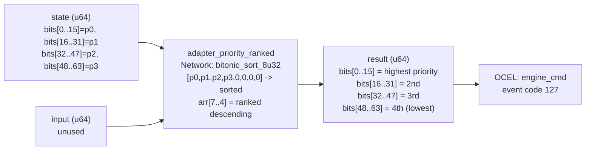

<!-- SCAFFOLDED BY ggen — fill in Context/Forces/Solution/Consequences below, then commit. -->
<!-- Source: ggen/schema/patterns.ttl (adapter_priority_ranked). Re-scaffold: `ggen sync`. -->

# Pattern: AdapterPriorityRanked

> **Family:** Engine Bridge · **Kernel:** `adapter_priority_ranked` · **Lowering:** `Network` · **Id:** 65

Rank 4 adapter priorities using a branchless bitonic sort network on 8 slots; highest priority lands in bits[0..16].

---

## Context

Game engines maintain multiple platform bridge adapters for the same function (e.g., WebGPU, WebGL, and software fallback for rendering; RTX Audio, OpenAL, and null audio for sound). At startup and on reconnect, the engine must select the highest-priority available adapter by sorting the four adapter priorities and dispatching to the one that ranks highest. A sort with comparisons implemented as conditional swaps branches on each comparison, creating unpredictable latency in an initialization path that may run under real-time constraints (session join, map load). Bitonic sort networks execute all comparisons and swaps in a fixed schedule with no data-dependent branches.

## Forces

- **Branch misprediction** — a comparison-based sort on four elements uses up to six conditional swaps; each branch mispredicts when adapter priorities are not pre-sorted, which is the normal case after dynamic priority updates.
- **Deterministic latency** — the Network lowering via `bitonic_sort_8u32` gives O(1) constant time: exactly five compare-swap stages, each executing unconditionally.
- **Descending output order** — the dispatch queue expects the highest-priority adapter in bits[0..16]; the sort network sorts ascending, so the kernel reads from the upper end of the sorted array.
- **Zero-padding neutrality** — four real priorities must be sorted without interference from padding zeros; the kernel places priorities in slots [0..4] and zeros in slots [4..8], ensuring zeros sort below any real priority.
- **OCEL auditability** — OCEL event code 127 ties each ranking to an `engine_cmd` object trace for adapter selection auditing.

## Solution

The kernel packs four 16-bit adapter priorities into `state`: p0=bits[0..15], p1=bits[16..31], p2=bits[32..47], p3=bits[48..63]. `input` is unused. The four priorities are placed into slots [0..4] of an 8-element array, with slots [4..8] set to 0. `bitonic_sort_8u32(&mut arr)` sorts all 8 elements ascending in-place using a fixed bitonic network. After sorting, `arr[7]` is the maximum (highest priority), `arr[6]` is the second, `arr[5]` the third, and `arr[4]` the fourth. These four values are packed back into the return u64 in descending priority order: highest in bits[0..15], second in bits[16..31], third in bits[32..47], fourth in bits[48..63]. This is the Network lowering: a fixed-depth compare-swap schedule that sorts without branches.

**Branchless primitive:** `bcinr_logic::network::bitonic_sort_8u32`

## Consequences

**Gains:** All four priorities are sorted in a fixed five-stage network with no data-dependent branching. The highest-priority adapter is always in bits[0..15] of the result — no additional max-finding step needed. Zero-padding ensures real priorities are never displaced below index 4 when priorities are non-zero (Hoare-logic invariant).

**Costs:** The bit-field ABI is fixed — four 16-bit priorities packed into the 64-bit state; four 16-bit sorted priorities in the 64-bit result. The bitonic network sorts 8 slots; using fewer than 4 real priorities requires zero-padding the unused slots explicitly. Priority ties are resolved in network-defined order (not necessarily stable with respect to original positions).

**Compositions:** After ranking, the highest-priority adapter receives the CONNECT event in `bridge_state_transitioned`. `capability_flag_evaluated` contributes capability count to adapter priority scores before ranking. `payload_size_bounded` is called after ranking to use the selected adapter's MTU.

---

## Structure Diagram



---

## Evidence Model

| Field | Value |
|---|---|
| OCEL activity | `AdapterPriorityRanked` |
| Event code | `127` |
| OTEL span | `127` |
| Object kinds | `engine_cmd` |
| Required status | `4` |
| Refusal status | `7` |
| Authority | oracle predicate: matches adapter_priority_ranked_reference for all inputs |

---

## Metadata

| Field | Value |
|---|---|
| Pattern id | 65 |
| Family | Engine Bridge |
| Lowering | `Network` |
| State cardinality | 8 |
| Primitive | `bcinr_logic::network::bitonic_sort_8u32` |
| Kernel signature | `adapter_priority_ranked(state: u64, input: u64) -> u64` |
| Source kernel | `src/patterns/adapter_priority_ranked.rs` |

---

## How to Use

```rust
use wasm4games::patterns::adapter_priority_ranked;

// Pack state and input into u64 fields as documented in the kernel source.
let result = adapter_priority_ranked(state, input);
```

The kernel is a pure `fn(u64, u64) -> u64` — no side effects, no allocation, no branches.
Pair with the evidence layer to emit OCEL events, OTEL spans, and receipt folds:

```rust
use wasm4games::evidence::{ocel::OcelEvent, otel};

let result = adapter_priority_ranked(state, input);
otel::emit(127);
let ev = OcelEvent::new(127, logical_tick, admission_status);
```

---

## Related Patterns

- [BridgeStateTransitioned](bridge_state_transitioned.md) — priority ranking determines which adapter receives the CONNECT event first.
- [CapabilityFlagEvaluated](capability_flag_evaluated.md) — capability count is a component of adapter priority before ranking.
- [PayloadSizeBounded](payload_size_bounded.md) — the top-ranked adapter's MTU is used to bound the first payload dispatch.
