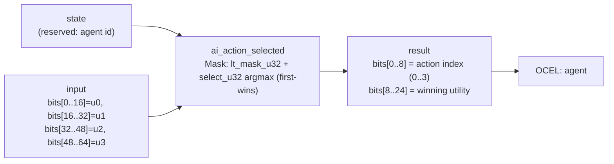

<!-- SCAFFOLDED BY ggen — fill in Context/Forces/Solution/Consequences below, then commit. -->
<!-- Source: ggen/schema/patterns.ttl (ai_action_selected). Re-scaffold: `ggen sync`. -->

# Pattern: AiActionSelected

> **Family:** AI Agent / Benchmark · **Kernel:** `ai_action_selected` · **Lowering:** `Mask` · **Id:** 13

Select an AI action by utility argmax over four scores (first index wins ties).

---

## Context

AI NPCs evaluate four utility scores each tick — attack, defend, flee, idle — and must execute the highest-scoring action. A naïve argmax compares best against each candidate with an `if v > best { best = v; idx = i }` guard, branching up to 3 times per NPC. With 100+ active NPCs evaluated sequentially this means up to 300 conditional branches per tick, each one mispredicting whenever two NPCs switch their relative utility rankings simultaneously — a common occurrence during group combat.

## Forces

- **Branch misprediction** — the loop-based argmax branches on each comparison, and in group combat the branch outcome changes frequently as utility scores shift, making the predictor's history useless.
- **Deterministic latency** — the Mask lowering onto `lt_mask_u32` / `select_u32` reduces the 3-comparison argmax to 3 unconditional mask-and-select pairs, all O(1) and branch-free, so every NPC evaluation costs the same cycles regardless of which action wins.
- **Tie-breaking determinism** — when two utilities are equal, game behavior must be deterministic for replay and fairness; the strict `<` comparison in `lt_mask_u32(best_val, u_i)` ensures the first (lowest-index) maximum always wins, with no random tie-breaking.
- **Action fairness** — with a deterministic first-wins tie-break, action priority is explicit in the lane ordering (lane 0 = highest-priority default), making the AI policy auditable without inspecting runtime state.
- **OCEL auditability** — OCEL event code `64` ties each action selection to the `agent` object trace, enabling frame-by-frame NPC decision replay for balance analysis.

## Solution

The kernel implements a branchless argmax by maintaining a running `(best_val, best_idx)` pair and updating it with `select_u32` for each of the three remaining candidates. The packed-u64 ABI packs four u16 utility scores into `input` lanes [0..16], [16..32], [32..48], [48..64]; `state` is reserved for an agent id. For each candidate i, `lt_mask_u32(best_val, u_i)` produces an all-ones mask if `best_val < u_i` (strictly), and `select_u32(mask, candidate, current)` updates both `best_idx` and `best_val` in the same branch-free step. The result packs the winning index in bits[0..8] and its utility in bits[8..24]. The Mask lowering was chosen because the argmax decision (`is this candidate better?`) maps directly to a comparison-and-select, the canonical use case for `lt_mask_u32` / `select_u32`.

**Branchless primitive:** `bcinr_logic::mask::select_u32`

## Consequences

**Gains:** All NPC action selections cost identical cycles, making total NPC update time proportional to count with no variance from score patterns. The first-wins tie-break is a compile-time invariant, not a runtime decision, so it cannot be perturbed by input. OCEL event `64` enables full NPC decision audit trails. **Costs:** The ABI is fixed to exactly 4 action slots (u16 each); more actions require a kernel extension. Utility scores are limited to 16-bit unsigned values. **Compositions:** This kernel's winning action index feeds into [ActionMaskApplied](action_mask_applied.md) to verify legality before execution, and into [EpisodeReturnBounded](episode_return_bounded.md) through the reward generated by the chosen action.

---

## Structure Diagram



---

## Evidence Model

| Field | Value |
|---|---|
| OCEL activity | `AiActionSelected` |
| Event code | `64` |
| OTEL span | `64` |
| Object kinds | `agent` |
| Required status | `4` |
| Refusal status | `7` |
| Authority | oracle predicate: matches ai_action_selected_reference for all inputs |

---

## Metadata

| Field | Value |
|---|---|
| Pattern id | 13 |
| Family | AI Agent / Benchmark |
| Lowering | `Mask` |
| State cardinality | 4 |
| Primitive | `bcinr_logic::mask::select_u32` |
| Kernel signature | `ai_action_selected(state: u64, input: u64) -> u64` |
| Source kernel | `src/patterns/ai_action_selected.rs` |

---

## How to Use

```rust
use wasm4games::patterns::ai_action_selected;

// Pack state and input into u64 fields as documented in the kernel source.
let result = ai_action_selected(state, input);
```

The kernel is a pure `fn(u64, u64) -> u64` — no side effects, no allocation, no branches.
Pair with the evidence layer to emit OCEL events, OTEL spans, and receipt folds:

```rust
use wasm4games::evidence::{ocel::OcelEvent, otel};

let result = ai_action_selected(state, input);
otel::emit(64);
let ev = OcelEvent::new(64, logical_tick, admission_status);
```

---

## Related Patterns

- [PolicyActionSelected](policy_action_selected.md) — the same argmax structure applied to RL Q-values rather than heuristic utility scores
- [ActionMaskApplied](action_mask_applied.md) — illegal action slots should be zeroed before passing utility scores to this kernel
- [EpisodeReturnBounded](episode_return_bounded.md) — the action chosen here generates rewards that accumulate into the episode return
