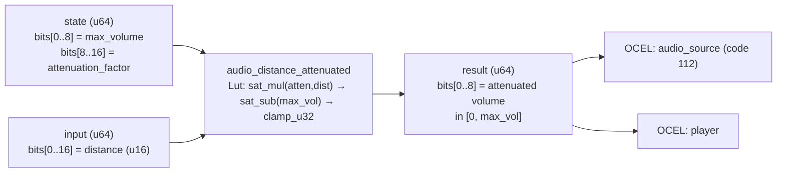

<!-- SCAFFOLDED BY ggen — fill in Context/Forces/Solution/Consequences below, then commit. -->
<!-- Source: ggen/schema/patterns.ttl (audio_distance_attenuated). Re-scaffold: `ggen sync`. -->

# Pattern: AudioDistanceAttenuated

> **Family:** Audio · **Kernel:** `audio_distance_attenuated` · **Lowering:** `Lut` · **Id:** 50

Compute attenuated volume from distance: max(0, max_vol - distance * attenuation_factor), clamped to [0, max_vol].

---

## Context

3D audio volume scales inversely with listener distance — footsteps are loud nearby and inaudible far away. The linear attenuation formula `max(0, max_vol - dist * factor)` is evaluated every tick for every active audio source. Naïvely, the `max(0, ...)` test is a conditional that branches when `dist * factor > max_vol` — exactly when the listener crosses the audibility threshold, which can happen many times per second in a mobile scene.

## Forces

- **Branch misprediction** — a naïve `if dist * factor > max_vol` guard branches at the audibility boundary for every source whose distance crosses the threshold during listener movement.
- **Deterministic latency** — the Lut lowering uses `saturating_mul`, `saturating_sub`, and `clamp_u32`, all branchless primitives, giving O(1) fixed throughput for every distance value.
- **Overflow safety** — `attenuation_factor * distance` can exceed u32::MAX for large distances and high factors; `saturating_mul` prevents the product from wrapping to a small value that would incorrectly boost volume.
- **Two-sided output invariant** — `clamp_u32(vol, 0, max_vol)` ensures the result is in [0, max_vol] even when the saturating subtraction undershoots zero; volume can never exceed the channel's maximum or go negative.
- **OCEL auditability** — event code 112 ties each attenuation result to both the `audio_source` and `player` object traces, enabling spatial audio reconstruction for replay.

## Solution

**Branchless primitive:** `bcinr_logic::fix::clamp_u32`

State bits[0..8] carry `max_volume` (0..255) and bits[8..16] carry `attenuation_factor` (volume units per distance unit). Input bits[0..16] carry the listener distance as a u16. The kernel computes `reduction = atten.saturating_mul(dist)` — safe against u32 overflow — then `vol = max_vol.saturating_sub(reduction)` — floors at zero without underflow — and finally `clamp_u32(vol, 0, max_vol)` enforces the ceiling. The Lut lowering was chosen because the output is a bounded scalar with a two-sided range invariant and no signed arithmetic or state machine is required.

## Consequences

**Gains:** Attenuated volume is provably in [0, max_vol] after every call; overflow in `factor * distance` cannot produce a boosted volume; the OCEL trace enables spatial audio forensics. **Costs:** Attenuation is linear in distance — no inverse-square or logarithmic models without a pre-computed lookup table; both factor and max_vol are 8-bit fields, limiting their range to 0..255. **Compositions:** The attenuated volume feeds `audio_priority_selected` (closer sources have higher effective priority); `volume_clamped` applies additional deltas within the same [0, 255] range; `semantic_lod_selected` applies the same distance-to-bounded-value idiom to LOD tier selection.

---

## Structure Diagram



---

## Evidence Model

| Field | Value |
|---|---|
| OCEL activity | `AudioDistanceAttenuated` |
| Event code | `112` |
| OTEL span | `112` |
| Object kinds | `audio_source`, `player` |
| Required status | `4` |
| Refusal status | `7` |
| Authority | oracle predicate: matches audio_distance_attenuated_reference for all inputs |

---

## Metadata

| Field | Value |
|---|---|
| Pattern id | 50 |
| Family | Audio |
| Lowering | `Lut` |
| State cardinality | 8 |
| Primitive | `bcinr_logic::fix::clamp_u32` |
| Kernel signature | `audio_distance_attenuated(state: u64, input: u64) -> u64` |
| Source kernel | `src/patterns/audio_distance_attenuated.rs` |

---

## How to Use

```rust
use wasm4games::patterns::audio_distance_attenuated;

// Pack state and input into u64 fields as documented in the kernel source.
let result = audio_distance_attenuated(state, input);
```

The kernel is a pure `fn(u64, u64) -> u64` — no side effects, no allocation, no branches.
Pair with the evidence layer to emit OCEL events, OTEL spans, and receipt folds:

```rust
use wasm4games::evidence::{ocel::OcelEvent, otel};

let result = audio_distance_attenuated(state, input);
otel::emit(112);
let ev = OcelEvent::new(112, logical_tick, admission_status);
```

---

## Related Patterns

- [AudioPrioritySelected](audio_priority_selected.md) — attenuated volume feeds the priority comparison; closer sources naturally rank higher.
- [VolumeClamped](volume_clamped.md) — attenuation and volume clamping both enforce the [0, 255] output range; this pattern produces the initial bounded value.
- [SemanticLodSelected](semantic_lod_selected.md) — applies the same distance-to-bounded-integer pattern to LOD tier selection rather than volume.
