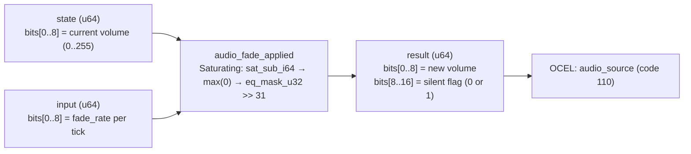

<!-- SCAFFOLDED BY ggen — fill in Context/Forces/Solution/Consequences below, then commit. -->
<!-- Source: ggen/schema/patterns.ttl (audio_fade_applied). Re-scaffold: `ggen sync`. -->

# Pattern: AudioFadeApplied

> **Family:** Audio · **Kernel:** `audio_fade_applied` · **Lowering:** `Saturating` · **Id:** 48

Apply a fade step — reduce volume by fade_rate per tick, floor at 0; return new volume and a silent flag.

---

## Context

Audio fade-out (music transitions, dialogue tail-off, explosion reverb decay) reduces a channel's volume by a fixed amount each game tick until the channel reaches silence and can be released. Without saturating subtraction the volume undershoots zero when the fade rate exceeds the remaining volume — wrapping around to 254 on the next tick and producing an audible glitch. The silent flag in the return value tells the mixer to reclaim the voice slot immediately after the tick that first hits zero, without any follow-up read of the volume field.

## Forces

- **Branch misprediction** — a naïve `max(0, vol - rate)` written as `if vol > rate { vol - rate } else { 0 }` branches on every tick that the floor fires, which is exactly the final tick of every fade-out.
- **Deterministic latency** — the Saturating lowering uses `saturating_sub_i64` + `.max(0)`, giving a fixed-instruction path regardless of whether the floor fires.
- **Silent-flag propagation** — `eq_mask_u32(new_vol as u32, 0) >> 31` extracts the silence flag branchlessly: the all-ones mask from `eq_mask_u32` produces 1 when shifted by 31, 0 otherwise.
- **Floor-at-zero invariant** — the result is provably in [0, 255]; a silent channel cannot produce a positive volume or a negative wrapped value on subsequent calls.
- **OCEL auditability** — event code 110 ties each fade step to the `audio_source` trace; the first tick with silent=1 is the canonical fade-completion event for replay and effect sequencing.

## Solution

**Branchless primitive:** `bcinr_logic::int::saturating_sub_i64`

State bits[0..8] carry the current volume (0..255); input bits[0..8] carry the fade rate per tick. `saturating_sub_i64(vol, rate)` subtracts without wrapping — the result saturates at i64::MIN which is then floored to 0 by `.max(0)`. The silent flag is extracted by `eq_mask_u32(new_vol as u32, 0) >> 31`: when `new_vol == 0`, `eq_mask_u32` returns 0xFFFFFFFF, and the arithmetic right-shift by 31 yields 1; otherwise it yields 0. The result packs the new volume in bits[0..8] and the silent flag in bit[8]. The Saturating lowering was chosen because the core operation is a signed subtraction with a semantic floor — the exact domain saturating arithmetic was designed to serve.

## Consequences

**Gains:** Volume cannot underflow; the silent flag fires on the same tick the floor is hit, eliminating a follow-up check; execution is O(1) and branch-free. **Costs:** Fade rate is an 8-bit unsigned field, so the coarsest single-tick step is 255 (instant silence) and the finest is 1; interpolating a continuous fade curve requires repeated single-step applications. **Compositions:** The silent flag (bits[8..16] of result) drives the `audio_trigger_evaluated` FSM to transition from FADING to STOPPED; volume output feeds `audio_priority_selected` (a fading channel's effective priority drops with its volume); `volume_clamped` handles the same [0, 255] window but for delta-driven rather than rate-driven changes.

---

## Structure Diagram



---

## Evidence Model

| Field | Value |
|---|---|
| OCEL activity | `AudioFadeApplied` |
| Event code | `110` |
| OTEL span | `110` |
| Object kinds | `audio_source` |
| Required status | `4` |
| Refusal status | `7` |
| Authority | oracle predicate: matches audio_fade_applied_reference for all inputs |

---

## Metadata

| Field | Value |
|---|---|
| Pattern id | 48 |
| Family | Audio |
| Lowering | `Saturating` |
| State cardinality | 32 |
| Primitive | `bcinr_logic::int::saturating_sub_i64` |
| Kernel signature | `audio_fade_applied(state: u64, input: u64) -> u64` |
| Source kernel | `src/patterns/audio_fade_applied.rs` |

---

## How to Use

```rust
use wasm4games::patterns::audio_fade_applied;

// Pack state and input into u64 fields as documented in the kernel source.
let result = audio_fade_applied(state, input);
```

The kernel is a pure `fn(u64, u64) -> u64` — no side effects, no allocation, no branches.
Pair with the evidence layer to emit OCEL events, OTEL spans, and receipt folds:

```rust
use wasm4games::evidence::{ocel::OcelEvent, otel};

let result = audio_fade_applied(state, input);
otel::emit(110);
let ev = OcelEvent::new(110, logical_tick, admission_status);
```

---

## Related Patterns

- [VolumeClamped](volume_clamped.md) — both bound volume to [0, 255]; this pattern uses saturating subtraction for a rate-driven fade; `volume_clamped` handles arbitrary signed deltas.
- [AudioTriggerEvaluated](audio_trigger_evaluated.md) — the silent flag from this kernel drives the FADING → STOPPED transition in the audio FSM.
- [AudioPrioritySelected](audio_priority_selected.md) — a channel whose volume reaches 0 via fade drops to lowest priority in the next selection call.
