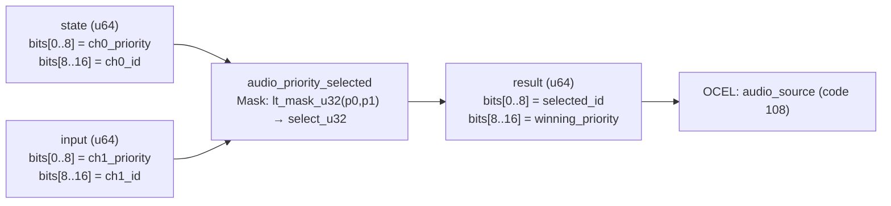

<!-- SCAFFOLDED BY ggen — fill in Context/Forces/Solution/Consequences below, then commit. -->
<!-- Source: ggen/schema/patterns.ttl (audio_priority_selected). Re-scaffold: `ggen sync`. -->

# Pattern: AudioPrioritySelected

> **Family:** Audio · **Kernel:** `audio_priority_selected` · **Lowering:** `Mask` · **Id:** 46

Select the higher-priority of two competing audio channels; tie goes to channel 0.

---

## Context

Game audio mixers compete for a limited pool of hardware voice channels. When two sound effects or music channels both want to play simultaneously, the mixer must award the voice slot to the higher-priority channel — explosions over footsteps, voice lines over ambient. This selection runs at every voice-assignment call, potentially hundreds of times per frame on busy scenes, and each naïve `if p1 > p0` branch produces a data-dependent misprediction every time the dominant channel changes.

## Forces

- **Branch misprediction** — a conditional priority comparison branches at every voice conflict, with misprediction rates proportional to how often priorities change (combat, transitions).
- **Deterministic latency** — the Mask lowering uses `lt_mask_u32` + `select_u32`, reducing the comparison to a bitwise all-ones/all-zeros mask and an arithmetic select, yielding O(1) fixed throughput.
- **Tie-breaking invariant** — the strict-`<` predicate (`p0 < p1`) ensures channel 0 wins on equal priority; this contract is observable (replays depend on it) and must not vary with input data.
- **Packed dual output** — the result returns both the winning channel id (bits[0..8]) and the winning priority (bits[8..16]) in a single word, avoiding a second call to recover the priority for downstream volume clamping.
- **OCEL auditability** — event code 108 ties each voice-slot assignment to the `audio_source` object trace, enabling reconstruction of the mixer state at any tick.

## Solution

**Branchless primitive:** `bcinr_logic::mask::select_u32`

State bits[0..8] carry channel 0 priority and bits[8..16] carry channel 0 id; input bits[0..8] carry channel 1 priority and bits[8..16] carry channel 1 id. `lt_mask_u32(p0, p1)` produces an all-ones mask when `p0 < p1` (channel 1 strictly wins) and all-zeros for ties and channel-0-wins cases. Two `select_u32` calls fan the mask over both the id and priority fields simultaneously. The result packs the winning channel id into bits[0..8] and the winning priority into bits[8..16].

## Consequences

**Gains:** Voice selection is O(1) and branch-free; the tie-breaking rule is structurally encoded in the strict-`<` predicate and cannot drift; both id and priority are available in one result word. **Costs:** Only two channels are compared per call; N-way selection (3+ simultaneous conflicts) requires chaining; channel id and priority are limited to 8-bit fields (0..255). **Compositions:** The winning channel's volume is then passed through `volume_clamped`; a fading channel reduces its priority to 0 via `audio_fade_applied` before the next selection; `look_target_weighted` applies the identical strict-higher-wins idiom to camera targets.

---

## Structure Diagram



---

## Evidence Model

| Field | Value |
|---|---|
| OCEL activity | `AudioPrioritySelected` |
| Event code | `108` |
| OTEL span | `108` |
| Object kinds | `audio_source` |
| Required status | `4` |
| Refusal status | `7` |
| Authority | oracle predicate: matches audio_priority_selected_reference for all inputs |

---

## Metadata

| Field | Value |
|---|---|
| Pattern id | 46 |
| Family | Audio |
| Lowering | `Mask` |
| State cardinality | 2 |
| Primitive | `bcinr_logic::mask::select_u32` |
| Kernel signature | `audio_priority_selected(state: u64, input: u64) -> u64` |
| Source kernel | `src/patterns/audio_priority_selected.rs` |

---

## How to Use

```rust
use wasm4games::patterns::audio_priority_selected;

// Pack state and input into u64 fields as documented in the kernel source.
let result = audio_priority_selected(state, input);
```

The kernel is a pure `fn(u64, u64) -> u64` — no side effects, no allocation, no branches.
Pair with the evidence layer to emit OCEL events, OTEL spans, and receipt folds:

```rust
use wasm4games::evidence::{ocel::OcelEvent, otel};

let result = audio_priority_selected(state, input);
otel::emit(108);
let ev = OcelEvent::new(108, logical_tick, admission_status);
```

---

## Related Patterns

- [VolumeClamped](volume_clamped.md) — the selected channel's volume is bounded after selection.
- [AudioFadeApplied](audio_fade_applied.md) — a fading channel drops its priority to 0 each tick, which then feeds back into selection.
- [AudioDistanceAttenuated](audio_distance_attenuated.md) — attenuation produces the effective volume that the selection uses for ranking.
- [LookTargetWeighted](look_target_weighted.md) — applies the same strict-higher-wins Mask pattern to competing camera look targets.
