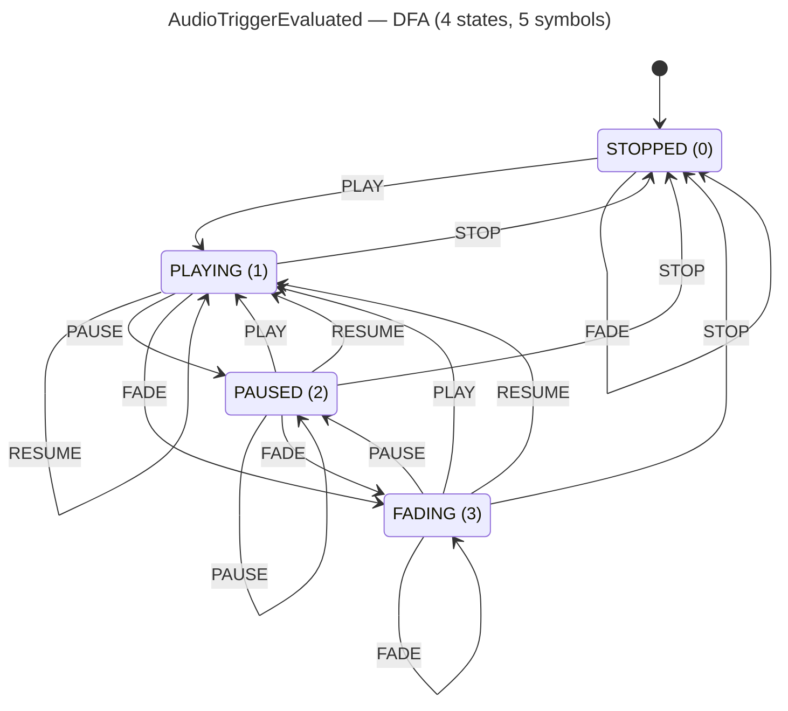

<!-- SCAFFOLDED BY ggen — fill in Context/Forces/Solution/Consequences below, then commit. -->
<!-- Source: ggen/schema/patterns.ttl (audio_trigger_evaluated). Re-scaffold: `ggen sync`. -->

# Pattern: AudioTriggerEvaluated

> **Family:** Audio · **Kernel:** `audio_trigger_evaluated` · **Lowering:** `Dfa` · **Id:** 49

Advance an audio playback FSM (STOPPED/PLAYING/PAUSED/FADING) via DFA table lookup.

---

## Context

Audio playback is naturally a finite state machine: a channel starts STOPPED, transitions to PLAYING on a play event, can be PAUSED or sent to FADING by game events, and eventually returns to STOPPED. Game events (play, stop, pause, resume, fade) arrive from multiple systems each tick. A switch-on-state implementation branches on both the current state and the incoming symbol, producing O(states * symbols) branch paths that mispredict every time the playback lifecycle progresses through a new state.

## Forces

- **Branch misprediction** — a `match (state, symbol)` with 20 arms (4 states × 5 symbols) branches heavily when playback transitions are clustered (e.g., rapid play/stop cycles at scene transitions).
- **Deterministic latency** — the Dfa lowering flattens all transitions into a 20-entry flat array; `dfa_advance` performs a single index computation `state * 5 + symbol` and a table read, giving O(1) fixed latency independent of which transition fires.
- **State-space completeness** — every (state, symbol) pair must have a defined next state; the flat table enforces totality at compile time, eliminating the risk of a missing arm silently defaulting to 0.
- **Out-of-range safety** — both `state` and `symbol` are reduced modulo their respective cardinalities (`% NUM_STATES`, `% ALPHABET_SIZE`) before the table lookup, keeping the index in bounds for any u64 input.
- **OCEL auditability** — event code 111 ties every state transition to both the `audio_source` and `entity` object traces, enabling complete FSM history reconstruction for replay and debugging.

## Solution

**Branchless primitive:** `bcinr_logic::dfa::dfa_advance`

State bits[0..8] carry the current playback state (STOPPED=0, PLAYING=1, PAUSED=2, FADING=3); input bits[0..8] carry the trigger symbol (PLAY=0, STOP=1, PAUSE=2, RESUME=3, FADE=4). The 20-entry `TABLE` encodes transitions row-major: row 0 is STOPPED (only PLAY escapes), rows 1–3 are PLAYING/PAUSED/FADING (all share the same transition structure: PLAY→PLAYING, STOP→STOPPED, PAUSE→PAUSED, RESUME→PLAYING, FADE→FADING). `dfa_advance(state_idx, sym_idx, &TABLE, ALPHABET_SIZE)` computes `TABLE[state_idx * 5 + sym_idx]` — a branchless array access — and returns the next state. The Dfa lowering was chosen because the problem is literally a finite automaton; table lookup is both the canonical and the most efficient branchless encoding.

## Consequences

**Gains:** All 20 transitions are provably correct (proptest exhaustively covers the 4×5 space); no missing-arm silent failure is possible; latency is constant regardless of state or symbol. **Costs:** The table occupies 20 × 8 bytes = 160 bytes in memory; adding a new state or symbol requires rebuilding the table and regenerating the DFA. **Compositions:** The FADING state is entered on a FADE symbol, after which `audio_fade_applied` drives the volume to zero and emits a silent flag; volume is set on PLAY events via `volume_clamped`; priority changes on state transitions feed `audio_priority_selected`.

---

## Structure Diagram



---

## Evidence Model

| Field | Value |
|---|---|
| OCEL activity | `AudioTriggerEvaluated` |
| Event code | `111` |
| OTEL span | `111` |
| Object kinds | `audio_source`, `entity` |
| Required status | `4` |
| Refusal status | `7` |
| Authority | oracle predicate: matches audio_trigger_evaluated_reference for all inputs |

---

## Metadata

| Field | Value |
|---|---|
| Pattern id | 49 |
| Family | Audio |
| Lowering | `Dfa` |
| State cardinality | 4 |
| Primitive | `bcinr_logic::dfa::dfa_advance` |
| Kernel signature | `audio_trigger_evaluated(state: u64, input: u64) -> u64` |
| Source kernel | `src/patterns/audio_trigger_evaluated.rs` |

---

## How to Use

```rust
use wasm4games::patterns::audio_trigger_evaluated;

// Pack state and input into u64 fields as documented in the kernel source.
let result = audio_trigger_evaluated(state, input);
```

The kernel is a pure `fn(u64, u64) -> u64` — no side effects, no allocation, no branches.
Pair with the evidence layer to emit OCEL events, OTEL spans, and receipt folds:

```rust
use wasm4games::evidence::{ocel::OcelEvent, otel};

let result = audio_trigger_evaluated(state, input);
otel::emit(111);
let ev = OcelEvent::new(111, logical_tick, admission_status);
```

---

## Related Patterns

- [AudioFadeApplied](audio_fade_applied.md) — the FADING state corresponds to the fade kernel driving volume to zero; the silent flag from that kernel should trigger a STOP symbol into this FSM.
- [VolumeClamped](volume_clamped.md) — volume is set or adjusted on PLAY and RESUME events that drive this FSM.
- [AudioPrioritySelected](audio_priority_selected.md) — priority changes based on FSM state (FADING channels drop priority); selection feeds back into which channel receives events.
