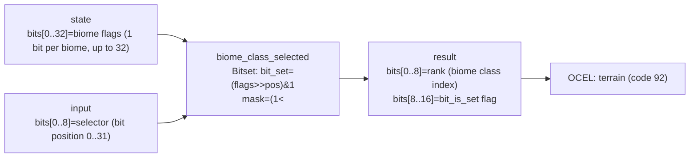

<!-- SCAFFOLDED BY ggen — fill in Context/Forces/Solution/Consequences below, then commit. -->
<!-- Source: ggen/schema/patterns.ttl (biome_class_selected). Re-scaffold: `ggen sync`. -->

# Pattern: BiomeClassSelected

> **Family:** Procedural Gen · **Kernel:** `biome_class_selected` · **Lowering:** `Bitset` · **Id:** 30

Select a biome class from a packed biome-flags bitset by ranking the highest set bit at the selector position.

---

## Context

Procedural maps assign each cell a set of active biome flags stored as a packed bitfield — for example, bit 0 = OCEAN, bit 1 = BEACH, bit 2 = FOREST, bit 3 = HIGHLAND — so that transition cells can carry multiple biome influences simultaneously. To select the dominant biome class for rendering, collision, and spawn-weight lookup, the map generator queries a specific bit position and computes its rank among the set bits: rank gives the biome's ordinal position in the active-biome list without iterating over the flags array. A naïve loop `for bit in 0..32 { if flags & (1 << bit) != 0 { count += 1; if bit == pos { return count } }` branches at every bit position and varies in iteration count with the flag density. The Bitset lowering replaces the loop with a single population-count on a below-position mask: one `count_ones()` instruction.

## Forces

- **Branch misprediction** — a bit-scanning loop branches on every set-bit test and on the early exit; both vary with the flag density and position, making the branch pattern data-dependent and poorly predicted.
- **Deterministic latency** — the Bitset lowering computes the rank with one mask (`(1 << pos) - 1`), one AND, and one `count_ones()` (typically a single `POPCNT` instruction); the time is O(1) regardless of how many biome flags are set.
- **Rank semantics** — the rank of a bit is the number of set bits strictly below it in the flags word; this gives a stable ordinal index into the active-biome list that does not change when new biome flags are added above or below the query position.
- **Dual output** — callers need both the rank (to index into a biome data table) and the `bit_is_set` flag (to confirm the queried biome is actually active at this cell); both are available in a single result word.
- **OCEL auditability** — event code 92 ties each biome query to the `terrain` object, making the per-cell biome classification inspectable in the OCEL event log.

## Solution

The kernel accepts `state` packed as `bits[0..32] = biome flags (up to 32 biomes, 1 bit per biome)` and `input` packed as `bits[0..8] = biome selector (bit position to query, 0..31)`. It returns `bits[0..8] = rank of the selector bit among set bits (biome class index)` and `bits[8..16] = bit_is_set flag (1 if the queried biome is active, 0 otherwise)`. The bit-is-set value is `(flags >> pos) & 1`. The rank is the population count of `flags & ((1 << pos) - 1)`: the mask zeroes out all bits at position `pos` and above, leaving only the bits strictly below `pos`, and `count_ones()` counts them. When `pos == 0` the mask is 0 and the rank is trivially 0. The Bitset lowering is appropriate because the operation is a rank query on a packed bit vector — the exact function the bitset rank primitive computes.

**Branchless primitive:** `bcinr_logic::bitset::rank_u64`

## Consequences

**Gains:** O(1) latency per query regardless of flag density; the rank is stable across flag additions above the query position; both the rank and the activity flag are available in one result word; the OCEL trail at event code 92 logs each biome query against the `terrain` object. **Costs:** the biome flag word is 32 bits, limiting the map to 32 distinct biome types; the selector is a 5-bit position index, so callers must ensure `pos < 32`; `dfa_advance`-style out-of-range clamping is not applied — the kernel masks `pos` to `0x1F` to prevent undefined shifts but does not validate that the queried biome is meaningful. **Natural compositions:** `terrain_height_quantized` produces the clamped height that the caller uses to set biome flags before querying this kernel; `tile_variant_selected` uses the biome class index to select the correct tile art set; `spawn_weight_evaluated` uses the biome class to look up per-biome spawn rates.

---

## Structure Diagram



---

## Evidence Model

| Field | Value |
|---|---|
| OCEL activity | `BiomeClassSelected` |
| Event code | `92` |
| OTEL span | `92` |
| Object kinds | `terrain` |
| Required status | `4` |
| Refusal status | `7` |
| Authority | oracle predicate: matches biome_class_selected_reference for all inputs |

---

## Metadata

| Field | Value |
|---|---|
| Pattern id | 30 |
| Family | Procedural Gen |
| Lowering | `Bitset` |
| State cardinality | 16 |
| Primitive | `bcinr_logic::bitset::rank_u64` |
| Kernel signature | `biome_class_selected(state: u64, input: u64) -> u64` |
| Source kernel | `src/patterns/biome_class_selected.rs` |

---

## How to Use

```rust
use wasm4games::patterns::biome_class_selected;

// Pack state and input into u64 fields as documented in the kernel source.
let result = biome_class_selected(state, input);
```

The kernel is a pure `fn(u64, u64) -> u64` — no side effects, no allocation, no branches.
Pair with the evidence layer to emit OCEL events, OTEL spans, and receipt folds:

```rust
use wasm4games::evidence::{ocel::OcelEvent, otel};

let result = biome_class_selected(state, input);
otel::emit(92);
let ev = OcelEvent::new(92, logical_tick, admission_status);
```

---

## Related Patterns

- [terrain_height_quantized](terrain_height_quantized.md) — the clamped terrain height determines which biome bits are set in the flags word before this kernel is queried
- [tile_variant_selected](tile_variant_selected.md) — the biome class index returned by this kernel selects the tile art set; tile_variant_selected then picks the sprite within that set
- [spawn_weight_evaluated](spawn_weight_evaluated.md) — the biome class index is used to look up per-biome spawn rate weights that feed spawn_weight_evaluated
