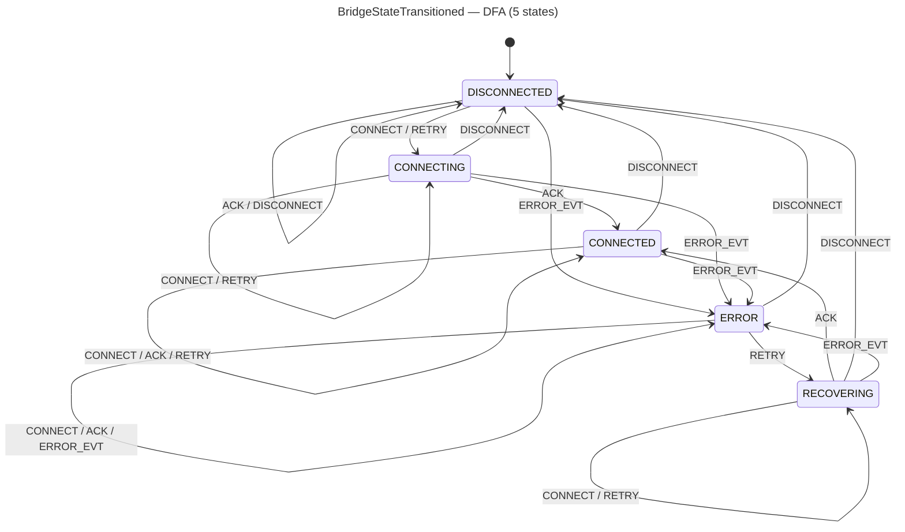

<!-- SCAFFOLDED BY ggen — fill in Context/Forces/Solution/Consequences below, then commit. -->
<!-- Source: ggen/schema/patterns.ttl (bridge_state_transitioned). Re-scaffold: `ggen sync`. -->

# Pattern: BridgeStateTransitioned

> **Family:** Engine Bridge · **Kernel:** `bridge_state_transitioned` · **Lowering:** `Dfa` · **Id:** 63

Advance a platform bridge adapter FSM (DISCONNECTED/CONNECTING/CONNECTED/ERROR/RECOVERING) over a flat 5x5 table.

---

## Context

Platform bridge adapters (graphics, audio, input) go through a multi-step lifecycle: they start DISCONNECTED, progress to CONNECTING when a connection attempt begins, reach CONNECTED when the handshake completes, transition to ERROR on failures, and move to RECOVERING during reconnect attempts. Game engine hot paths (command submission, capability queries, payload dispatch) must know the bridge state at every frame. A switch-on-state implementation in this hot path branches at every state check, adding latency variance directly proportional to the branch misprediction rate — which spikes precisely when connection loss occurs during active gameplay.

## Forces

- **Branch misprediction** — switch-on-state for five states mispredicts during state transitions, which occur at the highest-stress moments (connection loss, timeout, reconnect).
- **Deterministic latency** — the Dfa lowering via `dfa_advance` gives O(1) constant time: one flat table lookup per event, independent of which state the bridge is in.
- **Five-state completeness** — all five states must be reachable and all 25 (state, symbol) pairs must be defined; missing transitions must be made explicit (e.g., DISCONNECT from CONNECTED lands in DISCONNECTED=0).
- **ERROR isolation** — once in ERROR, only a RETRY can progress to RECOVERING; all other events must keep the bridge in ERROR to prevent spurious recovery.
- **OCEL auditability** — OCEL event code 125 ties each bridge transition to an `engine_cmd` object trace for adapter lifecycle monitoring.

## Solution

The kernel packs `state` bits[0..8] as the current bridge state (0..=4, reduced mod 5 for out-of-range values) and `input` bits[0..8] as the event symbol (0..=4, reduced mod 5). The flat 5×5 table encodes all 25 transitions: rows are DISCONNECTED=0, CONNECTING=1, CONNECTED=2, ERROR=3, RECOVERING=4; columns are CONNECT=0, ACK=1, DISCONNECT=2, ERROR_EVT=3, RETRY=4. `dfa_advance(st, sym, &TABLE, ALPHABET)` performs a single branchless array index read. The next state (bits[0..8]) is returned. This is the Dfa lowering: the entire bridge lifecycle is a constant-time flat table with no conditional logic in the transition path.

**Branchless primitive:** `bcinr_logic::dfa::dfa_advance`

## Consequences

**Gains:** All 25 transitions execute at identical latency. DISCONNECT from any state always returns to DISCONNECTED=0 (a safe, total reset). ERROR_EVT from any state always reaches ERROR=3, ensuring failures are captured universally. The table is auditable at a glance: adding a new event or state requires extending rows/columns, not restructuring branch logic.

**Costs:** The bit-field ABI is fixed. The transition table is a compile-time constant; runtime-configurable adapter policies (e.g., disabling RECOVERING for certain adapter types) require a kernel variant. Out-of-range state/symbol values are silently reduced modulo 5.

**Compositions:** Bridge state is prerequisite for `command_opcode_encoded` (encoding only in CONNECTED=2) and `capability_flag_evaluated` (queries only in CONNECTED=2). `adapter_priority_ranked` determines which adapter to attempt first before CONNECT is issued. The same multi-state lifecycle idiom appears in `sync_state_admitted`.

---

## Structure Diagram



---

## Evidence Model

| Field | Value |
|---|---|
| OCEL activity | `BridgeStateTransitioned` |
| Event code | `125` |
| OTEL span | `125` |
| Object kinds | `engine_cmd` |
| Required status | `4` |
| Refusal status | `7` |
| Authority | oracle predicate: matches bridge_state_transitioned_reference for all inputs |

---

## Metadata

| Field | Value |
|---|---|
| Pattern id | 63 |
| Family | Engine Bridge |
| Lowering | `Dfa` |
| State cardinality | 5 |
| Primitive | `bcinr_logic::dfa::dfa_advance` |
| Kernel signature | `bridge_state_transitioned(state: u64, input: u64) -> u64` |
| Source kernel | `src/patterns/bridge_state_transitioned.rs` |

---

## How to Use

```rust
use wasm4games::patterns::bridge_state_transitioned;

// Pack state and input into u64 fields as documented in the kernel source.
let result = bridge_state_transitioned(state, input);
```

The kernel is a pure `fn(u64, u64) -> u64` — no side effects, no allocation, no branches.
Pair with the evidence layer to emit OCEL events, OTEL spans, and receipt folds:

```rust
use wasm4games::evidence::{ocel::OcelEvent, otel};

let result = bridge_state_transitioned(state, input);
otel::emit(125);
let ev = OcelEvent::new(125, logical_tick, admission_status);
```

---

## Related Patterns

- [CommandOpcodeEncoded](command_opcode_encoded.md) — command encoding is gated on bridge being in CONNECTED state.
- [CapabilityFlagEvaluated](capability_flag_evaluated.md) — capability queries are valid only in CONNECTED state.
- [AdapterPriorityRanked](adapter_priority_ranked.md) — adapter ranking precedes connection attempt; highest-priority adapter receives CONNECT first.
- [PayloadSizeBounded](payload_size_bounded.md) — payload is bounded before transmission to a CONNECTED bridge.
