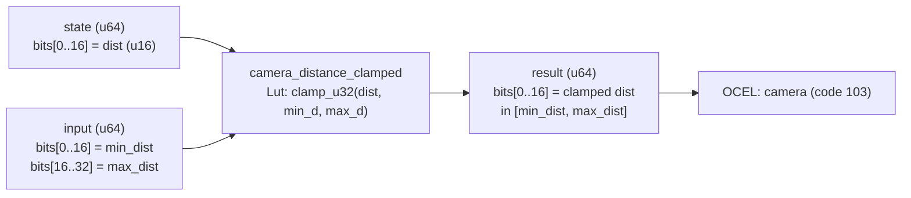

<!-- SCAFFOLDED BY ggen — fill in Context/Forces/Solution/Consequences below, then commit. -->
<!-- Source: ggen/schema/patterns.ttl (camera_distance_clamped). Re-scaffold: `ggen sync`. -->

# Pattern: CameraDistanceClamped

> **Family:** Camera · **Kernel:** `camera_distance_clamped` · **Lowering:** `Lut` · **Id:** 41

Clamp camera distance to [min_dist, max_dist], producing a bounded 16-bit distance value.

---

## Context

Third-person cameras compute a target follow distance from player input and game state each frame. Without explicit clamping, that distance can go negative — placing the camera inside the player mesh — or exceed the map boundary, clipping through level geometry. The kernel enforces a hard [min_dist, max_dist] window every tick so downstream consumers (lerp, LOD selection) always receive a geometrically valid distance.

## Forces

- **Branch misprediction** — a naïve `if dist < min || dist > max` pair branches on every call, adding latency jitter that compounds at 60 Hz camera update rates.
- **Deterministic latency** — the Lut lowering delegates to `clamp_u32`, an O(1) branchless primitive with a fixed instruction count regardless of input value.
- **Bounded output invariant** — downstream patterns (`camera_follow_lerped`, `semantic_lod_selected`) assume their distance input is in a valid u16 range; an unbounded value breaks those contracts silently.
- **Overflow safety** — the 16-bit mask on the return value (`& 0xFFFF`) guarantees that even a maximally wide `clamp_u32` result cannot pollute higher bits in the packed u64.
- **OCEL auditability** — event code 103 ties every clamped distance to the `camera` object trace, enabling deterministic replay and anticheat verification of camera position history.

## Solution

**Branchless primitive:** `bcinr_logic::fix::clamp_u32`

The kernel uses a packed-u64 ABI: `state` carries the raw current distance in bits[0..16]; `input` carries `min_dist` in bits[0..16] and `max_dist` in bits[16..32]. All three fields are extracted by masking and shifting, then fed directly to `clamp_u32(dist, min_d, max_d)`. `clamp_u32` is the Lut lowering: it uses bitwise arithmetic to compute `min(max(dist, min_d), max_d)` without any conditional branch. The result is masked to 16 bits and returned. The Lut lowering was chosen because distance is a bounded scalar with a two-sided invariant — exactly the domain that `clamp_u32` was designed for — and no signed arithmetic or state machine is required.

## Consequences

**Gains:** Camera distance is provably in [min_dist, max_dist] after every call; the OCEL event code 103 creates an auditable record of each clamped value; execution time is O(1) and data-independent, supporting deterministic replay. **Costs:** The packed-u64 ABI requires callers to pre-pack min/max into the input word; both bounds must satisfy min_dist <= max_dist (the kernel does not validate this ordering). **Compositions:** The clamped distance feeds directly into `camera_follow_lerped` (lerp target), `look_target_weighted` (target selection threshold), and `semantic_lod_selected` (LOD tier selection).

---

## Structure Diagram



---

## Evidence Model

| Field | Value |
|---|---|
| OCEL activity | `CameraDistanceClamped` |
| Event code | `103` |
| OTEL span | `103` |
| Object kinds | `camera` |
| Required status | `4` |
| Refusal status | `7` |
| Authority | oracle predicate: matches camera_distance_clamped_reference for all inputs |

---

## Metadata

| Field | Value |
|---|---|
| Pattern id | 41 |
| Family | Camera |
| Lowering | `Lut` |
| State cardinality | 8 |
| Primitive | `bcinr_logic::fix::clamp_u32` |
| Kernel signature | `camera_distance_clamped(state: u64, input: u64) -> u64` |
| Source kernel | `src/patterns/camera_distance_clamped.rs` |

---

## How to Use

```rust
use wasm4games::patterns::camera_distance_clamped;

// Pack state and input into u64 fields as documented in the kernel source.
let result = camera_distance_clamped(state, input);
```

The kernel is a pure `fn(u64, u64) -> u64` — no side effects, no allocation, no branches.
Pair with the evidence layer to emit OCEL events, OTEL spans, and receipt folds:

```rust
use wasm4games::evidence::{ocel::OcelEvent, otel};

let result = camera_distance_clamped(state, input);
otel::emit(103);
let ev = OcelEvent::new(103, logical_tick, admission_status);
```

---

## Related Patterns

- [CameraFollowLerped](camera_follow_lerped.md) — clamped distance is the target for the lerp step; both must agree on the valid distance range.
- [LookTargetWeighted](look_target_weighted.md) — distance to the selected look target is clamped by this pattern before weighting.
- [SemanticLodSelected](semantic_lod_selected.md) — camera distance drives LOD tier selection; clamped distance ensures the LOD index stays in the valid table range.
