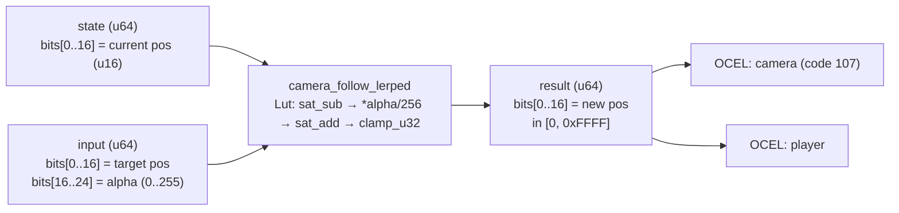

<!-- SCAFFOLDED BY ggen — fill in Context/Forces/Solution/Consequences below, then commit. -->
<!-- Source: ggen/schema/patterns.ttl (camera_follow_lerped). Re-scaffold: `ggen sync`. -->

# Pattern: CameraFollowLerped

> **Family:** Camera · **Kernel:** `camera_follow_lerped` · **Lowering:** `Lut` · **Id:** 45

Fixed-point lerp approximation for camera follow: new_pos = current + (target - current) * alpha / 256.

---

## Context

Follow cameras smooth their position toward a moving target each tick using linear interpolation. The canonical formula `new = cur + (target - cur) * alpha` requires a bounded alpha in [0, 1]; in fixed-point this becomes alpha in [0, 256] with a divide-by-256. Without bounding the alpha value and the intermediate difference, integer overflow in `diff * alpha` produces a catastrophic step that teleports the camera across the map instead of smoothly tracking the player. At alpha = 256 (full snap), the result must still be exactly `target`; at alpha = 0, the camera must not move at all.

## Forces

- **Branch misprediction** — a naïve `if alpha > 256` or `if new_pos < 0` guard branches on data-dependent conditions that fire on every edge case (high latency frames, rapid target movement).
- **Deterministic latency** — the Lut lowering delegates saturation and clamping to `saturating_sub_i64`, `saturating_add_i64`, and `clamp_u32`, all O(1) branchless primitives.
- **No-overshoot invariant** — the integer division `(diff * alpha) / 256` is strictly weaker than the full step; the result never overshoots `target` because `|step| = |diff| * alpha/256 <= |diff|`.
- **u16 output invariant** — `clamp_u32(new_pos.max(0) as u32, 0, 0xFFFF)` guarantees the output is a valid coordinate for downstream patterns regardless of extreme inputs.
- **OCEL auditability** — event code 107 ties each lerp step to both the `camera` and `player` object traces, enabling reconstruction of the camera path for replay.

## Solution

**Branchless primitive:** `bcinr_logic::fix::clamp_u32`

State bits[0..16] carry the current camera position as a u16. Input bits[0..16] carry the target position; bits[16..24] carry `alpha` (0..255, where 256 is encoded as full-snap via integer arithmetic). The kernel computes `diff = saturating_sub_i64(target, current)`, then `step = (diff * alpha) / 256` using integer division with no rounding branch. `saturating_add_i64(current, step)` produces the candidate new position, and `clamp_u32(new_pos.max(0) as u32, 0, 0xFFFF)` enforces the u16 coordinate bounds. The Lut lowering was chosen because the primary invariant is an absolute output range, just like `camera_distance_clamped`.

## Consequences

**Gains:** Camera movement is smooth, bounded, and branch-free; the no-overshoot property is a structural guarantee from the arithmetic, not a runtime check; the output is always a valid u16 coordinate. **Costs:** Integer division truncates the lerp step, introducing sub-pixel quantization error at low alpha values; alpha is effectively capped at 255 (full snap requires chaining or setting current = target explicitly). **Compositions:** The lerp result is the base position to which `camera_shake_applied` adds its offset; the lerp target position comes from `look_target_weighted`; the valid position range is bounded upstream by `camera_distance_clamped`.

---

## Structure Diagram



---

## Evidence Model

| Field | Value |
|---|---|
| OCEL activity | `CameraFollowLerped` |
| Event code | `107` |
| OTEL span | `107` |
| Object kinds | `camera`, `player` |
| Required status | `4` |
| Refusal status | `7` |
| Authority | oracle predicate: matches camera_follow_lerped_reference for all inputs |

---

## Metadata

| Field | Value |
|---|---|
| Pattern id | 45 |
| Family | Camera |
| Lowering | `Lut` |
| State cardinality | 8 |
| Primitive | `bcinr_logic::fix::clamp_u32` |
| Kernel signature | `camera_follow_lerped(state: u64, input: u64) -> u64` |
| Source kernel | `src/patterns/camera_follow_lerped.rs` |

---

## How to Use

```rust
use wasm4games::patterns::camera_follow_lerped;

// Pack state and input into u64 fields as documented in the kernel source.
let result = camera_follow_lerped(state, input);
```

The kernel is a pure `fn(u64, u64) -> u64` — no side effects, no allocation, no branches.
Pair with the evidence layer to emit OCEL events, OTEL spans, and receipt folds:

```rust
use wasm4games::evidence::{ocel::OcelEvent, otel};

let result = camera_follow_lerped(state, input);
otel::emit(107);
let ev = OcelEvent::new(107, logical_tick, admission_status);
```

---

## Related Patterns

- [CameraDistanceClamped](camera_distance_clamped.md) — lerp operates within the distance bounds established by this pattern; both enforce u16 output invariants.
- [CameraShakeApplied](camera_shake_applied.md) — the shake offset is applied after the lerp step to produce the final rendered position.
- [LookTargetWeighted](look_target_weighted.md) — the lerp target position is the winner from the look-target selection kernel.
