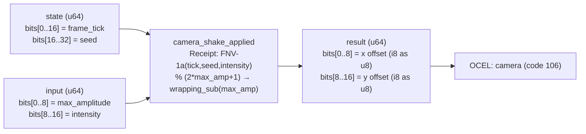

<!-- SCAFFOLDED BY ggen — fill in Context/Forces/Solution/Consequences below, then commit. -->
<!-- Source: ggen/schema/patterns.ttl (camera_shake_applied). Re-scaffold: `ggen sync`. -->

# Pattern: CameraShakeApplied

> **Family:** Camera · **Kernel:** `camera_shake_applied` · **Lowering:** `Receipt` · **Id:** 44

Deterministic camera shake offset computed from a receipt hash of (frame_tick, intensity, seed).

---

## Context

Camera shake on impact, explosion, or ability activation must be deterministic for two reasons: replays must reproduce the exact render position the player saw, and anticheat systems must verify that reported camera offsets are consistent with the inputs. A conventional pseudo-random number generator carries hidden mutable state that diverges across clients; swapping the PRNG seed per-session or per-tick makes determinism depend on call-sequence ordering rather than on the input values alone.

## Forces

- **Branch misprediction** — a naïve `if intensity > threshold` guard or range-clamping conditional inside a PRNG introduces data-dependent branches at every shake sample.
- **Deterministic latency** — the Receipt lowering folds `(tick, seed, intensity)` through `DeterministicSubstrateReceipt` (FNV-1a), which is a pure function of its inputs: same inputs always produce the same hash in constant time.
- **Replay fidelity** — camera offsets must reproduce byte-for-byte across clients and replay runs; any PRNG with global state fails this invariant under concurrent access or re-ordering.
- **Bounded amplitude** — the raw hash byte is reduced modulo `(2*max_amp + 1)` and offset by `-max_amp`, constraining the output to `[-max_amp, max_amp]` without a conditional.
- **OCEL auditability** — event code 106 ties each shake sample to the `camera` object trace; the receipt hash is reproducible from logged tick/seed/intensity, enabling forensic audit.

## Solution

**Branchless primitive:** `bcinr_logic::patterns::integrity_receipt::DeterministicSubstrateReceipt`

State bits[0..16] carry `frame_tick` and bits[16..32] carry `seed`; input bits[0..8] carry `max_amplitude` and bits[8..16] carry `intensity`. The kernel calls `DeterministicSubstrateReceipt::new()`, records all three fields via `r.record(tick, seed, intensity)`, and calls `r.finalize()` to obtain a deterministic hash. The low byte of the hash is reduced `% (2*max_amp + 1)` (range-collapsed to `[0, 2*max_amp]`), then `wrapping_sub(max_amp)` maps it to `[-max_amp, max_amp]` stored as u8 in bits[0..8]. The high byte produces the y offset in bits[8..16] by the same arithmetic. No branch appears anywhere: the modulo replaces the conditional clamp, and `wrapping_sub` replaces the sign flip.

## Consequences

**Gains:** Camera shake is fully deterministic — identical inputs always produce identical offsets — with no mutable global state; amplitude is provably in `[-max_amp, max_amp]`; the OCEL receipt makes each sample forensically reproducible. **Costs:** The FNV-based receipt has higher latency than a simple mask or add (~3-5 ns vs ~1 ns); the 8-bit amplitude field limits `max_amp` to 0..127 (range 255 covers the full u8 modulus, removing the reduction). **Compositions:** The shake offset is added to the result of `camera_follow_lerped`; `fov_adjusted` may also receive a shake-derived FOV delta; `noise_value_sampled` applies the same Receipt lowering for other deterministic noise needs.

---

## Structure Diagram



---

## Evidence Model

| Field | Value |
|---|---|
| OCEL activity | `CameraShakeApplied` |
| Event code | `106` |
| OTEL span | `106` |
| Object kinds | `camera` |
| Required status | `4` |
| Refusal status | `7` |
| Authority | oracle predicate: matches camera_shake_applied_reference for all inputs |

---

## Metadata

| Field | Value |
|---|---|
| Pattern id | 44 |
| Family | Camera |
| Lowering | `Receipt` |
| State cardinality | 64 |
| Primitive | `bcinr_logic::patterns::integrity_receipt::DeterministicSubstrateReceipt` |
| Kernel signature | `camera_shake_applied(state: u64, input: u64) -> u64` |
| Source kernel | `src/patterns/camera_shake_applied.rs` |

---

## How to Use

```rust
use wasm4games::patterns::camera_shake_applied;

// Pack state and input into u64 fields as documented in the kernel source.
let result = camera_shake_applied(state, input);
```

The kernel is a pure `fn(u64, u64) -> u64` — no side effects, no allocation, no branches.
Pair with the evidence layer to emit OCEL events, OTEL spans, and receipt folds:

```rust
use wasm4games::evidence::{ocel::OcelEvent, otel};

let result = camera_shake_applied(state, input);
otel::emit(106);
let ev = OcelEvent::new(106, logical_tick, admission_status);
```

---

## Related Patterns

- [CameraFollowLerped](camera_follow_lerped.md) — the shake offset is added to the lerp result to produce the final rendered camera position.
- [FovAdjusted](fov_adjusted.md) — shake can include a FOV component; both patterns feed the same camera state.
- [NoiseValueSampled](noise_value_sampled.md) — applies the same Receipt (FNV-1a) lowering to produce other deterministic noise values.
