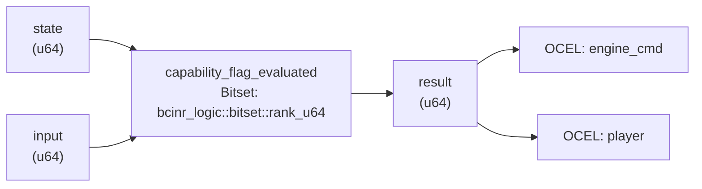

<!-- SCAFFOLDED BY ggen — fill in Context/Forces/Solution/Consequences below, then commit. -->
<!-- Source: ggen/schema/patterns.ttl (capability_flag_evaluated). Re-scaffold: `ggen sync`. -->

# Pattern: CapabilityFlagEvaluated

> **Family:** Engine Bridge · **Kernel:** `capability_flag_evaluated` · **Lowering:** `Bitset` · **Id:** 62

Test whether a capability bit is set in a 64-bit capability flags word and return its rank (count of set bits at 0..=idx).

---

## Context

<!-- TODO: Describe the game situation that makes CapabilityFlagEvaluated necessary.
     Why does this pattern exist? What breaks — or becomes unpredictably slow —
     without it? Seed from the authority line below, then expand:
     Authority: oracle predicate: matches capability_flag_evaluated_reference for all inputs -->

_Replace this placeholder with 2–3 sentences on the game problem this pattern addresses._

## Forces

<!-- TODO: List the tensions this pattern must hold in balance. Consider:
     - Branch misprediction: every CapabilityFlagEvaluated call that branches adds jitter
     - Deterministic latency: the Bitset lowering gives O(1) constant time
     - Bounded state: stateCard = 32 (32 distinct states)
     - Auditability: the OCEL event code 124 ties the transition to an object trace
     Authority to defend: oracle predicate: matches capability_flag_evaluated_reference for all inputs -->

_Replace this placeholder with the forces — what pulls in opposite directions here._

## Solution

<!-- TODO: Explain how capability_flag_evaluated resolves the forces.
     It lowers onto `bcinr_logic::bitset::rank_u64` to compute without conditional branches.
     Describe the bit-field ABI (how state and input are packed into u64),
     the branchless arithmetic, and why `Bitset` was the right lowering choice. -->

**Branchless primitive:** `bcinr_logic::bitset::rank_u64`

_Replace this placeholder with the solution description._

## Consequences

<!-- TODO: What trade-offs follow from applying this pattern?
     Gains: predictable latency, side-channel resistance, OCEL audit trail.
     Costs: fixed bit-field ABI, state space bounded to 32 classes.
     What patterns naturally compose with this one (see Related Patterns below)? -->

_Replace this placeholder with consequences and trade-offs._

---

## Structure Diagram



<!-- TODO: Improve this structural data-flow diagram:
     - Annotate bit-field layout on the state/input/result nodes
     - Label the arithmetic operation on the kernel node
     - Add state machine nodes if this pattern has meaningful internal states
     - Or replace with a more specific diagram tailored to this pattern -->

---

## Evidence Model

| Field | Value |
|---|---|
| OCEL activity | `CapabilityFlagEvaluated` |
| Event code | `124` |
| OTEL span | `124` |
| Object kinds | `engine_cmd`, `player` |
| Required status | `4` |
| Refusal status | `7` |
| Authority | oracle predicate: matches capability_flag_evaluated_reference for all inputs |

---

## Metadata

| Field | Value |
|---|---|
| Pattern id | 62 |
| Family | Engine Bridge |
| Lowering | `Bitset` |
| State cardinality | 32 |
| Primitive | `bcinr_logic::bitset::rank_u64` |
| Kernel signature | `capability_flag_evaluated(state: u64, input: u64) -> u64` |
| Source kernel | `src/patterns/capability_flag_evaluated.rs` |

---

## How to Use

```rust
use wasm4games::patterns::capability_flag_evaluated;

// Pack state and input into u64 fields as documented in the kernel source.
let result = capability_flag_evaluated(state, input);
```

The kernel is a pure `fn(u64, u64) -> u64` — no side effects, no allocation, no branches.
Pair with the evidence layer to emit OCEL events, OTEL spans, and receipt folds:

```rust
use wasm4games::evidence::{ocel::OcelEvent, otel};

let result = capability_flag_evaluated(state, input);
otel::emit(124);
let ev = OcelEvent::new(124, logical_tick, admission_status);
```

<!-- TODO: Add a concrete game-loop example showing this kernel in context:
     how is the state packed? what does the caller do with the result?
     what does the OCEL event represent in the game world? -->

---

## Related Patterns

<!-- TODO: Add links to related patterns in this directory. Examples:
     - [PatternName](pattern_name.md) — brief relationship note
     Suggestions: look for patterns in the same family, same lowering, or that
     compose naturally (one pattern's output feeds another's input). -->

_No related patterns linked yet — fill in and remove this placeholder._
