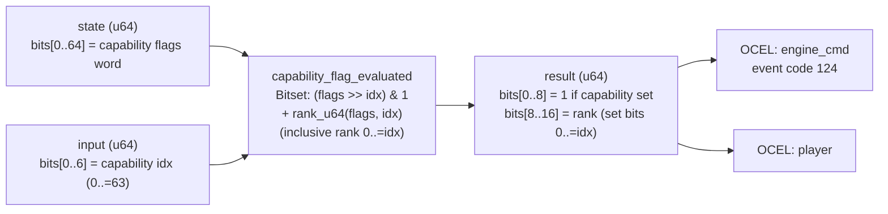

<!-- SCAFFOLDED BY ggen — fill in Context/Forces/Solution/Consequences below, then commit. -->
<!-- Source: ggen/schema/patterns.ttl (capability_flag_evaluated). Re-scaffold: `ggen sync`. -->

# Pattern: CapabilityFlagEvaluated

> **Family:** Engine Bridge · **Kernel:** `capability_flag_evaluated` · **Lowering:** `Bitset` · **Id:** 62

Test whether a capability bit is set in a 64-bit capability flags word and return its rank (count of set bits at 0..=idx).

---

## Context

Platform bridge adapters expose a 64-bit capability flags word encoding available hardware features: ray tracing, mesh shaders, compute dispatch, audio DSP acceleration, hardware video decode, and so on. Game systems must test individual capabilities before submitting command types that require them, and must also rank adapters by the number of capabilities they expose up to and including the queried feature (for priority-based adapter selection). A naïve capability check with an if-statement on a bit test is not the bottleneck, but the rank computation — counting set bits below a given index — requires an additional popcount that a branchy implementation typically gates behind the same if, adding a data-dependent branch.

## Forces

- **Branch misprediction** — testing a capability bit and conditionally computing its rank in the same if-block means the rank computation's presence depends on the capability, introducing a data-dependent branch in the adapter selection hot path.
- **Deterministic latency** — the Bitset lowering via `rank_u64` gives O(1) constant time; bit test and rank are computed unconditionally in parallel.
- **Inclusive rank semantics** — rank must count set bits at positions 0..=idx (inclusive of the queried bit), not 0..idx; the distinction matters for adapter priority: an adapter that has the capability contributes its own bit to its rank.
- **64-bit flag space** — the full 64-bit flags word must be accessible without truncation; the idx input is restricted to [0, 63] via 6-bit mask.
- **OCEL auditability** — OCEL event code 124 ties each capability evaluation to both `engine_cmd` and `player` object traces.

## Solution

The kernel takes `state` as the full 64-bit capability flags word and `input` bits[0..5] as the capability index (0..63, masked via `& 0x3F`). The bit test is `(flags >> idx) & 1` — a single branchless shift and mask. The inclusive rank is `rank_u64(flags, idx as usize)`, which counts set bits at positions 0..=idx using a branchless prefix mask and popcount. Both results are packed into the return u64: bit test in bits[0..8] and rank (saturated to 8 bits) in bits[8..16]. This is the Bitset lowering: the capability check and priority rank are computed simultaneously in one pass without any branching.

**Branchless primitive:** `bcinr_logic::bitset::rank_u64`

## Consequences

**Gains:** Both the binary capability test and the numeric rank are available in a single kernel call. The rank is always computed, so callers that only need the bit test pay a small fixed cost for the rank computation — this is the correct trade-off in a branchless design. The inclusive semantics (0..=idx) mean an adapter with the capability gets credit for it in its own rank.

**Costs:** The bit-field ABI is fixed — flags in state (full u64), idx in input bits[0..5], bit test in result bits[0..8], rank in result bits[8..16]. The rank is truncated to 8 bits; a flags word with more than 255 set bits below idx saturates silently (not a concern for 64-bit flags in practice, since 64 < 255).

**Compositions:** The bit test output gates `command_opcode_encoded` — only encode commands for capabilities that are set. The rank output feeds `adapter_priority_ranked` — capability count is a component of adapter priority. The same test+rank idiom appears in `action_mask_applied` in the anti-cheat family.

---

## Structure Diagram



---

## Evidence Model

| Field | Value |
|---|---|
| OCEL activity | `CapabilityFlagEvaluated` |
| Event code | `124` |
| OTEL span | `124` |
| Object kinds | `engine_cmd`, `player` |
| Required status | `4` |
| Refusal status | `7` |
| Authority | oracle predicate: matches capability_flag_evaluated_reference for all inputs |

---

## Metadata

| Field | Value |
|---|---|
| Pattern id | 62 |
| Family | Engine Bridge |
| Lowering | `Bitset` |
| State cardinality | 32 |
| Primitive | `bcinr_logic::bitset::rank_u64` |
| Kernel signature | `capability_flag_evaluated(state: u64, input: u64) -> u64` |
| Source kernel | `src/patterns/capability_flag_evaluated.rs` |

---

## How to Use

```rust
use wasm4games::patterns::capability_flag_evaluated;

// Pack state and input into u64 fields as documented in the kernel source.
let result = capability_flag_evaluated(state, input);
```

The kernel is a pure `fn(u64, u64) -> u64` — no side effects, no allocation, no branches.
Pair with the evidence layer to emit OCEL events, OTEL spans, and receipt folds:

```rust
use wasm4games::evidence::{ocel::OcelEvent, otel};

let result = capability_flag_evaluated(state, input);
otel::emit(124);
let ev = OcelEvent::new(124, logical_tick, admission_status);
```

---

## Related Patterns

- [CommandOpcodeEncoded](command_opcode_encoded.md) — capability bit test gates which command types are valid before encoding.
- [AdapterPriorityRanked](adapter_priority_ranked.md) — capability rank contributes to the adapter's priority score for dispatch ordering.
- [BridgeStateTransitioned](bridge_state_transitioned.md) — capabilities are queried in CONNECTED state; bridge state must be checked first.
