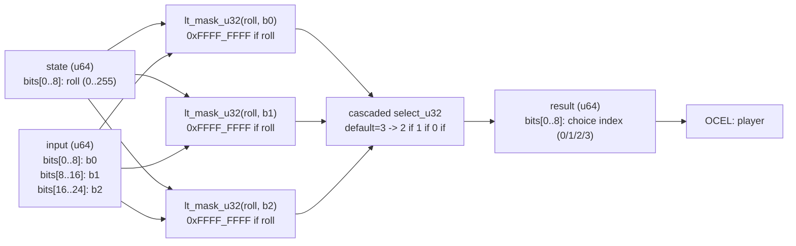

<!-- SCAFFOLDED BY ggen — fill in Context/Forces/Solution/Consequences below, then commit. -->
<!-- Source: ggen/schema/patterns.ttl (choice_weight_selected). Re-scaffold: `ggen sync`. -->

# Pattern: ChoiceWeightSelected

> **Family:** Narrative / Dialogue · **Kernel:** `choice_weight_selected` · **Lowering:** `Lut` · **Id:** 40

Select a dialogue choice by bucketing a roll against 3 cumulative weight boundaries.

---

## Context

Dialogue choice menus in RPGs and visual novels offer weighted options to create probabilistic NPC responses or weighted random events: "Agree (60%), Neutral (30%), Hostile (10%)". A random roll is drawn from [0,255] and compared against cumulative weight boundaries [60, 90, 100] to select the outcome bucket. The naïve implementation is a chain of `if roll < b0 / else if roll < b1 / else if roll < b2 / else` — three conditional branches that mispredicts at every bucket boundary and is difficult to extend. The branchless alternative replaces all three comparisons with parallel lt_mask computations and cascaded selects.

## Forces

- **Branch misprediction** — three chained `if roll < bN` comparisons introduce three mispredictable branches per choice selection, all of which mispredict when the roll falls near a boundary.
- **Deterministic latency** — the Lut lowering computes three `lt_mask_u32` comparisons and three `select_u32` calls in O(1) with no branch.
- **Ordered bucket semantics** — the cumulative boundaries must be treated as ordered partitions; the cascaded select from bucket 3 downward ensures that the lowest matching boundary wins, preserving `[0,b0) -> 0; [b0,b1) -> 1; [b1,b2) -> 2; [b2,∞) -> 3`.
- **Four-outcome coverage** — three boundaries define four buckets; all four must be reachable, including bucket 3 (roll >= b2), which is the default when no boundary matches.
- **Boundary configuration** — bucket boundaries are runtime parameters (not compile-time constants), allowing dialogue designers to tune weights without code changes.
- **OCEL auditability** — OCEL event code 102 ties every choice outcome to an auditable `player` object trace, enabling probabilistic dialogue replay.

## Solution

The kernel packs state as bits[0..8] = roll (0..255) and input as bits[0..8] = b0, bits[8..16] = b1, bits[16..24] = b2. Three `lt_mask_u32` comparisons are computed in parallel: `m_lt_b0`, `m_lt_b1`, `m_lt_b2`. The cascaded select builds the result bottom-up, starting with the default bucket 3 and overriding downward: `choice = select_u32(m_lt_b2, 2, 3)`, then `choice = select_u32(m_lt_b1, 1, choice)`, then `choice = select_u32(m_lt_b0, 0, choice)`. Because each pass overrides only when the roll is strictly less than the boundary, the lowest-boundary match wins, which is correct ordered-partition semantics. The `Lut` lowering is used because the bucket lookup is a small, bounded table-style operation: three thresholds partition the 256-value roll space into four named outputs.

## Consequences

**Gains:** all four buckets are reachable; ordered partition semantics are enforced by the cascaded-select order without sorting or loop; bucket boundaries are runtime-configurable; OCEL event 102 provides a per-outcome audit. **Costs:** the design is fixed to four buckets (three boundaries); extending to N buckets requires N-1 comparisons (still O(N) but requires code changes); boundaries are 8-bit (max 255), matching the roll range. **Compositions:** the choice index (0/1/2/3) drives the symbol input to [NarrativeBranchSelected](narrative_branch_selected.md) or [DialogueNodeAdvanced](dialogue_node_advanced.md); the same bucket idiom appears in [TileVariantSelected](tile_variant_selected.md) for weighted tile generation.

---

## Structure Diagram



---

## Evidence Model

| Field | Value |
|---|---|
| OCEL activity | `ChoiceWeightSelected` |
| Event code | `102` |
| OTEL span | `102` |
| Object kinds | `player` |
| Required status | `4` |
| Refusal status | `7` |
| Authority | oracle predicate: matches choice_weight_selected_reference for all inputs |

---

## Metadata

| Field | Value |
|---|---|
| Pattern id | 40 |
| Family | Narrative / Dialogue |
| Lowering | `Lut` |
| State cardinality | 8 |
| Primitive | `bcinr_logic::mask::select_u32` |
| Kernel signature | `choice_weight_selected(state: u64, input: u64) -> u64` |
| Source kernel | `src/patterns/choice_weight_selected.rs` |

---

## How to Use

```rust
use wasm4games::patterns::choice_weight_selected;

// Pack state and input into u64 fields as documented in the kernel source.
let result = choice_weight_selected(state, input);
```

The kernel is a pure `fn(u64, u64) -> u64` — no side effects, no allocation, no branches.
Pair with the evidence layer to emit OCEL events, OTEL spans, and receipt folds:

```rust
use wasm4games::evidence::{ocel::OcelEvent, otel};

let result = choice_weight_selected(state, input);
otel::emit(102);
let ev = OcelEvent::new(102, logical_tick, admission_status);
```

---

## Related Patterns

- [TileVariantSelected](tile_variant_selected.md) — uses the same LUT bucketize idiom for weighted tile variant selection.
- [NarrativeBranchSelected](narrative_branch_selected.md) — the chosen bucket index can drive narrative branch selection via weight comparison.
- [RewardTierSelected](reward_tier_selected.md) — tier selection uses a bitset popcount as a weight proxy bucketed against thresholds, an analogous structure.
