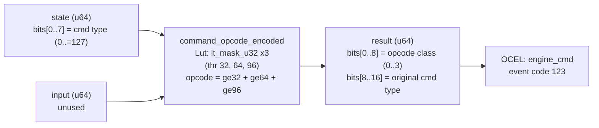

<!-- SCAFFOLDED BY ggen — fill in Context/Forces/Solution/Consequences below, then commit. -->
<!-- Source: ggen/schema/patterns.ttl (command_opcode_encoded). Re-scaffold: `ggen sync`. -->

# Pattern: CommandOpcodeEncoded

> **Family:** Engine Bridge · **Kernel:** `command_opcode_encoded` · **Lowering:** `Lut` · **Id:** 61

Encode a semantic command type (0..=127) into a platform opcode class via branchless boundary comparison.

---

## Context

Game engines maintain a vocabulary of semantic command types — MOVE, ATTACK, BUILD, UI, network sync, and so on — that must be translated into platform-specific opcode classes for different rendering and execution backends (WebGPU compute, DirectX draw, Metal blit, audio DSP dispatch). The translation assigns each command type to one of four opcode classes based on three threshold boundaries at 32, 64, and 96. Without branchless boundary comparison, every draw call submission traverses a chain of if-else statements on the command type, creating branch mispredictions at every class boundary in a high-frequency command stream.

## Forces

- **Branch misprediction** — a three-branch if-else-if chain on command type creates prediction pressure at each of the three class boundaries, which are frequently crossed during scene transitions.
- **Deterministic latency** — the Lut lowering via three `lt_mask_u32` comparisons summed to a threshold-crossing count gives O(1) constant time regardless of which class the command falls into.
- **Original type preservation** — the encoded opcode class must be accompanied by the original command type (bits[8..16]) so that bridge adapters can log the semantic intent alongside the platform opcode.
- **Four-class partition** — command types 0–31 (class 0), 32–63 (class 1), 64–95 (class 2), 96–127 (class 3) must be assigned without branching.
- **OCEL auditability** — OCEL event code 123 ties each opcode encoding to an `engine_cmd` object trace for command dispatch auditing.

## Solution

The kernel takes `state` bits[0..7] as the semantic command type (masked to 7 bits, 0..=127) and ignores `input`. Three `lt_mask_u32` comparisons determine how many of the thresholds [32, 64, 96] the command type crosses: `ge32 = (!lt_mask_u32(cmd, 32) >> 31)` yields 1 if cmd >= 32, else 0 — and similarly for 64 and 96. The opcode class is their sum: `ge32 + ge64 + ge96`, which equals 0, 1, 2, or 3 exactly. This is the Lut lowering: a threshold-crossing count that replaces a four-way branch with three independent comparisons and an addition. The return u64 packs opcode_class into bits[0..8] and the original cmd into bits[8..16].

**Branchless primitive:** `bcinr_logic::mask::lt_mask_u32`

## Consequences

**Gains:** The opcode class is computed in a fixed three-comparison + addition sequence; no branch predictor state is consumed. The original command type is preserved in the upper byte, enabling bridge adapters to log semantic intent without a second call. The threshold-crossing idiom generalizes cleanly to more classes by adding comparisons.

**Costs:** The bit-field ABI is fixed — command type in state bits[0..7], opcode class in result bits[0..8], original cmd in result bits[8..16]. The four opcode classes and three boundaries are compile-time constants; runtime-configurable class boundaries require a kernel variant.

**Compositions:** The encoded opcode feeds `bridge_state_transitioned` (encoding is only meaningful in CONNECTED state) and `payload_size_bounded` (the opcode's payload must be MTU-bounded). `capability_flag_evaluated` gates which opcode classes are valid for the current adapter before encoding.

---

## Structure Diagram



---

## Evidence Model

| Field | Value |
|---|---|
| OCEL activity | `CommandOpcodeEncoded` |
| Event code | `123` |
| OTEL span | `123` |
| Object kinds | `engine_cmd` |
| Required status | `4` |
| Refusal status | `7` |
| Authority | oracle predicate: matches command_opcode_encoded_reference for all inputs |

---

## Metadata

| Field | Value |
|---|---|
| Pattern id | 61 |
| Family | Engine Bridge |
| Lowering | `Lut` |
| State cardinality | 4 |
| Primitive | `bcinr_logic::mask::lt_mask_u32` |
| Kernel signature | `command_opcode_encoded(state: u64, input: u64) -> u64` |
| Source kernel | `src/patterns/command_opcode_encoded.rs` |

---

## How to Use

```rust
use wasm4games::patterns::command_opcode_encoded;

// Pack state and input into u64 fields as documented in the kernel source.
let result = command_opcode_encoded(state, input);
```

The kernel is a pure `fn(u64, u64) -> u64` — no side effects, no allocation, no branches.
Pair with the evidence layer to emit OCEL events, OTEL spans, and receipt folds:

```rust
use wasm4games::evidence::{ocel::OcelEvent, otel};

let result = command_opcode_encoded(state, input);
otel::emit(123);
let ev = OcelEvent::new(123, logical_tick, admission_status);
```

---

## Related Patterns

- [BridgeStateTransitioned](bridge_state_transitioned.md) — opcode encoding is only valid after the bridge reaches CONNECTED state.
- [CapabilityFlagEvaluated](capability_flag_evaluated.md) — adapter capabilities gate which opcode classes are available before encoding.
- [PayloadSizeBounded](payload_size_bounded.md) — the encoded opcode's payload must be MTU-clamped before transmission.
