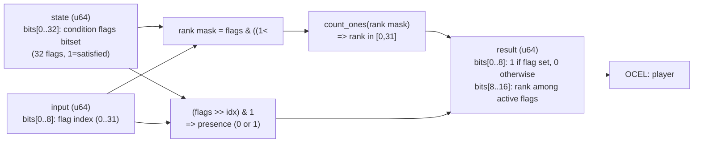

<!-- SCAFFOLDED BY ggen — fill in Context/Forces/Solution/Consequences below, then commit. -->
<!-- Source: ggen/schema/patterns.ttl (condition_flag_evaluated). Re-scaffold: `ggen sync`. -->

# Pattern: ConditionFlagEvaluated

> **Family:** Narrative / Dialogue · **Kernel:** `condition_flag_evaluated` · **Lowering:** `Bitset` · **Id:** 37

Test whether a condition flag is set in a 32-bit flags bitset and return its rank among active flags.

---

## Context

Narrative systems track world-state conditions — "player has visited the temple", "player has spoken to the blacksmith", "player holds the key" — as a 32-bit flag bitset. Dialogue trees and quest scripts test these conditions to determine which branches are available and in what order they appear. Without branchless bitset operations, checking a condition requires a conditional shift-and-compare, and computing the rank of a flag among all active flags (used to enumerate only satisfied conditions) requires a loop over all 32 bits with a counter — adding 32 branches per rank query in the worst case.

## Forces

- **Branch misprediction** — a naïve `for bit in 0..32 { if flags & (1<<bit) != 0 { count += 1; } }` loop adds up to 32 mispredictable branches per rank computation.
- **Deterministic latency** — the Bitset lowering computes both flag presence and rank in O(1) via a single masked popcount of `flags & ((1 << idx) - 1)`, with no loop or branch.
- **Dual output** — dialogue callers need both whether a flag is set (to gate the branch) and the rank of the flag among active flags (to order the offered choices); packing both into bits[0..8] and bits[8..16] avoids a second call.
- **5-bit index safety** — the flag index is masked to 5 bits (`idx = input & 0x1F`) before the shift, preventing undefined behavior on shift-by-32.
- **OCEL auditability** — OCEL event code 99 ties every flag evaluation to an auditable `player` object trace, supporting narrative replay.

## Solution

The kernel packs state as bits[0..32] = condition flags bitset (32 flags; 1 = condition satisfied) and input as bits[0..8] = flag index to test (0..31). The flag index is masked to 5 bits. The presence bit is extracted as `(flags >> idx) & 1`. The rank — the number of set flags at positions strictly below `idx` — is computed as `(flags & ((1u64 << idx).wrapping_sub(1))).count_ones()`: a single masked popcount using `wrapping_sub` to handle `idx = 0` safely (the mask becomes 0). The result packs presence into bit 0 and rank into bits[8..16]. The `Bitset` lowering is correct because both operations (flag test and rank) are standard bitset primitives reducible to popcount and mask.

## Consequences

**Gains:** flag test and rank are computed in O(1) with no loop; the packed dual-output avoids a second kernel call for ordering; the 5-bit index mask prevents shift-by-32 undefined behavior; OCEL event 99 provides per-condition-check audit. **Costs:** the condition space is bounded to 32 flags; games with more conditions must segment the bitset across multiple state words. **Compositions:** this pattern gates which dialogue symbols are offered in [DialogueNodeAdvanced](dialogue_node_advanced.md); the same bitset rank idiom appears in [CapabilityFlagEvaluated](capability_flag_evaluated.md); rank output feeds [NarrativeBranchSelected](narrative_branch_selected.md) as a branch weight.

---

## Structure Diagram



---

## Evidence Model

| Field | Value |
|---|---|
| OCEL activity | `ConditionFlagEvaluated` |
| Event code | `99` |
| OTEL span | `99` |
| Object kinds | `player` |
| Required status | `4` |
| Refusal status | `7` |
| Authority | oracle predicate: matches condition_flag_evaluated_reference for all inputs |

---

## Metadata

| Field | Value |
|---|---|
| Pattern id | 37 |
| Family | Narrative / Dialogue |
| Lowering | `Bitset` |
| State cardinality | 32 |
| Primitive | `bcinr_logic::bitset::rank_u64` |
| Kernel signature | `condition_flag_evaluated(state: u64, input: u64) -> u64` |
| Source kernel | `src/patterns/condition_flag_evaluated.rs` |

---

## How to Use

```rust
use wasm4games::patterns::condition_flag_evaluated;

// Pack state and input into u64 fields as documented in the kernel source.
let result = condition_flag_evaluated(state, input);
```

The kernel is a pure `fn(u64, u64) -> u64` — no side effects, no allocation, no branches.
Pair with the evidence layer to emit OCEL events, OTEL spans, and receipt folds:

```rust
use wasm4games::evidence::{ocel::OcelEvent, otel};

let result = condition_flag_evaluated(state, input);
otel::emit(99);
let ev = OcelEvent::new(99, logical_tick, admission_status);
```

---

## Related Patterns

- [DialogueNodeAdvanced](dialogue_node_advanced.md) — condition flag presence gates which symbols (CHOICE_A, CHOICE_B) are offered to the player.
- [NarrativeBranchSelected](narrative_branch_selected.md) — condition counts and ranks contribute to the branch weights compared by this pattern.
- [CapabilityFlagEvaluated](capability_flag_evaluated.md) — uses the same bitset rank idiom for capability rather than narrative condition flags.
