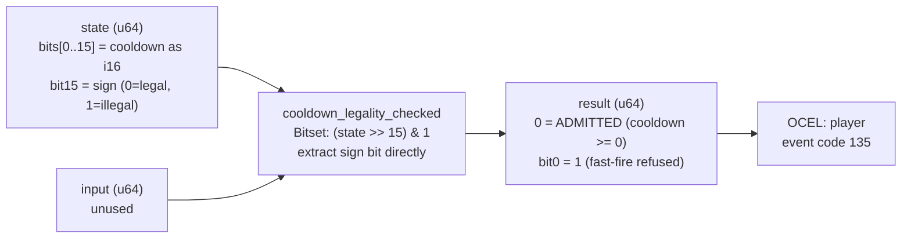

<!-- SCAFFOLDED BY ggen — fill in Context/Forces/Solution/Consequences below, then commit. -->
<!-- Source: ggen/schema/patterns.ttl (cooldown_legality_checked). Re-scaffold: `ggen sync`. -->

# Pattern: CooldownLegalityChecked

> **Family:** Anti-Cheat · **Kernel:** `cooldown_legality_checked` · **Lowering:** `Bitset` · **Id:** 73

Verdict bit0 mirrors the i16 sign bit of the remaining cooldown; a negative cooldown (fast-fire cheat) is refused.

---

## Context

Fast-fire cheats trigger game abilities (spells, attacks, special moves) before their cooldown timer has expired. The server tracks remaining cooldown as a signed i16 counter that decrements each tick; when it reaches zero or below by normal decrement, the ability may fire. Cheats bypass this by injecting a negative cooldown value directly — forcing the sign bit (bit15) to 1 without the counter having naturally expired. The anti-cheat gate checks this sign bit directly: a negative cooldown is an illegally forced value, not a naturally expired one. A conditional comparison (`if cooldown < 0 { refuse }`) is equivalent but branches on the sign bit, creating timing variation that cheaters can use to probe the cooldown representation.

## Forces

- **Branch misprediction** — a conditional `if cooldown < 0` branches on the sign bit, creating a timing side channel that leaks when the cooldown value crosses zero.
- **Deterministic latency** — the Bitset lowering via direct sign-bit extraction (`(state >> 15) & 1`) gives O(1) constant time; no comparison or mask is needed beyond a shift.
- **Sign-bit semantics** — the i16 encoding makes the sign bit the natural legality indicator: bit15=0 means non-negative (legal), bit15=1 means negative (illegal). The Bitset pattern extracts this bit directly without a full comparison.
- **Side-channel resistance** — legal cooldowns (bit15=0) and illegal fast-fire injections (bit15=1) must produce execution paths of identical duration; bit extraction is unconditional.
- **OCEL auditability** — OCEL event code 135 ties each cooldown check to a `player` object trace for anti-cheat audit logs.

## Solution

The kernel takes `state` bits[0..15] as the remaining cooldown encoded as an i16 (bit15 is the sign bit) and ignores `input`. The verdict is simply `(state >> 15) & 1`: shift right by 15 positions to bring the sign bit to position 0, then mask to isolate it. This is the Bitset lowering: a single shift-and-mask extracts the single bit that encodes the entire legality predicate. No mask primitives, no comparison, no arithmetic — just a bit extraction. Verdict bit0=1 means the cooldown is negative (fast-fire cheat, refused); verdict=0 means non-negative (legal, admitted).

**Branchless primitive:** direct sign-bit extraction (`>> 15 & 1`)

## Consequences

**Gains:** The implementation is one instruction (shift) plus one mask — the minimum possible cost for a single-bit predicate. Execution time is identical for legal and illegal cooldowns, closing the timing side channel completely. The verdict is a single bit composable with other anti-cheat verdict bits via OR.

**Costs:** The encoding assumption (negative i16 = illegal) is baked in; a game that legitimately uses negative cooldowns for special effects cannot use this kernel without modification. The input is only 16 bits; if cooldown is stored in a larger type, the caller must pack the lower 16 bits into state.

**Compositions:** Verdict bit composes with `movement_legality_checked`, `resource_bound_checked`, and `action_rate_bounded` via OR to form the complete per-tick anti-cheat verdict. The sign-bit Bitset idiom also appears in `status_effect_ticked` (same sign-bit extraction for effect expiry).

---

## Structure Diagram



---

## Evidence Model

| Field | Value |
|---|---|
| OCEL activity | `CooldownLegalityChecked` |
| Event code | `135` |
| OTEL span | `135` |
| Object kinds | `player` |
| Required status | `4` |
| Refusal status | `7` |
| Authority | legality spec: remaining_cooldown >= 0 (i16 sign bit clear) |

---

## Metadata

| Field | Value |
|---|---|
| Pattern id | 73 |
| Family | Anti-Cheat |
| Lowering | `Bitset` |
| State cardinality | 2 |
| Primitive | `bcinr_logic::bitset::rank_u64` |
| Kernel signature | `cooldown_legality_checked(state: u64, input: u64) -> u64` |
| Source kernel | `src/patterns/cooldown_legality_checked.rs` |

---

## How to Use

```rust
use wasm4games::patterns::cooldown_legality_checked;

// Pack state and input into u64 fields as documented in the kernel source.
let result = cooldown_legality_checked(state, input);
```

The kernel is a pure `fn(u64, u64) -> u64` — no side effects, no allocation, no branches.
Pair with the evidence layer to emit OCEL events, OTEL spans, and receipt folds:

```rust
use wasm4games::evidence::{ocel::OcelEvent, otel};

let result = cooldown_legality_checked(state, input);
otel::emit(135);
let ev = OcelEvent::new(135, logical_tick, admission_status);
```

---

## Related Patterns

- [MovementLegalityChecked](movement_legality_checked.md) — same anti-cheat family; movement and cooldown checks compose via OR into the full verdict.
- [ActionRateBounded](action_rate_bounded.md) — cooldown and rate are complementary anti-cheat gates covering timing vs. frequency cheats.
- [ResourceBoundChecked](resource_bound_checked.md) — all four anti-cheat gates compose into the complete per-tick verdict bitmask.
