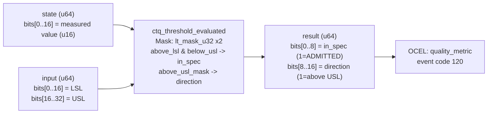

<!-- SCAFFOLDED BY ggen — fill in Context/Forces/Solution/Consequences below, then commit. -->
<!-- Source: ggen/schema/patterns.ttl (ctq_threshold_evaluated). Re-scaffold: `ggen sync`. -->

# Pattern: CtqThresholdEvaluated

> **Family:** DfLSS / Quality · **Kernel:** `ctq_threshold_evaluated` · **Lowering:** `Mask` · **Id:** 58

Evaluate a Critical-to-Quality (CTQ) characteristic: whether a measured value is within spec [LSL, USL] and the violation direction.

---

## Context

Game quality pipelines track CTQ characteristics such as frame latency, network round-trip jitter, and asset load time. Each characteristic has a specification window [LSL, USL]: values below the lower spec limit (too fast) are as much a process failure as values above the upper limit (too slow). Every tick, each metric measurement must be classified into one of three outcomes — ADMITTED (in spec), below-LSL, or above-USL — and the result must contribute to DPMO computation. A naïve nested if-else classifier (`if value < LSL ... else if value > USL ... else ...`) introduces two conditional branches per measurement per tick, directly polluting the pipeline with branch mispredictions on every spec boundary crossing.

## Forces

- **Branch misprediction** — two nested comparisons (LSL check, then USL check) mispredict whenever the measured metric drifts across either boundary.
- **Deterministic latency** — the Mask lowering via `lt_mask_u32` gives O(1) constant time; both boundary decisions execute unconditionally in parallel.
- **Three-way classification** — the result must encode both in_spec (bit0) and direction (bit8) in a single u64, enabling downstream consumers to act on either without re-evaluating.
- **Symmetric boundaries** — both under-spec and over-spec are defects; the pattern must treat both directions with equal importance.
- **OCEL auditability** — OCEL event code 120 ties each CTQ evaluation to a `quality_metric` object trace for process capability studies.

## Solution

The kernel packs `state` bits[0..16] as the measured value (u16) and `input` bits[0..16] as LSL, bits[16..32] as USL. Two `lt_mask_u32` calls produce `below_lsl` (all-ones when value < LSL) and `above_usl_mask` (all-ones when usl < value). Their bitwise inverses give `above_lsl` and `below_usl`. The conjunction `above_lsl & below_usl` gives an all-ones mask when value is in [LSL, USL]; `>> 31` extracts this as 1 for in_spec. Separately, `above_usl_mask >> 31` gives 1 for the direction bit when value strictly exceeds USL. Both are packed into bits[0..8] (in_spec) and bits[8..16] (direction) of the return u64. This is the Mask lowering: two simultaneous comparisons resolved to independent single bits in one data-flow pass, with no branching.

**Branchless primitive:** `bcinr_logic::mask::lt_mask_u32`

## Consequences

**Gains:** Both boundary decisions execute in a single pipeline pass with no branching. The in_spec and direction bits are independent: a consumer can test in_spec alone without also testing direction, or can OR the two bits into a single violation flag. The Hoare-logic invariant guarantees in_spec=1 only when value is in [LSL, USL] and direction=1 only when value strictly exceeds USL.

**Costs:** The bit-field ABI is fixed — value in state bits[0..16], LSL+USL packed into input bits[0..32]. The state cardinality is 2 (ADMITTED or VIOLATED), but the direction sub-field adds a third outcome for upstream consumers that read it.

**Compositions:** CTQ violations (in_spec=0) feed DPMO computation in `defect_rate_quantized`. The violation result drives `quality_gate_evaluated` FSM transitions. Pairs naturally with `sigma_level_computed` in a pipeline: CTQ -> defect_rate -> sigma.

---

## Structure Diagram



---

## Evidence Model

| Field | Value |
|---|---|
| OCEL activity | `CtqThresholdEvaluated` |
| Event code | `120` |
| OTEL span | `120` |
| Object kinds | `quality_metric` |
| Required status | `4` |
| Refusal status | `7` |
| Authority | oracle predicate: matches ctq_threshold_evaluated_reference for all inputs |

---

## Metadata

| Field | Value |
|---|---|
| Pattern id | 58 |
| Family | DfLSS / Quality |
| Lowering | `Mask` |
| State cardinality | 2 |
| Primitive | `bcinr_logic::mask::lt_mask_u32` |
| Kernel signature | `ctq_threshold_evaluated(state: u64, input: u64) -> u64` |
| Source kernel | `src/patterns/ctq_threshold_evaluated.rs` |

---

## How to Use

```rust
use wasm4games::patterns::ctq_threshold_evaluated;

// Pack state and input into u64 fields as documented in the kernel source.
let result = ctq_threshold_evaluated(state, input);
```

The kernel is a pure `fn(u64, u64) -> u64` — no side effects, no allocation, no branches.
Pair with the evidence layer to emit OCEL events, OTEL spans, and receipt folds:

```rust
use wasm4games::evidence::{ocel::OcelEvent, otel};

let result = ctq_threshold_evaluated(state, input);
otel::emit(120);
let ev = OcelEvent::new(120, logical_tick, admission_status);
```

---

## Related Patterns

- [SigmaLevelComputed](sigma_level_computed.md) — CTQ violations aggregate into DPMO that feeds sigma level classification.
- [DefectRateQuantized](defect_rate_quantized.md) — the CTQ failure rate (in_spec=0 count / sample) is the defect rate input.
- [QualityGateEvaluated](quality_gate_evaluated.md) — CTQ result advances the quality gate FSM on SUBMIT and FAIL symbols.
