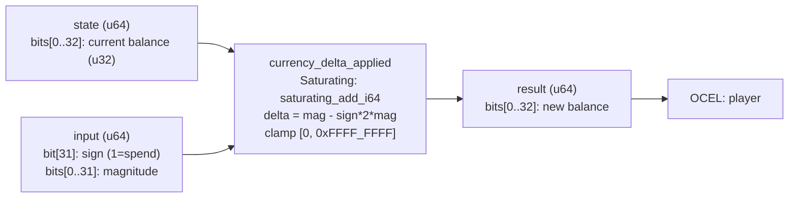

<!-- SCAFFOLDED BY ggen — fill in Context/Forces/Solution/Consequences below, then commit. -->
<!-- Source: ggen/schema/patterns.ttl (currency_delta_applied). Re-scaffold: `ggen sync`. -->

# Pattern: CurrencyDeltaApplied

> **Family:** Economy / Progression · **Kernel:** `currency_delta_applied` · **Lowering:** `Saturating` · **Id:** 31

Apply a signed currency delta (earn or spend) to a balance with a floor of 0 and a ceiling of 0xFFFF_FFFF.

---

## Context

Economy systems in RPGs and strategy games apply signed deltas to player balances: earning gold from a kill, spending mana on a spell, collecting coins from a chest. Without saturating arithmetic, a spend larger than the current balance wraps the u32 lane to a value near 0xFFFF_FFFF — an economy-breaking integer underflow that lets players "buy" items they cannot afford. Similarly, uncapped earning overflows the representation. The check-then-act pattern (`if balance >= cost`) introduces a conditional branch on every transaction, contributing to misprediction jitter in tight game loops that process many economy events per frame.

## Forces

- **Branch misprediction** — a naïve `if balance >= cost` conditional branches on every spend, adding misprediction jitter to the economy hot path.
- **Deterministic latency** — the Saturating lowering resolves the earn/spend in O(1) via `saturating_add_i64`, with no branch regardless of floor or ceiling proximity.
- **Integer underflow** — spending more than the balance must clamp to 0, not wrap; wraparound would produce a near-maximum balance, silently corrupting economy invariants.
- **Integer overflow** — earning past the u32 ceiling must saturate at 0xFFFF_FFFF; an unguarded add would truncate silently.
- **Branchless sign selection** — the signed delta is computed as `magnitude - sign_bit * 2 * magnitude`, turning the earn/spend distinction into arithmetic rather than a branch.
- **OCEL auditability** — OCEL event code 93 ties every balance mutation to an auditable `player` object trace.

## Solution

The kernel packs state as bits[0..32] = current balance (u32) and input as bits[0..32] with bit[31] as the sign flag (1 = spend) and bits[0..31] as the magnitude. The signed delta is assembled branchlessly: `delta = magnitude - sign_bit * 2 * magnitude`, which is +magnitude for earn and -magnitude for spend without any conditional. `saturating_add_i64` absorbs both the underflow and the overflow in a single operation; the result is then clamped to `[0, 0xFFFF_FFFF]` with `.max(0).min(0xFFFF_FFFF)`. The `Saturating` lowering is the right choice because the core invariant is "balance stays in a closed integer interval under any signed delta" — exactly what saturating arithmetic guarantees in O(1).

## Consequences

**Gains:** economy-breaking underflow and overflow are structurally impossible; every balance mutation takes constant time regardless of the sign or magnitude of the delta; the OCEL event 93 provides a per-player transaction audit trail. **Costs:** the balance is bounded to a u32 range; callers needing higher precision must widen the state field. **Compositions:** this pattern is downstream of [PurchaseAdmitted](purchase_admitted.md) — a confirmed purchase triggers a spend delta — and upstream of [InventoryItemChanged](inventory_item_changed.md) when a purchase also places an item. [XpThresholdCrossed](xp_threshold_crossed.md) uses the same earn-and-saturate idiom for XP accumulation.

---

## Structure Diagram



---

## Evidence Model

| Field | Value |
|---|---|
| OCEL activity | `CurrencyDeltaApplied` |
| Event code | `93` |
| OTEL span | `93` |
| Object kinds | `player` |
| Required status | `4` |
| Refusal status | `7` |
| Authority | oracle predicate: matches currency_delta_applied_reference for all inputs |

---

## Metadata

| Field | Value |
|---|---|
| Pattern id | 31 |
| Family | Economy / Progression |
| Lowering | `Saturating` |
| State cardinality | 64 |
| Primitive | `bcinr_logic::int::saturating_add_i64` |
| Kernel signature | `currency_delta_applied(state: u64, input: u64) -> u64` |
| Source kernel | `src/patterns/currency_delta_applied.rs` |

---

## How to Use

```rust
use wasm4games::patterns::currency_delta_applied;

// Pack state and input into u64 fields as documented in the kernel source.
let result = currency_delta_applied(state, input);
```

The kernel is a pure `fn(u64, u64) -> u64` — no side effects, no allocation, no branches.
Pair with the evidence layer to emit OCEL events, OTEL spans, and receipt folds:

```rust
use wasm4games::evidence::{ocel::OcelEvent, otel};

let result = currency_delta_applied(state, input);
otel::emit(93);
let ev = OcelEvent::new(93, logical_tick, admission_status);
```

---

## Related Patterns

- [XpThresholdCrossed](xp_threshold_crossed.md) — XP accumulation uses the same earn-and-saturate pattern before checking the level threshold.
- [InventoryItemChanged](inventory_item_changed.md) — purchases spend currency and place items; these two kernels compose in sequence.
- [PurchaseAdmitted](purchase_admitted.md) — the purchase FSM reaches PAID before the currency delta fires.
- [LevelGateEvaluated](level_gate_evaluated.md) — level gates may restrict which items a player can spend currency on.
