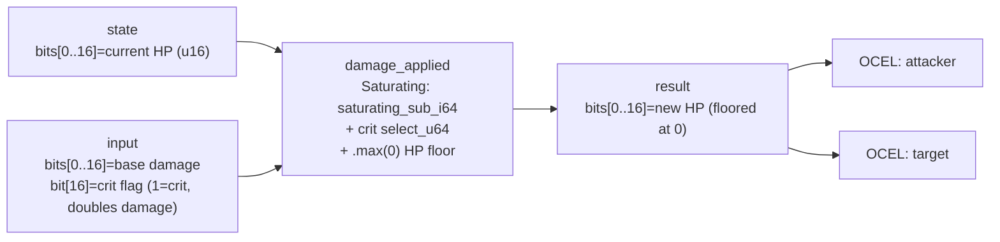

<!-- SCAFFOLDED BY ggen — fill in Context/Forces/Solution/Consequences below, then commit. -->
<!-- Source: ggen/schema/patterns.ttl (damage_applied). Re-scaffold: `ggen sync`. -->

# Pattern: DamageApplied

> **Family:** Core Sim & Combat · **Kernel:** `damage_applied` · **Lowering:** `Saturating` · **Id:** 14

Apply branchless saturating damage with crit select and an HP floor.

---

## Context

Every hit in a game subtracts damage from a target's HP, with optional critical-hit mechanics that double the damage when a crit flag is set. The naïve implementation branches on the crit flag (`if crit { dmg * 2 } else { dmg }`), then branches again to clamp the result to zero (`if new_hp < 0 { 0 } else { new_hp }`). In a combat frame where hundreds of projectiles and area-of-effect attacks hit entities simultaneously, those two branches per hit mispredict whenever the crit rate or overkill rate is statistically significant. Worse, omitting the HP floor (e.g., forgetting the clamp) allows HP to underflow into a huge u16 value, causing a dead entity to appear to have full health — a silent correctness bug. This pattern resolves both problems with saturating subtraction and a branchless crit select.

## Forces

- **Branch misprediction:** The crit-flag branch mispredicts at roughly the crit rate (e.g., 20% mispredicts in a 20% crit scenario); the HP-floor branch mispredicts on overkill hits; in a boss fight with hundreds of hits per second both branches compound.
- **Deterministic latency:** The Saturating lowering composes `select_u64` (for crit doubling) with `saturating_sub_i64` (for HP reduction) and `.max(0)` (for the floor), all executing in fixed time regardless of whether a crit fired or overkill occurred.
- **HP underflow:** Without the floor, a hit that exceeds current HP produces a negative i64 which, when masked to u16, appears as a large positive number — a dead entity reads as nearly full health. Saturating subtraction alone does not fix this because the floor must be applied after the signed subtraction, not before.
- **Crit fairness and side-channel resistance:** Computing crit damage via `wrapping_sub` mask + `select_u64` means the execution path is identical whether crit fires or not — preventing timing-based crit detection in adversarial multiplayer contexts.
- **OCEL auditability:** Event code `66` ties every damage event to both the `attacker` and `target` objects in the OCEL trace, recording the pre-hit HP, damage amount, crit flag, and post-hit HP for replay and balance analysis.

## Solution

The kernel unpacks the current HP from bits[0..16] of `state`, the base damage from bits[0..16] of `input`, and the crit flag from bit[16] of `input`. It computes a crit mask as `0u64.wrapping_sub((input >> 16) & 1)` — producing `0xFFFFFFFFFFFFFFFF` if crit is set, `0x00` otherwise — and uses `select_u64(crit_mask, dmg * 2, dmg)` to choose the effective damage without branching. It then applies `saturating_sub_i64(hp, dmg_eff)` to prevent underflow below `i64::MIN`, and `.max(0)` to floor the result at zero before masking to bits[0..16]. The Saturating lowering was the right choice because the problem is numeric: a subtraction with a mandatory floor — the crit select is a value-level multiplexer that naturally composes with the saturating primitive.

**Branchless primitive:** `bcinr_logic::int::saturating_sub_i64`

## Consequences

**Gains:** Damage computation executes in ~1 ns for all HP, damage, and crit values including overkill cases. The crit path is side-channel resistant — execution time is identical whether crit fires or not. The HP floor is enforced unconditionally, preventing the underflow-to-near-max-HP bug. Both attacker and target are recorded in the OCEL trace via event code `66`.

**Costs:** HP is limited to 16 bits (`[0, 65 535]`); bosses with more than 65 535 HP require a wider ABI. Base damage is similarly limited to 16 bits, so crit damage is capped at 131 070 — sufficient for most designs but not all. The crit flag is a single bit; partial-crit (e.g., 1.5×) requires a different lowering. Callers must explicitly pack HP into `state` and damage + crit into `input` before each call.

**Composes naturally with:** `entity_state_transitioned` (when the result HP is 0, the caller sends a `kill` event; if HP > 0, a `hit` event), `aabb_collision_resolved` (collision precedes damage — the collision result triggers this kernel), `status_effect_ticked` (damage can apply a status effect bit via the bitset kernel after the HP reduction).

---

## Structure Diagram



---

## Evidence Model

| Field | Value |
|---|---|
| OCEL activity | `DamageApplied` |
| Event code | `66` |
| OTEL span | `66` |
| Object kinds | `attacker`, `target` |
| Required status | `4` |
| Refusal status | `7` |
| Authority | oracle predicate: matches damage_applied_reference for all inputs |

---

## Metadata

| Field | Value |
|---|---|
| Pattern id | 14 |
| Family | Core Sim & Combat |
| Lowering | `Saturating` |
| State cardinality | 16 |
| Primitive | `bcinr_logic::int::saturating_sub_i64` |
| Kernel signature | `damage_applied(state: u64, input: u64) -> u64` |
| Source kernel | `src/patterns/damage_applied.rs` |

---

## How to Use

```rust
use wasm4games::patterns::damage_applied;

// Pack state and input into u64 fields as documented in the kernel source.
let result = damage_applied(state, input);
```

The kernel is a pure `fn(u64, u64) -> u64` — no side effects, no allocation, no branches.
Pair with the evidence layer to emit OCEL events, OTEL spans, and receipt folds:

```rust
use wasm4games::evidence::{ocel::OcelEvent, otel};

let result = damage_applied(state, input);
otel::emit(66);
let ev = OcelEvent::new(66, logical_tick, admission_status);
```

---

## Related Patterns

- [EntityStateTransitioned](entity_state_transitioned.md) — the new HP from this kernel determines the event symbol for the lifecycle DFA: `kill` (sym=3) when HP reaches 0, `hit` (sym=1) otherwise.
- [AabbCollisionResolved](aabb_collision_resolved.md) — collision detection precedes damage application; a positive collision result triggers this kernel with the attacker's damage payload.
- [StatusEffectTicked](status_effect_ticked.md) — after damage reduces HP, a status effect (poison, burn) can be applied by calling `status_effect_ticked` with the set-bit input encoding the effect slot.
