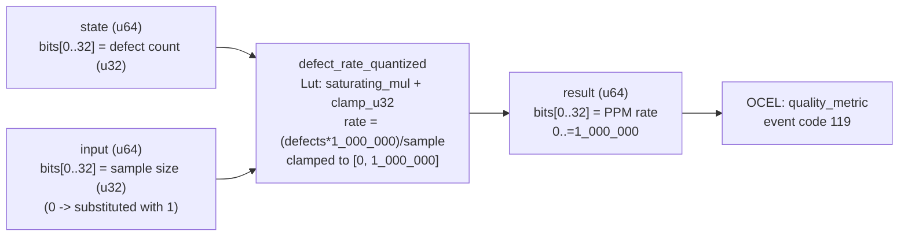

<!-- SCAFFOLDED BY ggen — fill in Context/Forces/Solution/Consequences below, then commit. -->
<!-- Source: ggen/schema/patterns.ttl (defect_rate_quantized). Re-scaffold: `ggen sync`. -->

# Pattern: DefectRateQuantized

> **Family:** DfLSS / Quality · **Kernel:** `defect_rate_quantized` · **Lowering:** `Lut` · **Id:** 57

Clamp a measured defect rate (parts per million) to [0, 1_000_000] for normalization.

---

## Context

Game telemetry pipelines collect raw defect counts and sample sizes per monitoring window. When the sample size is very small (e.g., a single observed event), the computed rate `(defects * 1_000_000) / sample` can explode far above 1,000,000 PPM — a physically meaningless value that corrupts sigma level and NPS score calculations downstream. In addition, a sample size of zero causes a division-by-zero fault, which a branchless check must absorb without halting the monitoring loop. Without this normalization kernel, upstream noise propagates through the quality pipeline as garbage-in, garbage-out.

## Forces

- **Branch misprediction** — a naïve `if rate > 1_000_000 { clamp }` guard on a hot monitoring path adds jitter whenever the defect spike occurs.
- **Deterministic latency** — the Lut lowering via `clamp_u32` gives O(1) constant time regardless of whether clamping is needed.
- **Division-by-zero safety** — sample size zero must be handled branchlessly; the kernel substitutes 1 via a bitwise zero-detect mask (`(sample == 0) as u64).wrapping_neg()`) without branching.
- **PPM ceiling invariant** — result must always be in [0, 1_000_000] for the sigma level LUT thresholds to remain valid.
- **OCEL auditability** — OCEL event code 119 ties each quantization to an object trace on `quality_metric`.

## Solution

The kernel packs `state` bits[0..32] as the raw defect count (u32) and `input` bits[0..32] as the sample size (u32). Sample size zero is substituted with 1 branchlessly: `let is_zero = ((raw_sample == 0) as u64).wrapping_neg()` produces an all-ones mask when zero, and `raw_sample | (is_zero & 1)` replaces zero with one without a branch. The rate is then `(defects * 1_000_000) / sample`, saturated via `saturating_mul` to prevent u64 overflow, and then `clamp_u32` enforces the [0, 1_000_000] ceiling. The result occupies bits[0..32] of the return u64. This is the Lut lowering: a fixed arithmetic transform that maps any (defects, sample) pair to a normalized PPM value in one pipeline pass.

**Branchless primitive:** `bcinr_logic::fix::clamp_u32`

## Consequences

**Gains:** The [0, 1_000_000] invariant on the output is unconditionally guaranteed, so downstream sigma level and NPS computations can trust the input range without their own guards. Division-by-zero is absorbed silently, preserving the monitoring loop's liveness. Constant-time execution eliminates jitter spikes on defect bursts.

**Costs:** The bit-field ABI is fixed — defect count in state bits[0..32], sample size in input bits[0..32]. Saturating multiplication loses precision for astronomically large defect counts (over ~4 billion per sample), but this is outside the PPM domain.

**Compositions:** The quantized PPM output feeds `sigma_level_computed` directly. It also feeds `ctq_threshold_evaluated` as the measured value against CTQ spec limits, and contributes to `nps_score_bounded` quality calculations.

---

## Structure Diagram



---

## Evidence Model

| Field | Value |
|---|---|
| OCEL activity | `DefectRateQuantized` |
| Event code | `119` |
| OTEL span | `119` |
| Object kinds | `quality_metric` |
| Required status | `4` |
| Refusal status | `7` |
| Authority | oracle predicate: matches defect_rate_quantized_reference for all inputs |

---

## Metadata

| Field | Value |
|---|---|
| Pattern id | 57 |
| Family | DfLSS / Quality |
| Lowering | `Lut` |
| State cardinality | 8 |
| Primitive | `bcinr_logic::fix::clamp_u32` |
| Kernel signature | `defect_rate_quantized(state: u64, input: u64) -> u64` |
| Source kernel | `src/patterns/defect_rate_quantized.rs` |

---

## How to Use

```rust
use wasm4games::patterns::defect_rate_quantized;

// Pack state and input into u64 fields as documented in the kernel source.
let result = defect_rate_quantized(state, input);
```

The kernel is a pure `fn(u64, u64) -> u64` — no side effects, no allocation, no branches.
Pair with the evidence layer to emit OCEL events, OTEL spans, and receipt folds:

```rust
use wasm4games::evidence::{ocel::OcelEvent, otel};

let result = defect_rate_quantized(state, input);
otel::emit(119);
let ev = OcelEvent::new(119, logical_tick, admission_status);
```

---

## Related Patterns

- [SigmaLevelComputed](sigma_level_computed.md) — receives this kernel's PPM output as its DPMO input for sigma classification.
- [CtqThresholdEvaluated](ctq_threshold_evaluated.md) — CTQ failure rate is the defect rate after normalization against spec limits.
- [NpsScoreBounded](nps_score_bounded.md) — NPS score computation uses the bounded defect rate as a quality signal.
