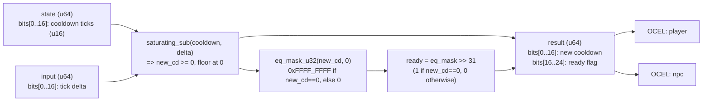

<!-- SCAFFOLDED BY ggen — fill in Context/Forces/Solution/Consequences below, then commit. -->
<!-- Source: ggen/schema/patterns.ttl (dialogue_cooldown_bounded). Re-scaffold: `ggen sync`. -->

# Pattern: DialogueCooldownBounded

> **Family:** Narrative / Dialogue · **Kernel:** `dialogue_cooldown_bounded` · **Lowering:** `Lut` · **Id:** 39

Decrement a dialogue cooldown counter by a tick delta, clamping to 0; return new cooldown and a ready flag.

---

## Context

NPCs in open-world and social games enforce cooldowns between dialogue interactions to prevent players from spamming conversation triggers. Each game tick, the cooldown counter is decremented by the elapsed tick delta; when it reaches zero the NPC is "ready" to talk again. Without saturating subtraction, a tick delta larger than the remaining cooldown wraps the u16 counter to a value near 65535 — meaning an NPC that should be immediately available instead shows a false cooldown of over a minute. Without branchless equality masking, the ready flag requires an `if new_cd == 0` conditional that mispredicts at the boundary tick.

## Forces

- **Branch misprediction** — a naïve `if new_cd == 0 { ready = true }` introduces a mispredictable branch at the cooldown-expiry tick.
- **Deterministic latency** — the Lut lowering (saturating subtraction + equality mask) resolves the countdown and ready flag in O(1) with no branch.
- **Integer underflow** — a tick delta larger than the remaining cooldown must saturate to 0 rather than wrapping to a near-maximum value; wraparound would produce a false cooldown delay of ~65535 ticks.
- **Ready flag derivation** — the ready flag must be exactly 1 when the new cooldown is 0, and 0 otherwise; `eq_mask_u32(new_cd, 0) >> 31` produces this branchlessly from the mask bit.
- **Already-expired cooldown** — if the cooldown is already 0 and a tick delta arrives, the result must remain 0 with ready=1; saturating subtraction handles this correctly.
- **OCEL auditability** — OCEL event code 101 ties every cooldown tick to an auditable `player`/`npc` object trace.

## Solution

The kernel packs state as bits[0..16] = current cooldown ticks and input as bits[0..16] = tick delta to subtract. `cooldown.saturating_sub(delta)` clamps the result to 0 when delta exceeds the cooldown, eliminating underflow in one instruction. The ready flag is computed as `eq_mask_u32(new_cd, 0) >> 31`: `eq_mask_u32` produces 0xFFFF_FFFF when `new_cd == 0` and 0 otherwise; shifting right by 31 extracts the top bit as a 0/1 ready flag. The result packs the new cooldown into bits[0..16] and the ready flag into bits[16..24]. The `Lut` lowering is used here because the equality-mask-to-flag derivation is a small lookup-style operation on a bounded value space rather than a pure arithmetic composition.

## Consequences

**Gains:** cooldown underflow is structurally impossible; the ready flag is derived branchlessly from the equality mask; an already-expired cooldown remains stable at 0 with ready=1 on every subsequent tick; OCEL event 101 provides per-tick audit for NPC availability. **Costs:** the cooldown is bounded to a 16-bit counter (max 65535 ticks); games needing longer cooldowns must widen the state field. **Compositions:** the ready flag from this pattern gates [NarrativeBranchSelected](narrative_branch_selected.md) — dialogue only proceeds when ready=1 — and composes with [DialogueNodeAdvanced](dialogue_node_advanced.md) which fires once the NPC becomes available. The same saturating-decrement-with-ready idiom appears in [NpsPromptGated](nps_prompt_gated.md).

---

## Structure Diagram



---

## Evidence Model

| Field | Value |
|---|---|
| OCEL activity | `DialogueCooldownBounded` |
| Event code | `101` |
| OTEL span | `101` |
| Object kinds | `player`, `npc` |
| Required status | `4` |
| Refusal status | `7` |
| Authority | oracle predicate: matches dialogue_cooldown_bounded_reference for all inputs |

---

## Metadata

| Field | Value |
|---|---|
| Pattern id | 39 |
| Family | Narrative / Dialogue |
| Lowering | `Lut` |
| State cardinality | 8 |
| Primitive | `bcinr_logic::mask::eq_mask_u32` |
| Kernel signature | `dialogue_cooldown_bounded(state: u64, input: u64) -> u64` |
| Source kernel | `src/patterns/dialogue_cooldown_bounded.rs` |

---

## How to Use

```rust
use wasm4games::patterns::dialogue_cooldown_bounded;

// Pack state and input into u64 fields as documented in the kernel source.
let result = dialogue_cooldown_bounded(state, input);
```

The kernel is a pure `fn(u64, u64) -> u64` — no side effects, no allocation, no branches.
Pair with the evidence layer to emit OCEL events, OTEL spans, and receipt folds:

```rust
use wasm4games::evidence::{ocel::OcelEvent, otel};

let result = dialogue_cooldown_bounded(state, input);
otel::emit(101);
let ev = OcelEvent::new(101, logical_tick, admission_status);
```

---

## Related Patterns

- [NarrativeBranchSelected](narrative_branch_selected.md) — dialogue branch selection is gated on the ready flag from this kernel.
- [DialogueNodeAdvanced](dialogue_node_advanced.md) — dialogue node advancement fires when the cooldown ready flag becomes 1.
- [NpsPromptGated](nps_prompt_gated.md) — NPS survey prompts use the same saturating-cooldown-with-ready-flag idiom.
