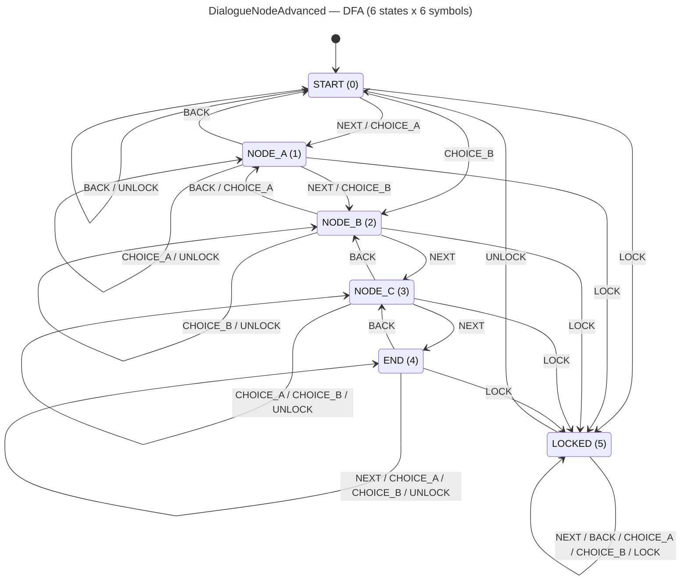

<!-- SCAFFOLDED BY ggen — fill in Context/Forces/Solution/Consequences below, then commit. -->
<!-- Source: ggen/schema/patterns.ttl (dialogue_node_advanced). Re-scaffold: `ggen sync`. -->

# Pattern: DialogueNodeAdvanced

> **Family:** Narrative / Dialogue · **Kernel:** `dialogue_node_advanced` · **Lowering:** `Dfa` · **Id:** 36

Advance a 6-state linear dialogue tree FSM via branchless DFA table lookup.

---

## Context

Branching dialogue trees in RPGs track conversation state through a sequence of nodes and choices: START, a series of content nodes (NODE_A through NODE_C), an END state, and a LOCKED state for conversations that have been administratively suspended. Players navigate with NEXT, BACK, and CHOICE_A/CHOICE_B symbols; a LOCK symbol suspends the conversation and UNLOCK resumes it. Without a DFA, this is managed with nested match arms — one per (state, symbol) pair — adding 36 branches in aggregate across the state/symbol space. The LOCKED state requires careful handling: every symbol except UNLOCK must stay in LOCKED, and coding this correctly in a match is error-prone under refactoring.

## Forces

- **Branch misprediction** — a 6×6 `match (state, symbol)` adds up to 36 branches; even a simplified version mispredicts at node boundaries.
- **Deterministic latency** — the Dfa lowering resolves any transition in O(1) via `DIALOGUE_TABLE[state * 6 + symbol]`, with no branch.
- **LOCKED absorbing trap** — the LOCKED state must absorb all symbols except UNLOCK; this invariant is structurally enforced by the table row, not by call-site logic.
- **Bidirectional navigation** — BACK must correctly retrace the conversation path (NODE_B -> NODE_A, NODE_C -> NODE_B, END -> NODE_C), which is non-trivial to get right in a match without a table.
- **Invalid state tolerance** — states > 5 are clamped to the table range; OOB states must not index outside the 36-entry table.
- **OCEL auditability** — OCEL event code 98 ties every dialogue advance to an auditable `npc`/`player` object trace, supporting narrative replay and QA.

## Solution

The kernel packs state as bits[0..8] = current dialogue state (0=START, 1=NODE_A, 2=NODE_B, 3=NODE_C, 4=END, 5=LOCKED) and input as bits[0..8] = symbol (0=NEXT, 1=BACK, 2=CHOICE_A, 3=CHOICE_B, 4=LOCK, 5=UNLOCK). The 6×6 transition table (`DIALOGUE_TABLE`, 36 entries) encodes all legal transitions. Key structural facts from the table: START and NODE_A/NODE_B/NODE_C all transition to LOCKED on LOCK; LOCKED absorbs all symbols except UNLOCK, which returns to START; END is a soft sink (NEXT and CHOICE_A/B stay in END; BACK returns to NODE_C; LOCK goes to LOCKED). `dfa_advance` performs the table lookup with state clamped to `[0, 5]`. The `Dfa` lowering is correct because the dialogue tree is a formal FSM with all transitions enumerable in a 6×6 table.

## Consequences

**Gains:** LOCKED absorbing behavior is structurally guaranteed by the table row; BACK navigation is correctly encoded without special-casing; all 36 transitions are auditable in a single data structure; OCEL event 98 provides a per-advance narrative trace. **Costs:** adding a new dialogue node requires widening the state vocabulary and regenerating the 36+-entry table. **Compositions:** dialogue advancement is triggered by [QuestStepAdvanced](quest_step_advanced.md) reaching Done; [ConditionFlagEvaluated](condition_flag_evaluated.md) gates which symbols are offered to the player; [ChoiceWeightSelected](choice_weight_selected.md) drives the CHOICE_A/CHOICE_B symbols probabilistically.

---

## Structure Diagram



---

## Evidence Model

| Field | Value |
|---|---|
| OCEL activity | `DialogueNodeAdvanced` |
| Event code | `98` |
| OTEL span | `98` |
| Object kinds | `npc`, `player` |
| Required status | `4` |
| Refusal status | `7` |
| Authority | oracle predicate: matches dialogue_node_advanced_reference for all inputs |

---

## Metadata

| Field | Value |
|---|---|
| Pattern id | 36 |
| Family | Narrative / Dialogue |
| Lowering | `Dfa` |
| State cardinality | 5 |
| Primitive | `bcinr_logic::dfa::dfa_advance` |
| Kernel signature | `dialogue_node_advanced(state: u64, input: u64) -> u64` |
| Source kernel | `src/patterns/dialogue_node_advanced.rs` |

---

## How to Use

```rust
use wasm4games::patterns::dialogue_node_advanced;

// Pack state and input into u64 fields as documented in the kernel source.
let result = dialogue_node_advanced(state, input);
```

The kernel is a pure `fn(u64, u64) -> u64` — no side effects, no allocation, no branches.
Pair with the evidence layer to emit OCEL events, OTEL spans, and receipt folds:

```rust
use wasm4games::evidence::{ocel::OcelEvent, otel};

let result = dialogue_node_advanced(state, input);
otel::emit(98);
let ev = OcelEvent::new(98, logical_tick, admission_status);
```

---

## Related Patterns

- [QuestStepAdvanced](quest_step_advanced.md) — quest completion in the Done state is the canonical trigger for advancing the dialogue FSM.
- [ConditionFlagEvaluated](condition_flag_evaluated.md) — narrative condition flags gate which CHOICE symbols the player is offered.
- [ChoiceWeightSelected](choice_weight_selected.md) — weighted random choice selection drives the CHOICE_A/CHOICE_B symbol to feed into this kernel.
