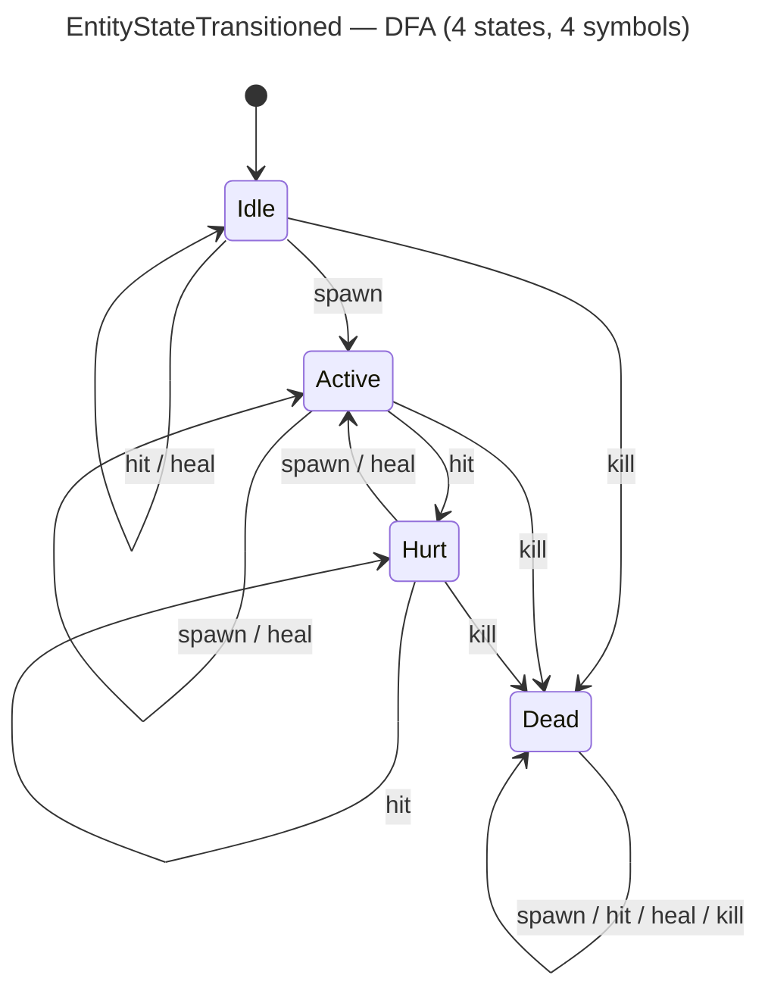

<!-- SCAFFOLDED BY ggen — fill in Context/Forces/Solution/Consequences below, then commit. -->
<!-- Source: ggen/schema/patterns.ttl (entity_state_transitioned). Re-scaffold: `ggen sync`. -->

# Pattern: EntityStateTransitioned

> **Family:** Core Sim & Combat · **Kernel:** `entity_state_transitioned` · **Lowering:** `Dfa` · **Id:** 3

Advance an entity lifecycle DFA one transition over a flat table.

---

## Context

Every active entity in a game — player characters, enemies, projectiles — moves through a well-defined lifecycle: spawned into an Idle state, activated by a spawn event, hurt by hits, healed back to Active, and finally killed into a terminal Dead state. Without a formal DFA, game code typically expresses this as nested if-else or a match on current state followed by a match on the event symbol, producing a combinatorial branch tree that mispredicts whenever a burst of hits or heals fires in rapid succession. The Dead state is especially dangerous: it must be absorbing (all further events must leave it unchanged), but a misimplemented transition can resurrect a dead entity or corrupt its HP if the wrong branch fires. This pattern encodes the full 4×4 lifecycle transition table in a flat array and advances it with a single branchless table read.

## Forces

- **Branch misprediction:** A nested match on (state, event) generates a branch for each of the 16 state-symbol combinations; combat bursts that exercise multiple paths per frame generate repeated mispredicts at exactly the moment when many entities are transitioning simultaneously.
- **Deterministic latency:** The Dfa lowering uses `dfa_advance` — a single multiply-and-index into a flat `[usize; 16]` table — giving strict O(1) time for all (state, symbol) pairs including the absorbing Dead state.
- **Absorbing Dead state:** Dead entities must never re-enter a live state regardless of what events arrive; the flat table enforces this structurally (row 3 is all 3s) so no runtime check is needed.
- **State and symbol clamping:** Untrusted `state` and `input` bytes could index out of the 4×4 table; both are masked to 2 bits (`& 0x3`) branchlessly before the read, keeping the index provably in-bounds for all u64 inputs.
- **OCEL auditability:** Event code `16` ties every transition to the `entity` object, so an OCEL trace shows the exact (prior state, event, next state) triple for every entity on every tick, enabling post-hoc replay and anomaly detection.

## Solution

The kernel maintains the entity lifecycle as a 4-state DFA with 4 input symbols. State 0 is Idle, 1 is Active, 2 is Hurt, and 3 is Dead. The alphabet is: 0=spawn, 1=hit, 2=heal, 3=kill. The transition table `TABLE: [usize; 16]` is laid out row-major (state × alphabet), so the next state for (state `s`, symbol `sym`) is `TABLE[s * 4 + sym]`. The kernel extracts the current state from bits[0..2] of `state` and the event symbol from bits[0..2] of `input` (both masked with `& 0x3`), delegates to `dfa_advance(st, sym, &TABLE, ALPHABET)`, and returns the next state in bits[0..8]. The DFA lowering was the right choice because the problem is exactly a finite-state machine with a fixed small alphabet — the table encodes all safety constraints (Dead is absorbing, Idle cannot be hit) as data rather than code, and the single index operation replaces the entire branch tree.

**Branchless primitive:** `bcinr_logic::dfa::dfa_advance`

## Consequences

**Gains:** All 16 (state, symbol) transitions execute in identical time — no branch, no special-case for Dead. Adding a new transition rule requires only editing a table entry, not restructuring conditional logic. The absorbing Dead invariant is guaranteed by construction: row 3 of TABLE is `[3, 3, 3, 3]`, and no runtime code can override it. Each transition is OCEL-traced via event code `16` on the `entity` object.

**Costs:** The state space is bounded to 4 states and 4 symbols; extending to more states or symbols requires regenerating the table and updating all callers that pack/unpack the bit-field ABI. The kernel advances exactly one step per call — multi-step event sequences must call it multiple times. State and symbol values above 3 are silently clamped to 3 (Dead / kill), which may confuse callers passing raw untrusted u64 values without pre-masking.

**Composes naturally with:** `damage_applied` (a hit event follows damage computation — the damage result informs whether to send `hit` or `kill`), `status_effect_ticked` (status effects can generate `hit` or `heal` events each tick), and `input_admitted` (admitted player inputs map to `spawn` events that drive Idle → Active).

---

## Structure Diagram



---

## Evidence Model

| Field | Value |
|---|---|
| OCEL activity | `EntityStateTransitioned` |
| Event code | `16` |
| OTEL span | `16` |
| Object kinds | `entity` |
| Required status | `4` |
| Refusal status | `7` |
| Authority | oracle predicate: matches entity_state_transitioned_reference for all inputs |

---

## Metadata

| Field | Value |
|---|---|
| Pattern id | 3 |
| Family | Core Sim & Combat |
| Lowering | `Dfa` |
| State cardinality | 4 |
| Primitive | `bcinr_logic::dfa::dfa_advance` |
| Kernel signature | `entity_state_transitioned(state: u64, input: u64) -> u64` |
| Source kernel | `src/patterns/entity_state_transitioned.rs` |

---

## How to Use

```rust
use wasm4games::patterns::entity_state_transitioned;

// Pack state and input into u64 fields as documented in the kernel source.
let result = entity_state_transitioned(state, input);
```

The kernel is a pure `fn(u64, u64) -> u64` — no side effects, no allocation, no branches.
Pair with the evidence layer to emit OCEL events, OTEL spans, and receipt folds:

```rust
use wasm4games::evidence::{ocel::OcelEvent, otel};

let result = entity_state_transitioned(state, input);
otel::emit(16);
let ev = OcelEvent::new(16, logical_tick, admission_status);
```

---

## Related Patterns

- [DamageApplied](damage_applied.md) — damage computation precedes the lifecycle transition; the damage result determines whether the event symbol is `hit` (HP > 0) or `kill` (HP = 0).
- [StatusEffectTicked](status_effect_ticked.md) — active status effects (poison, burn) generate `hit` events each tick that feed into this kernel, and a heal effect generates a `heal` event.
- [InputAdmitted](input_admitted.md) — admitted player input bytes map to `spawn` event symbols that drive the Idle → Active transition for player-controlled entities.
- [ObjectSpawned](object_spawned.md) — a newly spawned object starts in Idle (state 0); the first `spawn` event through this kernel drives it to Active (state 1).
