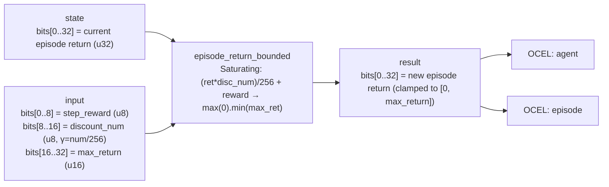

<!-- SCAFFOLDED BY ggen — fill in Context/Forces/Solution/Consequences below, then commit. -->
<!-- Source: ggen/schema/patterns.ttl (episode_return_bounded). Re-scaffold: `ggen sync`. -->

# Pattern: EpisodeReturnBounded

> **Family:** AI Agent / Benchmark · **Kernel:** `episode_return_bounded` · **Lowering:** `Saturating` · **Id:** 70

Accumulate episodic return with a fixed-point discount factor, clamped to [0, max_return].

---

## Context

Episodic return `G = Σ γ^t r_t` accumulates discounted rewards across all steps of an episode and is the primary training signal for value-function learning in RL. In fixed-point game implementations, the accumulator is a bounded integer; without an explicit ceiling clamp, many steps of positive reward push `G` above the u32 representable range, and the resulting wrap corrupts the value function target for all updates in that episode. The correction `if G > max_return { max_return }` is a branch that fires predictably only after the clamp engages — a branch that can be eliminated.

## Forces

- **Branch misprediction** — the ceiling check fires only after many positive-reward steps accumulate, so it is both rare and data-dependent; it triggers misprediction when it fires for the first time in a long winning episode.
- **Deterministic latency** — the Saturating lowering uses `saturating_add_i64` for the reward addition and `.max(0).min(max_ret)` for clamping, all O(1) arithmetic with no data-dependent control flow.
- **Fixed-point discount** — the discount factor γ is represented as `discount_num / 256` (a u8 numerator), enabling exact integer discount application with a single multiply-and-divide-by-256 — no floating-point required, no rounding branches.
- **Accumulator overflow** — without the ceiling clamp, a very large `old_return` multiplied by a near-1 discount and added to a positive reward can overflow even i64 before the clamp; `saturating_add_i64` prevents the intermediate overflow, and `.min(max_ret)` handles the logical ceiling.
- **OCEL auditability** — OCEL event code `132` ties each return accumulation step to both the `agent` and `episode` object traces, enabling per-episode return trajectory reconstruction.

## Solution

The kernel resolves the forces by computing discounted accumulation as pure saturating integer arithmetic. The packed-u64 ABI places the current episode return in `state` bits[0..32], the step reward in `input` bits[0..8], the discount numerator in bits[8..16] (discount = discount_num/256), and the max return in bits[16..32]. The discount is applied as `(ret * disc_num) / 256` — integer multiply then divide-by-256 shift, both O(1). The reward is added with `saturating_add_i64`, which prevents intermediate i64 overflow. The result is floored at 0 with `.max(0)` and ceilinged at `max_ret` with `.min(max_ret)`. The return value packs the new return in bits[0..32]. The Saturating lowering was chosen because episode return is fundamentally a clamped accumulator — saturation at the ceiling is the correct semantic, not wrap or panic.

**Branchless primitive:** `bcinr_logic::int::saturating_add_i64`

## Consequences

**Gains:** Every return accumulation step costs identical cycles regardless of whether the accumulator is near the ceiling or near zero. The fixed-point discount and saturating addition guarantee the result is always in `[0, max_return]` — a property the value function training can depend on. OCEL events `132` on both `agent` and `episode` objects enable per-episode return curve reconstruction. **Costs:** The discount factor is limited to `discount_num/256` granularity (u8 numerator), so exact γ values like 0.99 are approximated as 253/256 ≈ 0.98828. The max_return field is a u16, capping bounded returns at 65535. **Compositions:** This kernel accumulates the outputs of [RewardSignalClamped](reward_signal_clamped.md); the episode return it maintains is the training signal that shapes what [PolicyActionSelected](policy_action_selected.md) outputs after training.

---

## Structure Diagram



---

## Evidence Model

| Field | Value |
|---|---|
| OCEL activity | `EpisodeReturnBounded` |
| Event code | `132` |
| OTEL span | `132` |
| Object kinds | `agent`, `episode` |
| Required status | `4` |
| Refusal status | `7` |
| Authority | oracle predicate: matches episode_return_bounded_reference for all inputs |

---

## Metadata

| Field | Value |
|---|---|
| Pattern id | 70 |
| Family | AI Agent / Benchmark |
| Lowering | `Saturating` |
| State cardinality | 64 |
| Primitive | `bcinr_logic::int::saturating_add_i64` |
| Kernel signature | `episode_return_bounded(state: u64, input: u64) -> u64` |
| Source kernel | `src/patterns/episode_return_bounded.rs` |

---

## How to Use

```rust
use wasm4games::patterns::episode_return_bounded;

// Pack state and input into u64 fields as documented in the kernel source.
let result = episode_return_bounded(state, input);
```

The kernel is a pure `fn(u64, u64) -> u64` — no side effects, no allocation, no branches.
Pair with the evidence layer to emit OCEL events, OTEL spans, and receipt folds:

```rust
use wasm4games::evidence::{ocel::OcelEvent, otel};

let result = episode_return_bounded(state, input);
otel::emit(132);
let ev = OcelEvent::new(132, logical_tick, admission_status);
```

---

## Related Patterns

- [RewardSignalClamped](reward_signal_clamped.md) — each step reward fed into this accumulator should first be clamped here
- [PolicyActionSelected](policy_action_selected.md) — the trained policy that generated the actions whose rewards are accumulated here
- [ActionMaskApplied](action_mask_applied.md) — only legal actions generate rewards; illegal actions are masked before selection
