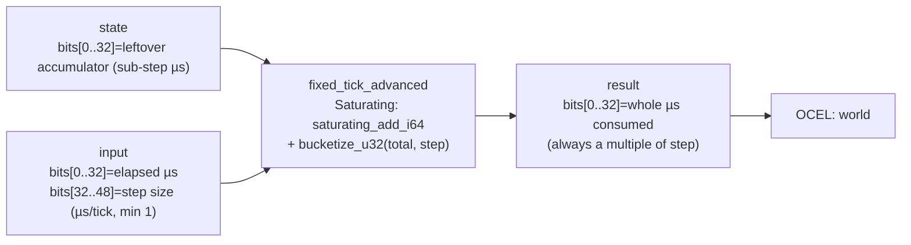

<!-- SCAFFOLDED BY ggen — fill in Context/Forces/Solution/Consequences below, then commit. -->
<!-- Source: ggen/schema/patterns.ttl (fixed_tick_advanced). Re-scaffold: `ggen sync`. -->

# Pattern: FixedTickAdvanced

> **Family:** Core Sim & Combat · **Kernel:** `fixed_tick_advanced` · **Lowering:** `Saturating` · **Id:** 2

Advance a fixed-step accumulator and emit whole ticks via bucketize.

---

## Context

Game simulations run on a fixed-timestep model: real-time delta (in microseconds) accumulates into an integer accumulator, and one simulation tick fires for each whole multiple of the configured step size that fits in the running total. The naïve implementation uses a `while accumulator >= tick_dt` loop, which branches on every frame. At 60 Hz with a 16 666 µs step, the branch is predictable most frames but mispredicts on the frame where the accumulator crosses the threshold — exactly the frame where timing accuracy matters most. Additionally, if the accumulator or elapsed delta overflows a 32-bit integer due to a long frame or debugger pause, a wrapping add silently corrupts the tick count. This pattern resolves both problems by saturating the addition and computing whole ticks with a branchless bucketize.

## Forces

- **Branch misprediction:** The standard `while accumulator >= step` loop branches every frame; on the frame where ticks fire, the predictor misses the loop exit, adding pipeline-flush latency at the exact moment frame work begins.
- **Deterministic latency:** The Saturating lowering composes `saturating_add_i64` with `bucketize_u32` to produce the tick count in O(1) time for all accumulator and elapsed values, including overflow cases.
- **Accumulator overflow:** Real-time elapsed deltas can spike to millions of microseconds during a debugger pause or system sleep; a wrapping add would produce a nonsensically large tick count and corrupt the simulation clock — saturating arithmetic caps the total at `0xFFFF_FFFF` µs instead.
- **Step size zero:** A step of zero would divide-by-zero in a naïve implementation; the kernel branchlessly coerces a zero step to `1` using `step | ((step == 0) as u64)`, so the result is always defined.
- **OCEL auditability:** Event code `1` ties every tick advance to the `world` object in the OCEL trace, giving replay tools a frame-by-frame record of how many ticks fired from each real-time delta.

## Solution

The kernel unpacks bits[0..32] of `state` as the leftover sub-step accumulator carried in from the previous frame, and bits[0..32] and [32..48] of `input` as elapsed microseconds and step size respectively. It coerces a zero step to `1` with a single bitwise OR, adds the elapsed delta to the accumulator with `saturating_add_i64` (capped at `i64::MAX` to prevent overflow), and passes the masked 32-bit total to `bucketize_u32(total, step)` which returns the largest multiple of `step` that does not exceed `total`. The result in bits[0..32] is the whole-micros consumed this advance — a multiple of `step` — not the new accumulator remainder; callers subtract the result from their accumulator to compute the carry-forward. Saturating arithmetic was the right lowering because the core invariant is a numeric floor (`total >= result >= 0`) rather than a state-machine transition or a table lookup.

**Branchless primitive:** `bcinr_logic::int::saturating_add_i64`

## Consequences

**Gains:** The tick count is computed in O(1) time with no loop, eliminating the loop-exit mispredict that plagues variable-step while-loop implementations. Saturating addition guarantees that even a 30-second pause does not corrupt the accumulator. The `bucketize_u32` snap-down enforces the invariant that the result is always a whole multiple of the step, which downstream tick consumers can rely on unconditionally.

**Costs:** Callers must pack and unpack the specific bit-field layout (accumulator in state, elapsed + step in input, whole ticks in result). The leftover remainder is not returned — callers must reconstruct it as `accumulator + elapsed - result`. Step sizes are bounded to 16 bits (`[0, 65535]` µs), which constrains the minimum tick rate to ~15 Hz at the 16-bit ceiling; sub-microsecond steps are not representable.

**Composes naturally with:** `input_admitted` (admitted inputs are processed once per tick fired), `entity_state_transitioned` (each emitted tick is the clock signal that drives entity lifecycle events), and `receipt_appended` (tick counts can be sealed into the receipt chain to anchor the simulation clock in the audit trail).

---

## Structure Diagram



---

## Evidence Model

| Field | Value |
|---|---|
| OCEL activity | `FixedTickAdvanced` |
| Event code | `1` |
| OTEL span | `1` |
| Object kinds | `world` |
| Required status | `4` |
| Refusal status | `7` |
| Authority | oracle predicate: matches fixed_tick_advanced_reference for all inputs |

---

## Metadata

| Field | Value |
|---|---|
| Pattern id | 2 |
| Family | Core Sim & Combat |
| Lowering | `Saturating` |
| State cardinality | 64 |
| Primitive | `bcinr_logic::int::saturating_add_i64` |
| Kernel signature | `fixed_tick_advanced(state: u64, input: u64) -> u64` |
| Source kernel | `src/patterns/fixed_tick_advanced.rs` |

---

## How to Use

```rust
use wasm4games::patterns::fixed_tick_advanced;

// Pack state and input into u64 fields as documented in the kernel source.
let result = fixed_tick_advanced(state, input);
```

The kernel is a pure `fn(u64, u64) -> u64` — no side effects, no allocation, no branches.
Pair with the evidence layer to emit OCEL events, OTEL spans, and receipt folds:

```rust
use wasm4games::evidence::{ocel::OcelEvent, otel};

let result = fixed_tick_advanced(state, input);
otel::emit(1);
let ev = OcelEvent::new(1, logical_tick, admission_status);
```

---

## Related Patterns

- [InputAdmitted](input_admitted.md) — admitted inputs are dispatched once per tick emitted by this kernel; the tick count from `fixed_tick_advanced` controls how many times `input_admitted` is called per real-time frame.
- [EntityStateTransitioned](entity_state_transitioned.md) — each tick fired by this kernel is the clock signal that drives entity lifecycle events; the entity DFA is advanced once per tick consumed.
- [ReceiptAppended](receipt_appended.md) — the tick word can be sealed into the rolling receipt chain on every advance, anchoring the simulation clock in the tamper-evident audit trail.
