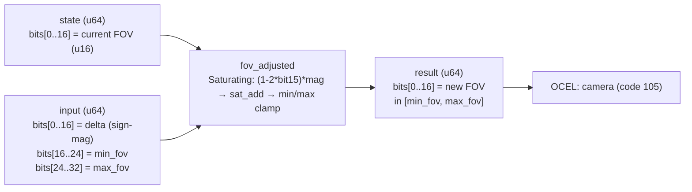

<!-- SCAFFOLDED BY ggen — fill in Context/Forces/Solution/Consequences below, then commit. -->
<!-- Source: ggen/schema/patterns.ttl (fov_adjusted). Re-scaffold: `ggen sync`. -->

# Pattern: FovAdjusted

> **Family:** Camera · **Kernel:** `fov_adjusted` · **Lowering:** `Saturating` · **Id:** 43

Adjust field-of-view by a signed delta, clamping to [min_fov, max_fov].

---

## Context

Camera FOV changes dynamically throughout gameplay — sprinting widens the FOV to convey speed, zooming into a scope narrows it, and screen-shake effects may briefly add or subtract a few degrees each frame. Each adjustment arrives as a signed delta to be applied to the current FOV. Without bounding the result, a large negative delta underflows to near-zero (extreme zoom that freezes the render pipeline) or a sequence of positive deltas exceeds 180°, inverting the perspective transform and producing a visually broken camera.

## Forces

- **Branch misprediction** — a naïve `if new_fov < min || new_fov > max` pair branches on every adjustment, producing variable latency that compounds during rapid FOV transitions (sprint-to-aim transitions, screen shake).
- **Deterministic latency** — the Saturating lowering uses `saturating_add_i64` + i64 `min`/`max`, giving O(1) fixed execution regardless of whether either clamp fires.
- **Sign-magnitude encoding** — the delta must be signed but the packed-u64 ABI only carries unsigned fields; the kernel encodes sign in bit15 of the 16-bit delta field and decodes it branchlessly via arithmetic shift and multiply (`(1 - 2*bit15) * mag`).
- **Two-sided bounding** — FOV has both a floor (prevent infinite zoom) and a ceiling (prevent perspective inversion); saturating arithmetic naturally enforces both without separate branch paths.
- **OCEL auditability** — event code 105 ties every FOV change to the `camera` object trace, enabling anticheat detection of impossible FOV values.

## Solution

**Branchless primitive:** `bcinr_logic::int::saturating_add_i64`

State bits[0..16] carry the current FOV as a u16 (e.g. in units of 0.1°, so 0..1800). Input bits[0..16] carry the delta in sign-magnitude encoding (bit15 = sign, bits[0..15] = magnitude); bits[16..24] carry `min_fov`; bits[24..32] carry `max_fov`. The sign is extracted by arithmetic shift (`raw_delta >> 15`) and the branchless sign flip `(1 - 2*bit15) * mag` converts to a signed i64 delta with no conditional. `saturating_add_i64(fov, delta)` adds without overflow, then `.max(min_fov).min(max_fov)` completes the two-sided clamp. The Saturating lowering was chosen because the adjustment is inherently signed-additive and the domain requires overflow protection at both the arithmetic and semantic levels.

## Consequences

**Gains:** FOV is provably in [min_fov, max_fov] after every call; sign handling is branch-free and constant-time; no floating-point is required. **Costs:** The sign-magnitude delta encoding places a maximum representable delta magnitude of 32767 (bit15 is the sign bit); both min_fov and max_fov are 8-bit fields (0..255 in the chosen unit), limiting the valid FOV range to one byte each. **Compositions:** The adjusted FOV feeds `camera_shake_applied` (shake offsets interact with the current FOV) and is bounded by the same two-sided clamp idiom as `camera_distance_clamped`.

---

## Structure Diagram



---

## Evidence Model

| Field | Value |
|---|---|
| OCEL activity | `FovAdjusted` |
| Event code | `105` |
| OTEL span | `105` |
| Object kinds | `camera` |
| Required status | `4` |
| Refusal status | `7` |
| Authority | oracle predicate: matches fov_adjusted_reference for all inputs |

---

## Metadata

| Field | Value |
|---|---|
| Pattern id | 43 |
| Family | Camera |
| Lowering | `Saturating` |
| State cardinality | 32 |
| Primitive | `bcinr_logic::int::saturating_add_i64` |
| Kernel signature | `fov_adjusted(state: u64, input: u64) -> u64` |
| Source kernel | `src/patterns/fov_adjusted.rs` |

---

## How to Use

```rust
use wasm4games::patterns::fov_adjusted;

// Pack state and input into u64 fields as documented in the kernel source.
let result = fov_adjusted(state, input);
```

The kernel is a pure `fn(u64, u64) -> u64` — no side effects, no allocation, no branches.
Pair with the evidence layer to emit OCEL events, OTEL spans, and receipt folds:

```rust
use wasm4games::evidence::{ocel::OcelEvent, otel};

let result = fov_adjusted(state, input);
otel::emit(105);
let ev = OcelEvent::new(105, logical_tick, admission_status);
```

---

## Related Patterns

- [CameraDistanceClamped](camera_distance_clamped.md) — both clamp a camera parameter to a [min, max] window; this pattern handles signed deltas where the distance pattern handles absolute values.
- [CameraShakeApplied](camera_shake_applied.md) — shake offsets can include a FOV component; the shake result may be composed with this kernel's output.
- [PhysicsValueRendered](physics_value_rendered.md) — applies the same saturating render-safe clamp idiom to physics-derived render quantities.
