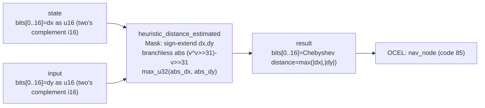

<!-- SCAFFOLDED BY ggen — fill in Context/Forces/Solution/Consequences below, then commit. -->
<!-- Source: ggen/schema/patterns.ttl (heuristic_distance_estimated). Re-scaffold: `ggen sync`. -->

# Pattern: HeuristicDistanceEstimated

> **Family:** Pathfinding · **Kernel:** `heuristic_distance_estimated` · **Lowering:** `Mask` · **Id:** 23

Branchless Chebyshev distance (max of |dx|, |dy|) for A* heuristic using signed i16 deltas.

---

## Context

A*'s heuristic function is called for every node placed on the open set, so it executes inside the innermost loop of pathfinding. On an 8-directional grid the optimal admissible heuristic is Chebyshev distance: `max(|dx|, |dy|)`. A naïve implementation branches twice — once for the absolute value of each signed delta and once for the max — producing six data-dependent branches per call. At high node counts on a wasm4 tick budget, those branches accumulate enough mispredict penalty to spill the frame. The Mask lowering replaces both abs operations with branchless arithmetic-shift-right idioms and the max with `max_u32`, making the heuristic cost independent of the sign or relative size of the deltas.

## Forces

- **Branch misprediction** — abs and max both branch on the sign/comparison of their inputs; on an 8-directional grid the signs of dx and dy vary unpredictably with node position, so the CPU cannot learn a static prediction.
- **Admissibility** — the heuristic must never overestimate the true cost; Chebyshev distance is tight for 8-directional movement and must be computed exactly to preserve A* optimality.
- **Signed delta domain** — grid coordinates are stored as i16 (range −32768..32767), so the deltas can be negative; the kernel must sign-extend and rectify before taking the max.
- **Deterministic latency** — the Mask lowering gives O(1) constant time: two branchless abs operations followed by one `max_u32`, totalling ~3 arithmetic instructions.
- **OCEL auditability** — event code 85 ties each heuristic evaluation to the `nav_node` object, making the h-cost for every expanded node traceable in the OCEL log.

## Solution

The kernel accepts `state` packed as `bits[0..16] = dx as u16 (two's complement i16)` and `input` packed as `bits[0..16] = dy as u16 (two's complement i16)`. It returns `bits[0..16] = Chebyshev distance = max(|dx|, |dy|)`. Each 16-bit raw value is sign-extended to i32 by left-shifting 16 then arithmetic-right-shifting 16 (`(v << 16) >> 16`); the branchless absolute value is then `(v ^ (v >> 31)).wrapping_sub(v >> 31)`, which is the standard arithmetic-shift-right idiom that avoids any conditional. Finally, `max_u32(abs_dx, abs_dy)` selects the larger magnitude using a mask comparison. The Mask lowering is appropriate because both abs and max are binary conditional selections — the exact problem class the mask primitives were designed for.

**Branchless primitive:** `bcinr_logic::mask::max_u32`

## Consequences

**Gains:** O(1) latency regardless of sign or relative magnitude of dx and dy; admissibility is structurally preserved because the computation is exact; no allocation and no side effects make the kernel safe to call inside the innermost pathfinding loop; the OCEL trail at event code 85 logs the h-cost for each `nav_node` without overhead. **Costs:** the delta domain is bounded to i16 (max map radius of 32767 cells in either axis); the result is a 16-bit Chebyshev distance, so maps larger than 65535 cells across require redesigning the packing. **Natural compositions:** the h-cost produced here is combined with the g-cost to form f-cost, which `path_node_expanded` then compares; `waypoint_reached` uses the same distance domain for arrival checking; `path_cost_bounded` bounds the combined f-cost against the route budget.

---

## Structure Diagram



---

## Evidence Model

| Field | Value |
|---|---|
| OCEL activity | `HeuristicDistanceEstimated` |
| Event code | `85` |
| OTEL span | `85` |
| Object kinds | `nav_node` |
| Required status | `4` |
| Refusal status | `7` |
| Authority | oracle predicate: matches heuristic_distance_estimated_reference for all inputs |

---

## Metadata

| Field | Value |
|---|---|
| Pattern id | 23 |
| Family | Pathfinding |
| Lowering | `Mask` |
| State cardinality | 2 |
| Primitive | `bcinr_logic::mask::max_u32` |
| Kernel signature | `heuristic_distance_estimated(state: u64, input: u64) -> u64` |
| Source kernel | `src/patterns/heuristic_distance_estimated.rs` |

---

## How to Use

```rust
use wasm4games::patterns::heuristic_distance_estimated;

// Pack state and input into u64 fields as documented in the kernel source.
let result = heuristic_distance_estimated(state, input);
```

The kernel is a pure `fn(u64, u64) -> u64` — no side effects, no allocation, no branches.
Pair with the evidence layer to emit OCEL events, OTEL spans, and receipt folds:

```rust
use wasm4games::evidence::{ocel::OcelEvent, otel};

let result = heuristic_distance_estimated(state, input);
otel::emit(85);
let ev = OcelEvent::new(85, logical_tick, admission_status);
```

---

## Related Patterns

- [path_node_expanded](path_node_expanded.md) — the h-cost this kernel produces combines with g-cost to form the f-cost compared during node expansion
- [waypoint_reached](waypoint_reached.md) — both patterns operate in the same grid-distance domain; waypoint tolerance is expressed in the same fixed-point units
- [path_cost_bounded](path_cost_bounded.md) — the f-cost formed by adding h-cost to g-cost is subsequently clamped by the path budget
