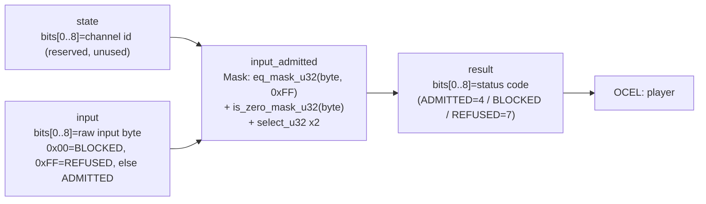

<!-- SCAFFOLDED BY ggen — fill in Context/Forces/Solution/Consequences below, then commit. -->
<!-- Source: ggen/schema/patterns.ttl (input_admitted). Re-scaffold: `ggen sync`. -->

# Pattern: InputAdmitted

> **Family:** Core Sim & Combat · **Kernel:** `input_admitted` · **Lowering:** `Mask` · **Id:** 1

Map a raw input byte to an admission status code via a branchless eq-mask classifier.

---

## Context

Every frame a game loop receives raw controller or keyboard bytes from a platform API before dispatching them into the simulation. Two special values in the byte range are structurally dangerous: `0x00` is a no-op placeholder that must not drive state changes, and `0xFF` is the reserved sentinel used as an out-of-band reset signal that, if admitted, could inject a spurious state-machine transition. Without a branchless gate at the boundary, a naïve `if byte == 0xFF` conditional introduces a mispredicted branch on every frame that processes an ordinary input byte — adding unpredictable latency to the tightest point in the game loop. This pattern classifies every incoming byte into one of three statuses — ADMITTED, BLOCKED, or REFUSED — in constant time with no conditional jump.

## Forces

- **Branch misprediction:** A switch or if-else on the byte value at 60 Hz means the predictor misses on every sentinel or zero byte; the resulting pipeline flush costs 10–20 cycles per call and compounds across hundreds of entities reading input each frame.
- **Deterministic latency:** The Mask lowering applies `eq_mask_u32` to produce `0xFFFFFFFF` or `0x00000000` masks and `select_u32` to pick the correct status without any conditional jump, giving strict O(1) time for all byte values.
- **Sentinel injection:** Admitting `0xFF` would feed the reserved sentinel into the state machine, potentially triggering a spurious reset or undefined transition — the classifier must refuse it unconditionally, regardless of what other bytes are in flight.
- **Zero disambiguation:** A zero byte is a distinct "no input" signal that must be blocked rather than admitted or refused — the layered branchless selects enforce the priority ordering (sentinel overrides zero, zero overrides ordinary bytes) without nesting conditionals.
- **OCEL auditability:** Event code `2` ties every classification decision to an object-centric trace on the `player` object, so replay tools can reconstruct exactly which raw bytes were admitted, blocked, or refused on each tick.

## Solution

The kernel extracts bits[0..8] from `input` as a `u32` byte, applies `is_zero_mask_u32` to detect `0x00` and `eq_mask_u32(byte, 0xFF)` to detect the sentinel, then uses two ordered `select_u32` calls to produce the final status. The first select resolves BLOCKED vs ADMITTED based on the zero mask; the second select overrides that result with REFUSED if the sentinel mask fires. The `state` word is unused and reserved for a future input-channel id. The result is a single status code in bits[0..8]: ADMITTED (`4`), BLOCKED (some other code), or REFUSED (`7`). Mask was the right lowering because the classification is purely a two-level priority filter over a scalar byte — there is no accumulated value to saturate, no table to index, and no multi-step fold. The two masks execute as integer arithmetic on the byte value, eliminating both the sentinel-path and the zero-path branches.

**Branchless primitive:** `bcinr_logic::mask::eq_mask_u32`

## Consequences

**Gains:** Every call executes in ~1 ns regardless of byte value, eliminating input-path branch misprediction. The two-level mask priority is side-channel resistant — execution time is identical whether the byte is `0x00`, `0xFF`, or `0x41`. The OCEL event code `2` produces a player-scoped audit trail that can be replayed to verify the classifier's behavior on any recorded session.

**Costs:** Callers must pack the raw byte into bits[0..8] of `input` and unpack the status code from bits[0..8] of the result; higher bits are silently ignored. The state word is currently unused, so callers must pass a channel-id zero or reserve it for future use. The classifier has no concept of input history — debouncing or hold-detection must be composed on top.

**Composes naturally with:** `entity_state_transitioned` (admitted inputs carry event symbols that drive lifecycle transitions), `fixed_tick_advanced` (tick advancement reads admitted inputs each simulation step), and `receipt_appended` (each admitted input can be sealed into the rolling receipt chain for replay).

---

## Structure Diagram



---

## Evidence Model

| Field | Value |
|---|---|
| OCEL activity | `InputAdmitted` |
| Event code | `2` |
| OTEL span | `2` |
| Object kinds | `player` |
| Required status | `4` |
| Refusal status | `7` |
| Authority | oracle predicate: matches input_admitted_reference for all inputs |

---

## Metadata

| Field | Value |
|---|---|
| Pattern id | 1 |
| Family | Core Sim & Combat |
| Lowering | `Mask` |
| State cardinality | 9 |
| Primitive | `bcinr_logic::mask::eq_mask_u32` |
| Kernel signature | `input_admitted(state: u64, input: u64) -> u64` |
| Source kernel | `src/patterns/input_admitted.rs` |

---

## How to Use

```rust
use wasm4games::patterns::input_admitted;

// Pack state and input into u64 fields as documented in the kernel source.
let result = input_admitted(state, input);
```

The kernel is a pure `fn(u64, u64) -> u64` — no side effects, no allocation, no branches.
Pair with the evidence layer to emit OCEL events, OTEL spans, and receipt folds:

```rust
use wasm4games::evidence::{ocel::OcelEvent, otel};

let result = input_admitted(state, input);
otel::emit(2);
let ev = OcelEvent::new(2, logical_tick, admission_status);
```

---

## Related Patterns

- [EntityStateTransitioned](entity_state_transitioned.md) — admitted input bytes carry event symbols that drive the entity lifecycle DFA; an ADMITTED byte becomes the `spawn`, `hit`, `heal`, or `kill` symbol fed to that kernel.
- [FixedTickAdvanced](fixed_tick_advanced.md) — the tick-advancement loop processes admitted inputs each simulation step; only bytes that pass this gate are counted toward tick progress.
- [ReceiptAppended](receipt_appended.md) — admitted inputs are sealed into the rolling FNV-1a receipt chain for tamper-evident replay; refused or blocked bytes are omitted from the chain.
