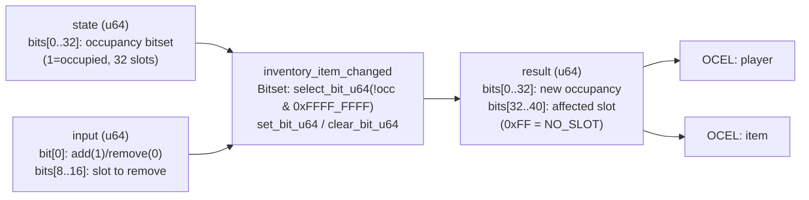

<!-- SCAFFOLDED BY ggen — fill in Context/Forces/Solution/Consequences below, then commit. -->
<!-- Source: ggen/schema/patterns.ttl (inventory_item_changed). Re-scaffold: `ggen sync`. -->

# Pattern: InventoryItemChanged

> **Family:** Economy / Progression · **Kernel:** `inventory_item_changed` · **Lowering:** `Bitset` · **Id:** 16

Change an inventory: find the first free slot on add, clear a slot on remove.

---

## Context

RPG and action games model player inventories as fixed-capacity slot arrays. Every time an item is picked up or dropped, the game must locate the first free slot (on add) or clear a specific slot (on remove). Without branchless bitset operations, the slot search loops over each of the 32 occupancy bits with a conditional branch per iteration, introducing up to 32 mispredictions per pickup event. At the volume of item interactions in a loot-heavy game, this compounds into measurable frame-time jitter.

## Forces

- **Branch misprediction** — a naïve loop over occupancy slots branches at each bit, adding up to 32 pipeline flushes per add operation.
- **Deterministic latency** — the Bitset lowering resolves first-free-slot lookup in O(1) via a single `select_bit_u64` on the inverted occupancy word.
- **Overflow sentinel** — when all 32 slots are full, the kernel must signal `NO_SLOT` (0xFF) unambiguously rather than silently wrapping to slot 0, which would corrupt inventory state.
- **State space bounded to 32 slots** — the occupancy bitset is masked to bits[0..32]; higher bits of the state word are ignored, keeping the state representation canonical.
- **OCEL auditability** — OCEL event code 68 ties every slot mutation to an auditable object trace linking `player` and `item`.

## Solution

The kernel packs state as bits[0..32] = occupancy bitset (32 slots; 1 = occupied) and input as bit[0] = add/remove flag, bits[8..16] = slot index for remove. On add, the occupancy word is bitwise-inverted and masked to 32 bits; `select_bit_u64` extracts the index of the lowest set bit in that free-slot word in a single instruction, avoiding any loop. On remove, `clear_bit_u64` zeroes the named slot. The all-ones sentinel `NO_SLOT = 0xFF` is returned in bits[32..40] when the inventory is full, making overflow detectable without a branch. The `Bitset` lowering is the right choice because the core operation is exactly "find first zero in a 32-bit word" — a canonical population-count/bit-select problem.

## Consequences

**Gains:** O(1) worst-case slot lookup with no loop; pipeline-predictable execution regardless of occupancy pattern; the NO_SLOT sentinel makes full-inventory detection data-driven rather than conditional; OCEL event 68 provides a complete per-item audit trail. **Costs:** inventory capacity is fixed at 32 slots by the u32 occupancy word; callers that need larger inventories must widen the state field or segment inventories. **Compositions:** this pattern feeds naturally into [CurrencyDeltaApplied](currency_delta_applied.md) when a purchase both spends gold and places an item, and into [LevelGateEvaluated](level_gate_evaluated.md) when level gates determine which item types may occupy slots.

---

## Structure Diagram



---

## Evidence Model

| Field | Value |
|---|---|
| OCEL activity | `InventoryItemChanged` |
| Event code | `68` |
| OTEL span | `68` |
| Object kinds | `player`, `item` |
| Required status | `4` |
| Refusal status | `7` |
| Authority | oracle predicate: matches inventory_item_changed_reference for all inputs |

---

## Metadata

| Field | Value |
|---|---|
| Pattern id | 16 |
| Family | Economy / Progression |
| Lowering | `Bitset` |
| State cardinality | 32 |
| Primitive | `bcinr_logic::bitset::select_bit_u64` |
| Kernel signature | `inventory_item_changed(state: u64, input: u64) -> u64` |
| Source kernel | `src/patterns/inventory_item_changed.rs` |

---

## How to Use

```rust
use wasm4games::patterns::inventory_item_changed;

// Pack state and input into u64 fields as documented in the kernel source.
let result = inventory_item_changed(state, input);
```

The kernel is a pure `fn(u64, u64) -> u64` — no side effects, no allocation, no branches.
Pair with the evidence layer to emit OCEL events, OTEL spans, and receipt folds:

```rust
use wasm4games::evidence::{ocel::OcelEvent, otel};

let result = inventory_item_changed(state, input);
otel::emit(68);
let ev = OcelEvent::new(68, logical_tick, admission_status);
```

---

## Related Patterns

- [CurrencyDeltaApplied](currency_delta_applied.md) — items have purchase costs; a confirmed buy triggers a currency delta alongside the slot change.
- [LevelGateEvaluated](level_gate_evaluated.md) — level gates item eligibility; the gate result precedes an inventory add.
- [RewardTierSelected](reward_tier_selected.md) — tier reward bundles include inventory items; tier selection drives the add event.
