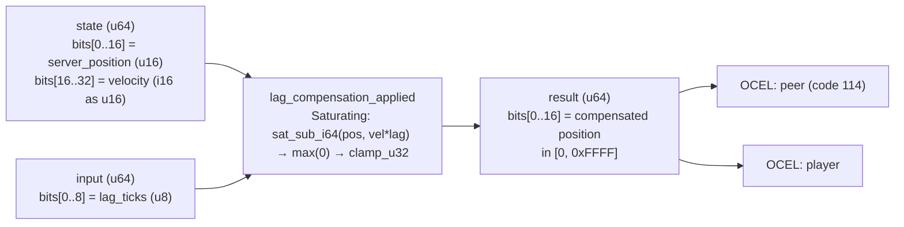

<!-- SCAFFOLDED BY ggen — fill in Context/Forces/Solution/Consequences below, then commit. -->
<!-- Source: ggen/schema/patterns.ttl (lag_compensation_applied). Re-scaffold: `ggen sync`. -->

# Pattern: LagCompensationApplied

> **Family:** Multiplayer / Network · **Kernel:** `lag_compensation_applied` · **Lowering:** `Saturating` · **Id:** 52

Rewind a server-authoritative position by lag*velocity to estimate where the client was at a past tick.

---

## Context

Server-side hit detection must check collision at the tick when the client fired, not the current server tick — otherwise fast-moving players are unhittable from the client's perspective because the server sees them at a later position. The rewind formula `compensated = server_position - lag_ticks * velocity` computes where the target was. With two's-complement signed velocity (a player moving left has negative velocity) and potentially large lag values (100+ ticks under packet loss), the subtraction can underflow a u16 coordinate to wrap around to near-65535 — placing the rewound position on the opposite side of the map.

## Forces

- **Branch misprediction** — a naïve `if compensated < 0 { 0 } else { compensated }` floor branches on every lag-spike tick, precisely when network conditions are worst and the branch is least predictable.
- **Deterministic latency** — the Saturating lowering uses `saturating_sub_i64` + `.max(0)` + `clamp_u32`, all branchless primitives, giving O(1) fixed execution regardless of whether the floor or ceiling fires.
- **Signed velocity encoding** — velocity is stored as a u16 in two's-complement (i16 reinterpreted as u16) to fit in the packed-u64 ABI; the kernel reinterprets it as `vel_raw as i16` to recover the signed value before multiplication.
- **Two-sided coordinate bound** — `clamp_u32(rewind.max(0) as u32, 0, 0xFFFF)` ensures the compensated position is always a valid u16 game coordinate, even for extreme lag and velocity combinations.
- **OCEL auditability** — event code 114 ties each rewound position to both the `peer` and `player` object traces, enabling forensic verification of hit detection decisions.

## Solution

**Branchless primitive:** `bcinr_logic::int::saturating_sub_i64`

State bits[0..16] carry `server_position` (u16) and bits[16..32] carry `velocity` encoded as i16 in u16 two's-complement. Input bits[0..8] carry `lag_ticks` (u8). The kernel extracts velocity as `(vel_raw as i16) as i64` to recover the signed value. `saturating_sub_i64(server_pos, velocity * lag)` performs the rewind without i64 overflow; `.max(0)` floors negative results; `clamp_u32(..., 0, 0xFFFF)` enforces the valid coordinate ceiling. The Saturating lowering was chosen because the rewind is an inherently signed subtraction that must be guarded against both underflow and overflow at the i64 level before the u16 truncation.

## Consequences

**Gains:** Rewound position is provably in [0, 0xFFFF]; signed velocity is handled correctly without a sign-extension branch; the result is reproducible for the same (server_pos, velocity, lag) triple. **Costs:** Linear rewind assumes constant velocity over the lag window — if the target changed direction during the lag, the estimate is incorrect; velocity and lag are limited to i16 and u8 respectively. **Compositions:** The bounded delta from `tick_delta_bounded` limits the lag value passed to this kernel; `prediction_error_bounded` computes the difference between the rewound server position and the client's prediction; `aabb_collision_resolved` tests collision at the rewound position.

---

## Structure Diagram



---

## Evidence Model

| Field | Value |
|---|---|
| OCEL activity | `LagCompensationApplied` |
| Event code | `114` |
| OTEL span | `114` |
| Object kinds | `peer`, `player` |
| Required status | `4` |
| Refusal status | `7` |
| Authority | oracle predicate: matches lag_compensation_applied_reference for all inputs |

---

## Metadata

| Field | Value |
|---|---|
| Pattern id | 52 |
| Family | Multiplayer / Network |
| Lowering | `Saturating` |
| State cardinality | 32 |
| Primitive | `bcinr_logic::int::saturating_sub_i64` |
| Kernel signature | `lag_compensation_applied(state: u64, input: u64) -> u64` |
| Source kernel | `src/patterns/lag_compensation_applied.rs` |

---

## How to Use

```rust
use wasm4games::patterns::lag_compensation_applied;

// Pack state and input into u64 fields as documented in the kernel source.
let result = lag_compensation_applied(state, input);
```

The kernel is a pure `fn(u64, u64) -> u64` — no side effects, no allocation, no branches.
Pair with the evidence layer to emit OCEL events, OTEL spans, and receipt folds:

```rust
use wasm4games::evidence::{ocel::OcelEvent, otel};

let result = lag_compensation_applied(state, input);
otel::emit(114);
let ev = OcelEvent::new(114, logical_tick, admission_status);
```

---

## Related Patterns

- [TickDeltaBounded](tick_delta_bounded.md) — bounded tick delta constrains the lag value passed to this kernel, limiting maximum rewind depth.
- [PredictionErrorBounded](prediction_error_bounded.md) — prediction error is computed after lag compensation to measure how well the client predicted the rewound position.
- [SyncStateAdmitted](sync_state_admitted.md) — lag compensation is applied in the SYNCED state; excessive rewind depth signals drift and may trigger a DRIFTED transition.
