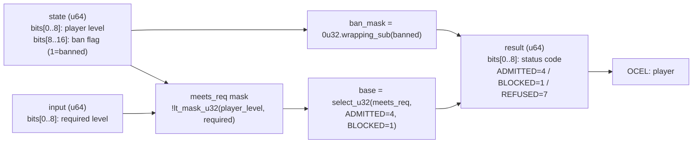

<!-- SCAFFOLDED BY ggen — fill in Context/Forces/Solution/Consequences below, then commit. -->
<!-- Source: ggen/schema/patterns.ttl (level_gate_evaluated). Re-scaffold: `ggen sync`. -->

# Pattern: LevelGateEvaluated

> **Family:** Economy / Progression · **Kernel:** `level_gate_evaluated` · **Lowering:** `Mask` · **Id:** 33

Gate an ability or item unlock: banned->REFUSED, level met->ADMITTED, else BLOCKED, composed from branchless selects.

---

## Context

Game content — abilities, items, zones, shop slots — is routinely gated behind player level to enforce progression pacing. The gate also enforces a permanent ban flag for players who have exploited the economy or violated terms of service; a banned player must be refused regardless of level. Without branchless composition, the gate is a nested if-else: check ban first, then check level, producing two conditional branches per gate evaluation. In a busy frame that evaluates dozens of content gates (UI state, item eligibility, NPC dialogue unlocks), the branch overhead and audit surface both grow proportionally.

## Forces

- **Branch misprediction** — a nested `if banned / else if level >= required / else BLOCKED` introduces two mispredictable branches per gate call.
- **Deterministic latency** — the Mask lowering composes two `select_u32` calls in O(1), producing the status code without any conditional.
- **Ban override** — the ban flag must have strict priority over the level check; a banned-but-eligible player must receive REFUSED, never ADMITTED, and this priority must be structurally enforced, not left to call-site ordering.
- **Three-way output** — the kernel emits one of three status codes (ADMITTED=4, BLOCKED=1, REFUSED=7) rather than a boolean, enabling downstream patterns to distinguish "not yet" from "never".
- **OCEL auditability** — OCEL event code 95 ties every gate decision to an auditable `player` object trace, supporting compliance and progression forensics.

## Solution

The kernel packs state as bits[0..8] = player level and bits[8..16] = ban flag, and input as bits[0..8] = required level. `lt_mask_u32(player_level, required)` produces the "below required" mask; its complement is the "meets requirement" mask, which drives the first `select_u32(meets_req, ADMITTED, BLOCKED)` to produce the base result. The ban mask is computed as `0u32.wrapping_sub(banned)` — zero when not banned, all-ones when banned — and a second `select_u32(ban_mask, REFUSED, base)` overrides the base with REFUSED. Because `select_u32` evaluates both arms unconditionally and picks via mask, the ban override is enforced at the arithmetic level rather than at call-site control flow. The `Mask` lowering is correct here because the entire logic reduces to two priority-ordered mask selects.

## Consequences

**Gains:** the two-level priority (ban overrides level) is structurally guaranteed, not dependent on call-site ordering; three-way status codes let downstream patterns distinguish permanently refused (REFUSED) from temporarily blocked (BLOCKED); OCEL event 95 provides a complete gate decision audit. **Costs:** the player-level field is 8 bits (max level 255); games with wider level ranges must widen the state field. **Compositions:** this pattern receives its input from [XpThresholdCrossed](xp_threshold_crossed.md) — a level-up event feeds a new level into the gate — and acts as a prerequisite guard before [PurchaseAdmitted](purchase_admitted.md) and [NpsPromptGated](nps_prompt_gated.md).

---

## Structure Diagram



---

## Evidence Model

| Field | Value |
|---|---|
| OCEL activity | `LevelGateEvaluated` |
| Event code | `95` |
| OTEL span | `95` |
| Object kinds | `player` |
| Required status | `4` |
| Refusal status | `7` |
| Authority | oracle predicate: matches level_gate_evaluated_reference for all inputs |

---

## Metadata

| Field | Value |
|---|---|
| Pattern id | 33 |
| Family | Economy / Progression |
| Lowering | `Mask` |
| State cardinality | 2 |
| Primitive | `bcinr_logic::mask::select_u32` |
| Kernel signature | `level_gate_evaluated(state: u64, input: u64) -> u64` |
| Source kernel | `src/patterns/level_gate_evaluated.rs` |

---

## How to Use

```rust
use wasm4games::patterns::level_gate_evaluated;

// Pack state and input into u64 fields as documented in the kernel source.
let result = level_gate_evaluated(state, input);
```

The kernel is a pure `fn(u64, u64) -> u64` — no side effects, no allocation, no branches.
Pair with the evidence layer to emit OCEL events, OTEL spans, and receipt folds:

```rust
use wasm4games::evidence::{ocel::OcelEvent, otel};

let result = level_gate_evaluated(state, input);
otel::emit(95);
let ev = OcelEvent::new(95, logical_tick, admission_status);
```

---

## Related Patterns

- [XpThresholdCrossed](xp_threshold_crossed.md) — a level-up event feeds a new level into this gate, unlocking new content.
- [PurchaseAdmitted](purchase_admitted.md) — the level gate precedes purchase admission; only ADMITTED players may enter the purchase FSM.
- [NpsPromptGated](nps_prompt_gated.md) — the same two-select gate idiom gates NPS survey prompts by engagement level.
