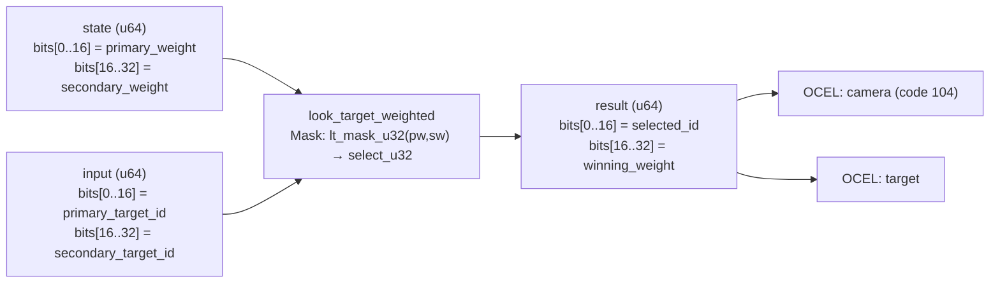

<!-- SCAFFOLDED BY ggen — fill in Context/Forces/Solution/Consequences below, then commit. -->
<!-- Source: ggen/schema/patterns.ttl (look_target_weighted). Re-scaffold: `ggen sync`. -->

# Pattern: LookTargetWeighted

> **Family:** Camera · **Kernel:** `look_target_weighted` · **Lowering:** `Mask` · **Id:** 42

Select between two look targets (primary vs secondary) by priority weight; higher wins, ties to primary.

---

## Context

Cameras often track two competing points of interest simultaneously — a primary target such as a locked-on enemy and a secondary target such as an incoming projectile or explosion. Each tick the camera system must decide which target to follow based on their current priority weights. Encoding this decision as a conditional branch on two u32 values produces a data-dependent branch that mispredicts every time the dominant target changes, introducing latency spikes precisely when the player's view is most dynamic.

## Forces

- **Branch misprediction** — a naïve `if secondary_weight > primary_weight` branches on every target switch, degrading pipeline throughput at the worst moment (combat, explosions).
- **Deterministic latency** — the Mask lowering uses `lt_mask_u32` + `select_u32`, replacing the conditional with arithmetic bitmasking, yielding O(1) fixed-latency selection.
- **Tie-breaking invariant** — the strict-`<` predicate (`pw < sw`) means equal weights always return the primary target; this is an observable contract that downstream consumers (lerp, distance) must be able to rely on.
- **Packed dual output** — the result carries both the selected target id (bits[0..16]) and the winning weight (bits[16..32]) so the caller can use either field without re-reading the inputs.
- **OCEL auditability** — event code 104 ties each selection to both the `camera` and `target` object traces, enabling reconstruction of which target was active at each tick.

## Solution

**Branchless primitive:** `bcinr_logic::mask::select_u32`

The kernel packs `primary_weight` in state bits[0..16] and `secondary_weight` in bits[16..32]; `input` carries `primary_target_id` in bits[0..16] and `secondary_target_id` in bits[16..32]. `lt_mask_u32(pw, sw)` produces an all-ones mask when `pw < sw` (secondary strictly wins) and all-zeros otherwise. Two `select_u32` calls then fan this mask over both the id and weight fields simultaneously — no branch, no cmov, pure bitwise arithmetic. Ties and primary-wins cases both fall through to the all-zeros path, preserving the primary target without any special-case logic.

## Consequences

**Gains:** Target selection is O(1) and branch-free; the strict-`<` tie-breaking rule is statically verifiable from the mask predicate alone; both id and weight are available in a single result word. **Costs:** Only two candidates are compared per call; selecting among N > 2 targets requires chaining multiple calls or a different pattern. The 16-bit id and weight fields limit each to 0..65535. **Compositions:** The selected target id feeds `camera_distance_clamped` (computes follow distance) and `camera_follow_lerped` (camera tracks selected position); `audio_priority_selected` applies the same higher-wins-strict idiom to audio voice selection.

---

## Structure Diagram



---

## Evidence Model

| Field | Value |
|---|---|
| OCEL activity | `LookTargetWeighted` |
| Event code | `104` |
| OTEL span | `104` |
| Object kinds | `camera`, `target` |
| Required status | `4` |
| Refusal status | `7` |
| Authority | oracle predicate: matches look_target_weighted_reference for all inputs |

---

## Metadata

| Field | Value |
|---|---|
| Pattern id | 42 |
| Family | Camera |
| Lowering | `Mask` |
| State cardinality | 2 |
| Primitive | `bcinr_logic::mask::select_u32` |
| Kernel signature | `look_target_weighted(state: u64, input: u64) -> u64` |
| Source kernel | `src/patterns/look_target_weighted.rs` |

---

## How to Use

```rust
use wasm4games::patterns::look_target_weighted;

// Pack state and input into u64 fields as documented in the kernel source.
let result = look_target_weighted(state, input);
```

The kernel is a pure `fn(u64, u64) -> u64` — no side effects, no allocation, no branches.
Pair with the evidence layer to emit OCEL events, OTEL spans, and receipt folds:

```rust
use wasm4games::evidence::{ocel::OcelEvent, otel};

let result = look_target_weighted(state, input);
otel::emit(104);
let ev = OcelEvent::new(104, logical_tick, admission_status);
```

---

## Related Patterns

- [CameraDistanceClamped](camera_distance_clamped.md) — the selected target position is the input from which follow distance is computed.
- [CameraFollowLerped](camera_follow_lerped.md) — lerp smoothing uses the selected target position as its lerp destination.
- [AudioPrioritySelected](audio_priority_selected.md) — applies the identical strict-higher-wins Mask idiom to competing audio channels.
