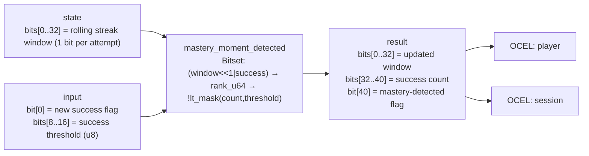

<!-- SCAFFOLDED BY ggen — fill in Context/Forces/Solution/Consequences below, then commit. -->
<!-- Source: ggen/schema/patterns.ttl (mastery_moment_detected). Re-scaffold: `ggen sync`. -->

# Pattern: MasteryMomentDetected

> **Family:** Promotion & NPS · **Kernel:** `mastery_moment_detected` · **Lowering:** `Bitset` · **Id:** 18

Detect a mastery moment when the rolling streak popcount meets a threshold.

---

## Context

High-engagement trigger events — a 5-kill streak, a perfect combo, completing every challenge in a level — are the moments when players are most likely to share, rate, or invite friends. Detecting these moments requires tracking a rolling window of recent success flags and firing when the window contains enough successes to cross a mastery threshold. A naïve implementation counts successes with a loop counter and branches on the threshold comparison; with hundreds of player sessions and multiple achievement types this adds measurable jitter to the event-detection tick.

## Forces

- **Branch misprediction** — the threshold comparison `if count >= threshold { fire }` is data-dependent and fires unpredictably as players approach but do not yet reach mastery, causing mispredictions precisely at the highest-engagement moment.
- **Deterministic latency** — the Bitset lowering uses `rank_u64` (hardware popcount on the rolling window) and `lt_mask_u32` for the threshold comparison, both O(1) with no data-dependent control flow, so detection latency is identical whether the player is at count 0 or count 31.
- **Rolling window semantics** — the 32-bit window is shifted left by 1 and OR'd with the new success bit on every call, naturally expiring old attempts; the kernel preserves the updated window in the result so the caller can thread it back as state on the next tick without a separate data structure.
- **Threshold equality** — the detection condition is `count >= threshold` (not `>`); the kernel uses `!lt_mask_u32(count, threshold)` to express this branchlessly, and the proptest oracle confirms equality fires correctly — a weakened `>` implementation misses the exact-threshold case.
- **OCEL auditability** — OCEL event code `80` ties each mastery evaluation to both the `player` and `session` object traces, enabling per-session achievement reconstruction and fairness audits.

## Solution

The kernel resolves the forces by representing the rolling streak as a 32-bit bitset and computing detection via popcount + comparison. The packed-u64 ABI places the current 32-bit window in `state` bits[0..32], the new success flag in `input` bit[0], and the success threshold in bits[8..16]. The new window is computed as `((window << 1) | success) & 0xFFFF_FFFF` — a branchless shift-and-OR that ages out the oldest attempt. `rank_u64(new_window, 31)` counts set bits in the low 32 bits via hardware popcount. Detection fires as `(!lt_mask_u32(count, threshold) & 1)` — equivalently, `count >= threshold`. The result encodes the updated window in bits[0..32], the count in bits[32..40], and the detection flag in bit[40]. The Bitset lowering was chosen because the rolling window is a literal bitset and popcount rank is the defining primitive of the Bitset family.

**Branchless primitive:** `bcinr_logic::bitset::rank_u64`

## Consequences

**Gains:** Mastery detection costs identical cycles at count 1 and count 32, giving flat latency across all session states. The threshold-equality boundary is correctly handled by `!lt_mask_u32`, making the detection semantics precise. The updated window is returned in-band, so no auxiliary state structure is needed. OCEL events `80` span both `player` and `session`, enabling cross-session mastery analytics. **Costs:** The rolling window is fixed at 32 attempts; longer history windows require a wider kernel or a multi-word bitset. The threshold is limited to 8 bits (u8), so thresholds above 255 are unsupported. **Compositions:** A detected mastery moment triggers [ShareArtifactGenerated](share_artifact_generated.md) and [NpsPromptGated](nps_prompt_gated.md); the same set/clear/count bitset idiom appears in [StatusEffectTicked](status_effect_ticked.md).

---

## Structure Diagram



---

## Evidence Model

| Field | Value |
|---|---|
| OCEL activity | `MasteryMomentDetected` |
| Event code | `80` |
| OTEL span | `80` |
| Object kinds | `player`, `session` |
| Required status | `4` |
| Refusal status | `7` |
| Authority | oracle predicate: matches mastery_moment_detected_reference for all inputs |

---

## Metadata

| Field | Value |
|---|---|
| Pattern id | 18 |
| Family | Promotion & NPS |
| Lowering | `Bitset` |
| State cardinality | 32 |
| Primitive | `bcinr_logic::bitset::rank_u64` |
| Kernel signature | `mastery_moment_detected(state: u64, input: u64) -> u64` |
| Source kernel | `src/patterns/mastery_moment_detected.rs` |

---

## How to Use

```rust
use wasm4games::patterns::mastery_moment_detected;

// Pack state and input into u64 fields as documented in the kernel source.
let result = mastery_moment_detected(state, input);
```

The kernel is a pure `fn(u64, u64) -> u64` — no side effects, no allocation, no branches.
Pair with the evidence layer to emit OCEL events, OTEL spans, and receipt folds:

```rust
use wasm4games::evidence::{ocel::OcelEvent, otel};

let result = mastery_moment_detected(state, input);
otel::emit(80);
let ev = OcelEvent::new(80, logical_tick, admission_status);
```

---

## Related Patterns

- [NpsPromptGated](nps_prompt_gated.md) — a detected mastery moment sets the readiness flag that gates the NPS prompt
- [ShareArtifactGenerated](share_artifact_generated.md) — a detected mastery moment triggers generation of a shareable artifact
- [StatusEffectTicked](status_effect_ticked.md) — shares the same rolling bitset set/clear/count idiom for tracking timed effects
