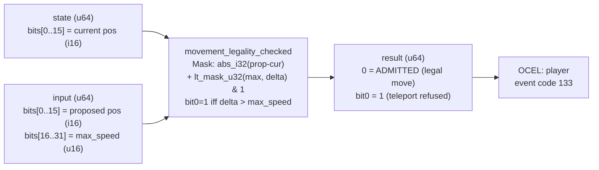

<!-- SCAFFOLDED BY ggen — fill in Context/Forces/Solution/Consequences below, then commit. -->
<!-- Source: ggen/schema/patterns.ttl (movement_legality_checked). Re-scaffold: `ggen sync`. -->

# Pattern: MovementLegalityChecked

> **Family:** Anti-Cheat · **Kernel:** `movement_legality_checked` · **Lowering:** `Mask` · **Id:** 71

Verdict bit0 set iff |proposed - current| exceeds max_speed (teleport cheat); a move at or under the budget is admitted.

---

## Context

Teleportation cheats work by submitting position updates where the distance from the player's current position to the proposed position exceeds what any human-speed movement could produce in a single game tick. The anti-cheat gate computes `|proposed - current| > max_speed` and refuses the update. A naïve conditional branch on this inequality leaks timing information: cheaters can instrument the branch to measure which direction the comparison goes, probing the exact value of `max_speed` through timing differentials without triggering any observable refusal. Branchless comparison eliminates the timing side channel while maintaining the legality invariant.

## Forces

- **Branch misprediction** — a conditional branch on the speed comparison mispredicts at the legality boundary and leaks timing information usable for side-channel speed-limit probing.
- **Deterministic latency** — the Mask lowering via `lt_mask_u32` gives O(1) constant time; the verdict is computed as pure arithmetic with no conditional branching.
- **Side-channel resistance** — the execution path must be identical for legal and illegal moves; `lt_mask_u32` achieves this by converting the comparison to an all-ones or all-zeros mask without branching.
- **Signed displacement** — position values are signed 16-bit coordinates; displacement is `|proposed - current|` as an unsigned magnitude, computed via `abs_i32` without branching on the sign.
- **OCEL auditability** — OCEL event code 133 ties each movement check to a `player` object trace for anti-cheat audit logs.

## Solution

The kernel packs `state` bits[0..15] as the current position (u16 interpreted as i32) and `input` bits[0..15] as the proposed position and bits[16..31] as max_speed. The displacement is `abs_i32(prop - cur) as u32`, computed branchlessly. `lt_mask_u32(max, delta)` produces all-ones when `max < delta` (teleport detected), all-zeros otherwise. The result is `u64::from(lt_mask_u32(max, delta)) & 1`: verdict bit0 is 1 on refusal (teleport), 0 on admission. This is the Mask lowering: the legality predicate `delta <= max` is resolved by a single mask operation with no branching.

**Branchless primitive:** `bcinr_logic::mask::lt_mask_u32`

## Consequences

**Gains:** Execution time is identical for legal and illegal moves, closing the timing side channel. Displacement exactly equal to max_speed is admitted (boundary-inclusive invariant verified by Hoare-logic). The verdict is a single bit in the return value, composable with other anti-cheat verdict bits via OR.

**Costs:** The bit-field ABI is fixed — current position in state bits[0..15], proposed position in input bits[0..15], max_speed in input bits[16..31]. Position values are 16-bit, limiting the coordinate space to 0..=65535 per axis; larger worlds require a kernel variant with 32-bit positions.

**Compositions:** The verdict bit composes with `resource_bound_checked`, `cooldown_legality_checked`, and `action_rate_bounded` via OR to build a full per-tick anti-cheat verdict. Movement legality is one transition input into `transition_legality_checked` when the player's full state machine is under surveillance.

---

## Structure Diagram



---

## Evidence Model

| Field | Value |
|---|---|
| OCEL activity | `MovementLegalityChecked` |
| Event code | `133` |
| OTEL span | `133` |
| Object kinds | `player` |
| Required status | `4` |
| Refusal status | `7` |
| Authority | legality spec: |proposed - cur| <= max_speed |

---

## Metadata

| Field | Value |
|---|---|
| Pattern id | 71 |
| Family | Anti-Cheat |
| Lowering | `Mask` |
| State cardinality | 2 |
| Primitive | `bcinr_logic::mask::lt_mask_u32` |
| Kernel signature | `movement_legality_checked(state: u64, input: u64) -> u64` |
| Source kernel | `src/patterns/movement_legality_checked.rs` |

---

## How to Use

```rust
use wasm4games::patterns::movement_legality_checked;

// Pack state and input into u64 fields as documented in the kernel source.
let result = movement_legality_checked(state, input);
```

The kernel is a pure `fn(u64, u64) -> u64` — no side effects, no allocation, no branches.
Pair with the evidence layer to emit OCEL events, OTEL spans, and receipt folds:

```rust
use wasm4games::evidence::{ocel::OcelEvent, otel};

let result = movement_legality_checked(state, input);
otel::emit(133);
let ev = OcelEvent::new(133, logical_tick, admission_status);
```

---

## Related Patterns

- [ResourceBoundChecked](resource_bound_checked.md) — same anti-cheat Mask verdict idiom for resource overflow detection.
- [ActionRateBounded](action_rate_bounded.md) — action rate and movement legality are complementary per-tick anti-cheat gates.
- [TransitionLegalityChecked](transition_legality_checked.md) — movement legality is one transition input in the full game-state cheat DFA.
