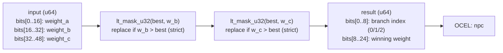

<!-- SCAFFOLDED BY ggen — fill in Context/Forces/Solution/Consequences below, then commit. -->
<!-- Source: ggen/schema/patterns.ttl (narrative_branch_selected). Re-scaffold: `ggen sync`. -->

# Pattern: NarrativeBranchSelected

> **Family:** Narrative / Dialogue · **Kernel:** `narrative_branch_selected` · **Lowering:** `Mask` · **Id:** 38

Select one of three narrative branches by which weighted condition has the highest weight; ties go to lowest index.

---

## Context

Narrative games that model player relationships with factions, characters, or moral alignments assign numeric weights to story branches based on accumulated choices. At a branching point, the branch with the highest weight wins — "follow the merchant path (weight 70), stay neutral (weight 20), side with the rebels (weight 10)". Without branchless mask selects, the argmax over three weights is a nested if-else with two comparisons and two branches, each mispredicting when weights are close. In games with frequent branching points (dialogue trees, cut-scene triggers), this compounds across many frame-rate-critical calls.

## Forces

- **Branch misprediction** — a nested `if w_a > w_b && w_a > w_c / else if w_b > w_c ...` introduces two mispredictable branches per branch selection.
- **Deterministic latency** — the Mask lowering resolves the three-way argmax in O(1) via two `lt_mask_u32` comparisons and two `select_u32` calls, with no branch.
- **Tie-breaking discipline** — when two branches share the maximum weight, the lowest-index branch must win deterministically; the strict `<` replacement rule in the cascaded select enforces this without a conditional.
- **Winning weight output** — callers need not only the winning branch index but also its weight (for downstream logging and receipt folding); both are returned in the packed result.
- **OCEL auditability** — OCEL event code 100 ties every branch selection to an auditable `npc` object trace, supporting narrative replay forensics.

## Solution

The kernel packs state as unused (reserved) and input as bits[0..16] = weight_a, bits[16..32] = weight_b, bits[32..48] = weight_c (three 16-bit weights). The argmax is computed with two cascaded passes: first, `lt_mask_u32(best_val, w_b)` replaces the running best with branch 1 only when `w_b` is strictly greater (preserving branch 0 on a tie); second, `lt_mask_u32(best_val, w_c)` similarly replaces with branch 2. Both the best index and best weight are tracked and updated in lockstep via `select_u32`. The result packs the branch index into bits[0..8] and the winning weight into bits[8..24]. The `Mask` lowering is correct because the argmax is a sequence of mask-guarded replacements — the canonical select-on-mask idiom — with no iteration.

## Consequences

**Gains:** three-way argmax with tie-breaking is computed in O(1) with no branch; tie-breaking is structurally enforced by the strict `<` replacement rule; the winning weight is returned alongside the index for downstream receipt folding; OCEL event 100 provides a per-branch-selection audit. **Costs:** the pattern is fixed to three branches; extending to N branches requires N-1 comparison passes (still O(N) but requires code changes). **Compositions:** the selected branch index drives the symbol input to [DialogueNodeAdvanced](dialogue_node_advanced.md); weights are contributed by condition counts from [ConditionFlagEvaluated](condition_flag_evaluated.md); the same argmax pattern appears in [ChoiceWeightSelected](choice_weight_selected.md) in a bucketed form.

---

## Structure Diagram



---

## Evidence Model

| Field | Value |
|---|---|
| OCEL activity | `NarrativeBranchSelected` |
| Event code | `100` |
| OTEL span | `100` |
| Object kinds | `npc` |
| Required status | `4` |
| Refusal status | `7` |
| Authority | oracle predicate: matches narrative_branch_selected_reference for all inputs |

---

## Metadata

| Field | Value |
|---|---|
| Pattern id | 38 |
| Family | Narrative / Dialogue |
| Lowering | `Mask` |
| State cardinality | 2 |
| Primitive | `bcinr_logic::mask::select_u32` |
| Kernel signature | `narrative_branch_selected(state: u64, input: u64) -> u64` |
| Source kernel | `src/patterns/narrative_branch_selected.rs` |

---

## How to Use

```rust
use wasm4games::patterns::narrative_branch_selected;

// Pack state and input into u64 fields as documented in the kernel source.
let result = narrative_branch_selected(state, input);
```

The kernel is a pure `fn(u64, u64) -> u64` — no side effects, no allocation, no branches.
Pair with the evidence layer to emit OCEL events, OTEL spans, and receipt folds:

```rust
use wasm4games::evidence::{ocel::OcelEvent, otel};

let result = narrative_branch_selected(state, input);
otel::emit(100);
let ev = OcelEvent::new(100, logical_tick, admission_status);
```

---

## Related Patterns

- [DialogueNodeAdvanced](dialogue_node_advanced.md) — the selected branch index (0/1/2) maps to CHOICE_A/CHOICE_B/NEXT symbols driving the dialogue FSM.
- [ConditionFlagEvaluated](condition_flag_evaluated.md) — condition counts and ranks contribute to the branch weights compared here.
- [ChoiceWeightSelected](choice_weight_selected.md) — uses the same weighted-selection pattern in a cumulative-bucket form for dialogue choice menus.
