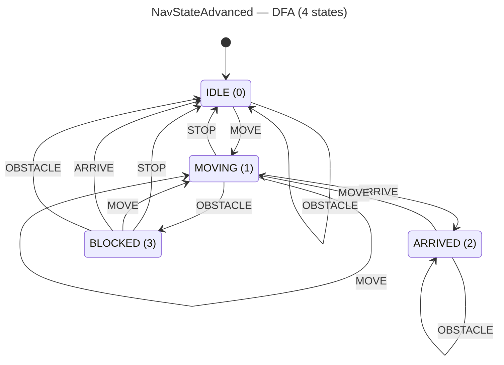

<!-- SCAFFOLDED BY ggen — fill in Context/Forces/Solution/Consequences below, then commit. -->
<!-- Source: ggen/schema/patterns.ttl (nav_state_advanced). Re-scaffold: `ggen sync`. -->

# Pattern: NavStateAdvanced

> **Family:** Pathfinding · **Kernel:** `nav_state_advanced` · **Lowering:** `Dfa` · **Id:** 25

Advance a 4-state navigation FSM (IDLE/MOVING/ARRIVED/BLOCKED) via branchless DFA table lookup.

---

## Context

Game agents navigating a tile map move through a lifecycle: idle until commanded, moving along a computed path, arriving at a waypoint, or blocked by an impassable obstacle. Encoding this lifecycle as a traditional `match` or `if/else` chain branches on the current state and the incoming event at every tick — two data-dependent branches per agent per frame. With hundreds of agents, each agent's current state differs, maximizing branch diversity and mispredict rate. The Dfa lowering replaces the entire state machine with a single flat table lookup: `NAV_TABLE[state * 4 + symbol]` — one array index, zero branches.

## Forces

- **Branch misprediction** — a `match (state, event)` block with 16 arms produces two nested data-dependent branches; in a crowd of agents all in different states, the CPU sees a fully unpredictable branch pattern.
- **Deterministic latency** — the Dfa lowering computes the next state in O(1) with a single bounds-safe array index via `dfa_advance`; the transition is independent of which state or symbol is active.
- **Completeness** — all 16 (state, symbol) pairs must be defined; a missing case in a `match` either panics or silently falls through; the flat table is exhaustive by construction.
- **BLOCKED as a sink** — the table explicitly routes `MOVING + OBSTACLE → BLOCKED` but keeps `ARRIVED + OBSTACLE → ARRIVED` (arrival is terminal); this asymmetry must be encoded statically, not derived at runtime.
- **OCEL auditability** — event code 87 ties each FSM transition to object-centric traces over `player` and `nav_node`, so the full navigation lifecycle is inspectable from the event log.

## Solution

The kernel accepts `state` packed as `bits[0..8] = current nav state (0=IDLE, 1=MOVING, 2=ARRIVED, 3=BLOCKED)` and `input` packed as `bits[0..8] = event symbol (0=STOP, 1=MOVE, 2=ARRIVE, 3=OBSTACLE)`. It returns `bits[0..8] = next nav state`. The 16-entry static table `NAV_TABLE` encodes all transitions row-major (state major, symbol minor) and is indexed by `dfa_advance(current, symbol, &NAV_TABLE, 4)`, which masks both indices to valid range before indexing — no bounds check branch needed. The Dfa lowering is appropriate because the computation is a finite state machine over a bounded alphabet: the exact problem domain DFA tables were designed for.

**Branchless primitive:** `bcinr_logic::dfa::dfa_advance`

## Consequences

**Gains:** O(1) transition cost regardless of agent count or state distribution; all 16 transitions are statically defined and trivially auditable by reading `NAV_TABLE`; out-of-range state or symbol values are safely clamped by `dfa_advance` masking rather than panicking; the OCEL trail at event code 87 provides a per-agent, per-tick navigation event log over `player` and `nav_node` objects. **Costs:** the state space is fixed at 4 states and 4 symbols — adding a fifth state (e.g., REROUTING) requires extending the table to 25 entries and updating all callers; the packed u8 ABI limits each to 256 distinct values. **Natural compositions:** `path_node_expanded` drives MOVE events when pathfinding has a valid next node; `waypoint_reached` drives ARRIVE events when the agent closes within tolerance; `path_cost_bounded` drives OBSTACLE events when the accumulated path cost exceeds the budget.

---

## Structure Diagram



---

## Evidence Model

| Field | Value |
|---|---|
| OCEL activity | `NavStateAdvanced` |
| Event code | `87` |
| OTEL span | `87` |
| Object kinds | `player`, `nav_node` |
| Required status | `4` |
| Refusal status | `7` |
| Authority | oracle predicate: matches nav_state_advanced_reference for all inputs |

---

## Metadata

| Field | Value |
|---|---|
| Pattern id | 25 |
| Family | Pathfinding |
| Lowering | `Dfa` |
| State cardinality | 4 |
| Primitive | `bcinr_logic::dfa::dfa_advance` |
| Kernel signature | `nav_state_advanced(state: u64, input: u64) -> u64` |
| Source kernel | `src/patterns/nav_state_advanced.rs` |

---

## How to Use

```rust
use wasm4games::patterns::nav_state_advanced;

// Pack state and input into u64 fields as documented in the kernel source.
let result = nav_state_advanced(state, input);
```

The kernel is a pure `fn(u64, u64) -> u64` — no side effects, no allocation, no branches.
Pair with the evidence layer to emit OCEL events, OTEL spans, and receipt folds:

```rust
use wasm4games::evidence::{ocel::OcelEvent, otel};

let result = nav_state_advanced(state, input);
otel::emit(87);
let ev = OcelEvent::new(87, logical_tick, admission_status);
```

---

## Related Patterns

- [path_node_expanded](path_node_expanded.md) — a successful node expansion issues the MOVE event that drives IDLE→MOVING or keeps the agent in MOVING
- [waypoint_reached](waypoint_reached.md) — when the reached flag is 1, the caller issues the ARRIVE event that drives MOVING→ARRIVED
- [path_cost_bounded](path_cost_bounded.md) — when the overflow flag is set, the caller issues the OBSTACLE event that drives MOVING→BLOCKED
