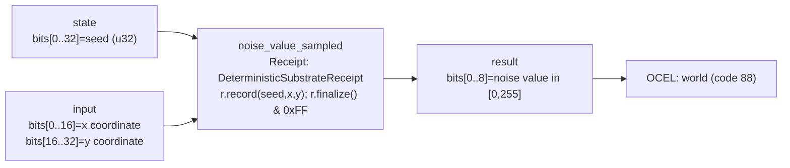

<!-- SCAFFOLDED BY ggen — fill in Context/Forces/Solution/Consequences below, then commit. -->
<!-- Source: ggen/schema/patterns.ttl (noise_value_sampled). Re-scaffold: `ggen sync`. -->

# Pattern: NoiseValueSampled

> **Family:** Procedural Gen · **Kernel:** `noise_value_sampled` · **Lowering:** `Receipt` · **Id:** 26

Deterministic hash-based noise — fold (seed, x, y) through a receipt to produce a bounded noise value in [0, 255].

---

## Context

Procedural map generation samples a noise value at every tile coordinate to determine terrain height, object placement, and biome transitions — potentially millions of calls during level construction. A traditional RNG requires mutable state and branches on its internal counter; a Perlin or simplex noise implementation allocates gradient tables and uses conditional interpolation. The Receipt lowering folds `(seed, x, y)` through a `DeterministicSubstrateReceipt` (FNV-1a hash chain) that is stateless, allocation-free, and branchless, producing a bounded byte in `[0, 255]` for any input triple with no side effects and perfectly reproducible results across runs, platforms, and save/load cycles.

## Forces

- **Branch misprediction** — a stateful RNG with an internal modulo or table-lookup branch mispredicts on the counter update; even a simple LCG has a conditional wrap that varies with the counter value.
- **Determinism** — procedural generation must be exactly reproducible from the seed alone; any mutable global state, thread-local RNG, or allocation can break reproducibility across reloads or network-synchronized worlds.
- **No allocation** — wasm4 games run in a 64 KB heap; each per-tile noise call that heap-allocates a gradient table exhausts the arena in seconds; the Receipt lowering has zero allocation by design.
- **Range bounding** — downstream consumers (tile variant selection, terrain height quantization, spawn weight evaluation) expect a byte in `[0, 255]`; an unbounded 64-bit hash digest would require explicit range reduction in every caller.
- **OCEL auditability** — event code 88 ties each noise sample to the `world` object, making the procedural seed auditable as an OCEL event rather than invisible state mutation.

## Solution

The kernel accepts `state` packed as `bits[0..32] = seed` and `input` packed as `bits[0..16] = x coordinate, bits[16..32] = y coordinate`. It returns `bits[0..8] = noise value in 0..=255`. The implementation creates a `DeterministicSubstrateReceipt`, calls `r.record(seed, x, y)` to fold all three values through the FNV-1a hash chain, calls `r.finalize()` to emit the 64-bit digest, and masks by `0xFF` to reduce to `[0, 255]`. The Receipt lowering was chosen because the problem is an integrity fold — constructing a deterministic, auditable fingerprint of the input triple — which is the exact semantics the receipt primitive encodes. The `& 0xFF` mask is structurally load-bearing: without it the raw digest can escape the byte range that downstream consumers require.

**Branchless primitive:** `bcinr_logic::patterns::integrity_receipt::DeterministicSubstrateReceipt`

## Consequences

**Gains:** O(1) latency per tile; perfectly reproducible across all platforms and run instances given the same seed and coordinates; zero allocation and zero mutable global state; the result is always in `[0, 255]` by construction, so callers need no additional range guard; the OCEL trail at event code 88 makes each noise sample attributable to the `world` object without side effects. **Costs:** FNV-1a is a non-cryptographic hash — do not use for security-sensitive randomness; the noise distribution is uniform over bytes but has no spatial coherence (no gradient smoothing), so it is suitable as a lookup key but not as a smooth terrain function without further processing; the ABI limits seeds to 32 bits and coordinates to 16 bits each. **Natural compositions:** the byte output feeds `tile_variant_selected` (which bucketizes it into variant 0–3), `terrain_height_quantized` (which clamps it to a height band), and `spawn_weight_evaluated` (which compares it to a spawn rate threshold).

---

## Structure Diagram



---

## Evidence Model

| Field | Value |
|---|---|
| OCEL activity | `NoiseValueSampled` |
| Event code | `88` |
| OTEL span | `88` |
| Object kinds | `world` |
| Required status | `4` |
| Refusal status | `7` |
| Authority | oracle predicate: matches noise_value_sampled_reference for all inputs |

---

## Metadata

| Field | Value |
|---|---|
| Pattern id | 26 |
| Family | Procedural Gen |
| Lowering | `Receipt` |
| State cardinality | 64 |
| Primitive | `bcinr_logic::patterns::integrity_receipt::DeterministicSubstrateReceipt` |
| Kernel signature | `noise_value_sampled(state: u64, input: u64) -> u64` |
| Source kernel | `src/patterns/noise_value_sampled.rs` |

---

## How to Use

```rust
use wasm4games::patterns::noise_value_sampled;

// Pack state and input into u64 fields as documented in the kernel source.
let result = noise_value_sampled(state, input);
```

The kernel is a pure `fn(u64, u64) -> u64` — no side effects, no allocation, no branches.
Pair with the evidence layer to emit OCEL events, OTEL spans, and receipt folds:

```rust
use wasm4games::evidence::{ocel::OcelEvent, otel};

let result = noise_value_sampled(state, input);
otel::emit(88);
let ev = OcelEvent::new(88, logical_tick, admission_status);
```

---

## Related Patterns

- [tile_variant_selected](tile_variant_selected.md) — the noise byte feeds the weight input that is bucketized into a tile variant index 0–3
- [terrain_height_quantized](terrain_height_quantized.md) — the noise byte serves as the raw height sample that is clamped to the valid height band
- [spawn_weight_evaluated](spawn_weight_evaluated.md) — the noise byte serves as the random roll compared against the spawn rate threshold
