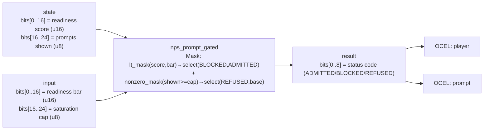

<!-- SCAFFOLDED BY ggen — fill in Context/Forces/Solution/Consequences below, then commit. -->
<!-- Source: ggen/schema/patterns.ttl (nps_prompt_gated). Re-scaffold: `ggen sync`. -->

# Pattern: NpsPromptGated

> **Family:** Promotion & NPS · **Kernel:** `nps_prompt_gated` · **Lowering:** `Mask` · **Id:** 20

Gate an NPS prompt on readiness vs saturation, yielding ADMITTED/BLOCKED/REFUSED.

---

## Context

Net Promoter Score prompts must thread two conflicting requirements: they should appear when the player is in a positive, engaged state (readiness above a bar), but they must not be shown so frequently that the player becomes annoyed and ignores them (saturation cap). A player in an engaged state who has already seen the prompt three times today should get REFUSED, not ADMITTED. In a multi-threaded game engine, the naïve if-else chain — `if shown >= cap { refused } else if score < bar { blocked } else { admitted }` — reads two shared counters inside a conditional that can race between the read and the write in another thread, causing miscount. A branchless kernel closes the race by computing the decision from a single consistent snapshot of the packed state word.

## Forces

- **Branch misprediction** — the two-condition gate (`shown >= cap` then `score < bar`) produces two conditional branches whose outcomes change as the player's session evolves, causing mispredictions at exactly the moments the prompt is most likely to be shown.
- **Deterministic latency** — the Mask lowering onto `lt_mask_u32`, `nonzero_mask_u32`, and `select_u32` resolves both conditions in O(1) arithmetic with no data-dependent control flow, giving flat latency across ADMITTED, BLOCKED, and REFUSED.
- **Priority ordering** — saturation (REFUSED) must dominate readiness (ADMITTED/BLOCKED); if saturation is checked second, a saturated player with a high score would be incorrectly ADMITTED. The kernel encodes this priority explicitly: base is computed first (BLOCKED vs ADMITTED), then overridden by saturation.
- **Concurrency safety** — because the decision is a pure function of a single u64 snapshot, the caller can load the state word atomically and call the kernel; no double-read race between the saturation check and the readiness check is possible.
- **OCEL auditability** — OCEL event code `82` ties each NPS gate decision to both the `player` and `prompt` object traces, providing an immutable record of when each player was shown, blocked, or refused a prompt.

## Solution

The kernel resolves the forces by composing two comparison masks in priority order. The packed-u64 ABI places the readiness score in `state` bits[0..16] and prompts-shown count in bits[16..24]; the readiness bar is in `input` bits[0..16] and the saturation cap in bits[16..24]. First, `lt_mask_u32(score, bar)` produces the below-bar mask; `select_u32(below_bar, BLOCKED, ADMITTED)` is the base decision. Second, `!lt_mask_u32(shown, cap)` produces the saturated mask (shown >= cap); `nonzero_mask_u32(saturated)` converts it to a full-word mask; `select_u32(saturated_mask, REFUSED, base)` overrides the base with REFUSED if saturated. The result is a status code in bits[0..8] — one of ADMITTED (4), BLOCKED (7, per `status::BLOCKED`), or REFUSED. The Mask lowering was chosen because the gate decision is a two-level conditional select — the canonical use case for ordered `select_u32` composition.

**Branchless primitive:** `bcinr_logic::mask::select_u32`

## Consequences

**Gains:** The NPS gate computes ADMITTED/BLOCKED/REFUSED in a single deterministic O(1) call with no branches, giving flat latency regardless of player state. The priority ordering (saturation dominates readiness) is encoded in the kernel and cannot be violated by a race condition in the caller. OCEL events `82` on both `player` and `prompt` support per-player prompt-exposure analytics. **Costs:** The readiness score and cap are limited to 16 bits and 8 bits respectively; engines with wider score representations must normalize before packing. The saturation cap is a hard count ceiling with no time decay — a cap of 3 means "at most 3 prompts ever," not "3 per day"; time-decayed caps require a pre-processing step. **Compositions:** This kernel is triggered by [MasteryMomentDetected](mastery_moment_detected.md) (which sets the readiness flag) and accompanies [ShareArtifactGenerated](share_artifact_generated.md) (which provides the artifact to share from the prompt); the same ADMITTED/BLOCKED/REFUSED select idiom appears in [LevelGateEvaluated](level_gate_evaluated.md).

---

## Structure Diagram



---

## Evidence Model

| Field | Value |
|---|---|
| OCEL activity | `NpsPromptGated` |
| Event code | `82` |
| OTEL span | `82` |
| Object kinds | `player`, `prompt` |
| Required status | `4` |
| Refusal status | `7` |
| Authority | oracle predicate: matches nps_prompt_gated_reference for all inputs |

---

## Metadata

| Field | Value |
|---|---|
| Pattern id | 20 |
| Family | Promotion & NPS |
| Lowering | `Mask` |
| State cardinality | 9 |
| Primitive | `bcinr_logic::mask::select_u32` |
| Kernel signature | `nps_prompt_gated(state: u64, input: u64) -> u64` |
| Source kernel | `src/patterns/nps_prompt_gated.rs` |

---

## How to Use

```rust
use wasm4games::patterns::nps_prompt_gated;

// Pack state and input into u64 fields as documented in the kernel source.
let result = nps_prompt_gated(state, input);
```

The kernel is a pure `fn(u64, u64) -> u64` — no side effects, no allocation, no branches.
Pair with the evidence layer to emit OCEL events, OTEL spans, and receipt folds:

```rust
use wasm4games::evidence::{ocel::OcelEvent, otel};

let result = nps_prompt_gated(state, input);
otel::emit(82);
let ev = OcelEvent::new(82, logical_tick, admission_status);
```

---

## Related Patterns

- [MasteryMomentDetected](mastery_moment_detected.md) — mastery detection sets the readiness score that gates the NPS prompt
- [ShareArtifactGenerated](share_artifact_generated.md) — the artifact accompanying the NPS prompt is generated by this pattern
- [LevelGateEvaluated](level_gate_evaluated.md) — shares the same ADMITTED/BLOCKED/REFUSED select-composition idiom
