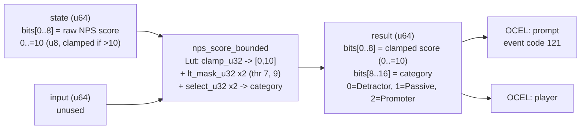

<!-- SCAFFOLDED BY ggen — fill in Context/Forces/Solution/Consequences below, then commit. -->
<!-- Source: ggen/schema/patterns.ttl (nps_score_bounded). Re-scaffold: `ggen sync`. -->

# Pattern: NpsScoreBounded

> **Family:** DfLSS / Quality · **Kernel:** `nps_score_bounded` · **Lowering:** `Lut` · **Id:** 59

Normalize a raw NPS response score (0..=10) and classify as Detractor/Passive/Promoter via branchless thresholds.

---

## Context

NPS (Net Promoter Score) surveys embedded in games collect raw response scores on a 0–10 scale from players at session end, milestone events, or prompted intervals. The game server must classify each response into Detractor (0–6), Passive (7–8), or Promoter (9–10) in a tight monitoring loop alongside other quality signals. Raw scores arriving from the network may exceed 10 due to encoding errors or adversarial input; without clamping, the classifier can index into the wrong bucket or return a sentinel value that corrupts the NPS aggregate. A branchy classifier on eleven possible score values (0–10) plus an overflow guard pollutes the branch predictor on every NPS event.

## Forces

- **Branch misprediction** — an if/else-if chain on score < 7 / score < 9 / else executes different code paths depending on player sentiment, creating a jitter source correlated with player behavior.
- **Deterministic latency** — the Lut lowering via `clamp_u32` and two `lt_mask_u32` + `select_u32` calls gives O(1) constant time across all 11 possible input values.
- **Input validation** — raw scores outside [0, 10] must be silently clamped before classification; the clamp must not branch on the overflow condition.
- **Three-category output** — the result must encode both the clamped score (for audit) and the category (0/1/2) in a single u64 for downstream NPS aggregation.
- **OCEL auditability** — OCEL event code 121 ties each NPS classification to both a `prompt` and a `player` object trace for player experience analytics.

## Solution

The kernel takes `state` bits[0..8] as the raw NPS score (0..=10, u8) and ignores `input`. First, `clamp_u32(score, 0, 10)` branchlessly enforces the [0, 10] ceiling — any score above 10 is silently reduced to 10. Then two `lt_mask_u32` calls produce `below_7` (all-ones when clamped < 7) and `below_9` (all-ones when clamped < 9). A nested `select_u32` resolves the category: `select_u32(below_9, 1, 2)` gives 1 for Passive (<9) or 2 for Promoter (>=9); then `select_u32(below_7, 0, cat_ge_7)` gives 0 for Detractor (<7) or the previous result otherwise. The return u64 packs the clamped score into bits[0..8] and the category into bits[8..16]. This is the Lut lowering: a two-threshold priority table that handles all 11 input values in one data-flow pass.

**Branchless primitive:** `bcinr_logic::fix::clamp_u32`

## Consequences

**Gains:** The clamped score and category are computed simultaneously in a single pipeline pass. The category is monotone-non-decreasing in the clamped score (Detractor < Passive < Promoter), which is structurally guaranteed by the priority cascade. Both the clamped score and category are available in the return value, so audit and aggregation consumers share one kernel call.

**Costs:** The bit-field ABI is fixed — raw score in state bits[0..8]; clamped score in result bits[0..8], category in result bits[8..16]. Scores above 10 are silently clamped to 10 (Promoter), which may mask data quality issues upstream if the caller does not validate input.

**Compositions:** The NPS category output feeds `sigma_level_computed` as a quality contribution metric. Pairs with `nps_prompt_gated` (which gates when the NPS prompt fires) and `defect_rate_quantized` (NPS is a quality metric alongside defect rates).

---

## Structure Diagram



---

## Evidence Model

| Field | Value |
|---|---|
| OCEL activity | `NpsScoreBounded` |
| Event code | `121` |
| OTEL span | `121` |
| Object kinds | `prompt`, `player` |
| Required status | `4` |
| Refusal status | `7` |
| Authority | oracle predicate: matches nps_score_bounded_reference for all inputs |

---

## Metadata

| Field | Value |
|---|---|
| Pattern id | 59 |
| Family | DfLSS / Quality |
| Lowering | `Lut` |
| State cardinality | 11 |
| Primitive | `bcinr_logic::fix::clamp_u32` |
| Kernel signature | `nps_score_bounded(state: u64, input: u64) -> u64` |
| Source kernel | `src/patterns/nps_score_bounded.rs` |

---

## How to Use

```rust
use wasm4games::patterns::nps_score_bounded;

// Pack state and input into u64 fields as documented in the kernel source.
let result = nps_score_bounded(state, input);
```

The kernel is a pure `fn(u64, u64) -> u64` — no side effects, no allocation, no branches.
Pair with the evidence layer to emit OCEL events, OTEL spans, and receipt folds:

```rust
use wasm4games::evidence::{ocel::OcelEvent, otel};

let result = nps_score_bounded(state, input);
otel::emit(121);
let ev = OcelEvent::new(121, logical_tick, admission_status);
```

---

## Related Patterns

- [DefectRateQuantized](defect_rate_quantized.md) — NPS score is a quality metric parallel to defect rate; both feed quality analysis.
- [SigmaLevelComputed](sigma_level_computed.md) — NPS promoter/detractor ratio contributes to the quality sigma signal.
