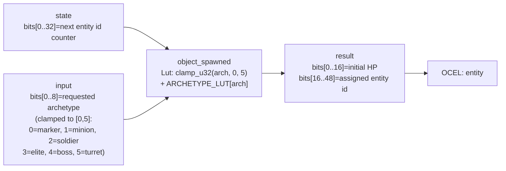

<!-- SCAFFOLDED BY ggen — fill in Context/Forces/Solution/Consequences below, then commit. -->
<!-- Source: ggen/schema/patterns.ttl (object_spawned). Re-scaffold: `ggen sync`. -->

# Pattern: ObjectSpawned

> **Family:** Core Sim & Combat · **Kernel:** `object_spawned` · **Lowering:** `Lut` · **Id:** 4

Resolve a requested archetype to its initial packed state via a bounded LUT.

---

## Context

When a game spawns an entity — a minion, soldier, elite, boss, or turret — it must resolve that archetype identifier to a packed initial state (primarily an initial HP value in this ABI). Without a LUT, game code uses a match or switch to produce the initial HP per archetype, branching on the archetype id. In a spawn-heavy frame (wave start, explosion spawning debris) this match runs hundreds of times per frame with an unpredictable archetype sequence, generating repeated branch mispredicts. An out-of-range archetype id that is not clamped before a match or slice index will also panic at runtime. This pattern resolves both problems by clamping the archetype index branchlessly and indexing a fixed-size table to retrieve the initial state in O(1) time.

## Forces

- **Branch misprediction:** A match/switch over 6 archetype cases branches once per spawn; when a wave-start event spawns 50 mixed enemies in a single frame the predictor cannot follow the archetype sequence, causing 50 mispredicts per wave.
- **Deterministic latency:** The Lut lowering clamps the archetype index with `clamp_u32` and performs a direct array read, giving strict O(1) time for all archetype values including out-of-range inputs.
- **Out-of-range archetype safety:** Archetype ids above 5 must not panic or produce garbage initial state; `clamp_u32(arch, 0, 5)` saturates any out-of-range value to the last valid entry (turret, initial HP = 50) without branching.
- **Entity id stamping:** Each spawned entity must receive a unique id derived from a monotonically increasing counter; the kernel packs the caller-supplied `next_id` from `state` into bits[16..48] of the result alongside the initial archetype state in bits[0..16].
- **OCEL auditability:** Event code `18` ties every spawn to the `entity` object in the OCEL trace, recording the archetype resolved and entity id assigned, enabling replay tools to reconstruct the spawn sequence exactly.

## Solution

The kernel holds six archetypes in `ARCHETYPE_LUT: [u16; 6]` mapping archetype index to initial HP: `[0, 10, 30, 100, 250, 50]` for marker, minion, soldier, elite, boss, and turret respectively. It extracts `next_id` from bits[0..32] of `state` and the requested archetype from bits[0..8] of `input`, clamps the archetype to `[0, 5]` with `clamp_u32` (a branchless saturating clamp), reads `ARCHETYPE_LUT[arch]` for the initial packed state word, and returns `init | (next_id << 16)` — initial state in bits[0..16] and entity id in bits[16..48]. The LUT lowering was the right choice because archetype resolution is a pure index-to-value mapping with a small, bounded domain; the table encodes all archetype configurations as data, and the branchless clamp ensures the index is always in bounds.

**Branchless primitive:** `bcinr_logic::fix::clamp_u32`

## Consequences

**Gains:** Spawn resolution executes in ~1 ns regardless of archetype id or count — even a wave of 200 mixed enemies resolves all initial states without a single branch mispredict. Adding or changing archetype stats requires only editing `ARCHETYPE_LUT` entries, not restructuring conditional logic. Out-of-range archetype ids are silently clamped to the turret entry rather than panicking.

**Costs:** The bit-field ABI requires callers to maintain an external `next_id` counter in bits[0..32] of `state` and increment it after each spawn; the kernel does not auto-increment. The initial state is limited to 16 bits (HP only in the current ABI); richer initial state (e.g., initial position, team id) requires a wider table or a follow-up kernel. The archetype table is compiled in — adding a 7th archetype requires a code change and re-generation.

**Composes naturally with:** `entity_state_transitioned` (a freshly spawned entity starts in Idle state 0; the caller sends a `spawn` event symbol to transition it to Active), `aabb_collision_resolved` (spawned objects immediately enter the collision system to begin receiving hit events).

---

## Structure Diagram



---

## Evidence Model

| Field | Value |
|---|---|
| OCEL activity | `ObjectSpawned` |
| Event code | `18` |
| OTEL span | `18` |
| Object kinds | `entity` |
| Required status | `4` |
| Refusal status | `7` |
| Authority | oracle predicate: matches object_spawned_reference for all inputs |

---

## Metadata

| Field | Value |
|---|---|
| Pattern id | 4 |
| Family | Core Sim & Combat |
| Lowering | `Lut` |
| State cardinality | 6 |
| Primitive | `bcinr_logic::fix::clamp_u32` |
| Kernel signature | `object_spawned(state: u64, input: u64) -> u64` |
| Source kernel | `src/patterns/object_spawned.rs` |

---

## How to Use

```rust
use wasm4games::patterns::object_spawned;

// Pack state and input into u64 fields as documented in the kernel source.
let result = object_spawned(state, input);
```

The kernel is a pure `fn(u64, u64) -> u64` — no side effects, no allocation, no branches.
Pair with the evidence layer to emit OCEL events, OTEL spans, and receipt folds:

```rust
use wasm4games::evidence::{ocel::OcelEvent, otel};

let result = object_spawned(state, input);
otel::emit(18);
let ev = OcelEvent::new(18, logical_tick, admission_status);
```

---

## Related Patterns

- [EntityStateTransitioned](entity_state_transitioned.md) — spawned entities start in Idle (state 0); the caller immediately sends a `spawn` event symbol through this kernel to drive the entity to Active (state 1).
- [AabbCollisionResolved](aabb_collision_resolved.md) — spawned objects enter the collision system; their initial bounding box is registered so they can receive hit events on the next tick.
- [DamageApplied](damage_applied.md) — the initial HP value in bits[0..16] of the spawn result seeds the HP field that `damage_applied` will decrement on future hit events.
