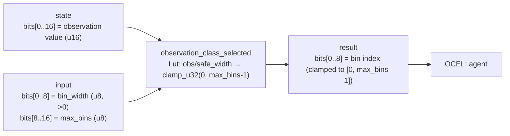

<!-- SCAFFOLDED BY ggen — fill in Context/Forces/Solution/Consequences below, then commit. -->
<!-- Source: ggen/schema/patterns.ttl (observation_class_selected). Re-scaffold: `ggen sync`. -->

# Pattern: ObservationClassSelected

> **Family:** AI Agent / Benchmark · **Kernel:** `observation_class_selected` · **Lowering:** `Lut` · **Id:** 68

Discretize a continuous observation value into one of N bins via integer division, clamped to [0, max_bins-1].

---

## Context

RL agents with tabular or low-dimensional discrete observation spaces must map continuous game measurements — entity distance (0..65535), current health percentage (0..100), velocity magnitude — into a finite set of bins that index into a Q-table or discrete observation encoder. A chain of `if obs < T1 ... else if obs < T2 ...` guards is the naive implementation but branches unpredictably as observations cross thresholds during gameplay, and the number of branches scales linearly with the number of bins. At 8+ bins and hundreds of agents per step this is measurably expensive.

## Forces

- **Branch misprediction** — a threshold cascade branches once per bin boundary crossed; in dynamic gameplay observations oscillate across boundaries on consecutive steps, maximally confounding the branch predictor.
- **Deterministic latency** — the Lut lowering maps distance to bin via integer division (`obs / bin_width`) and a single `clamp_u32`, both O(1) with no data-dependent control flow.
- **Zero bin_width guard** — a `bin_width` of 0 from the caller would cause integer division by zero; the kernel branchlessly replaces it with 1 via `bin_width + ((bin_width == 0) as u32)`, keeping the kernel total without a branch.
- **Bin count overflow** — the integer division can produce a raw bin index larger than `max_bins - 1` for large observations; `clamp_u32(raw_bin, 0, max_bins-1)` bounds it branchlessly, ensuring the result is always a valid Q-table index.
- **OCEL auditability** — OCEL event code `130` ties each observation discretization to the `agent` object trace, enabling replay-based verification that the agent received the correct observation class at each step.

## Solution

The kernel resolves the forces via two arithmetic steps with no branches. The packed-u64 ABI places the raw observation value in `state` bits[0..16], the bin_width in `input` bits[0..8], and max_bins in bits[8..16]. The safe bin_width is computed as `bin_width + ((bin_width == 0) as u32)` — a branchless 0→1 replacement. The raw bin index is `obs / safe_width`. Then `cap = max_bins.saturating_sub(1)` and `clamp_u32(raw_bin, 0, cap)` yields the final bin index in bits[0..8] of the return value. The Lut lowering was chosen because this is precisely a uniform-width binning table lookup: integer division is the branchless implementation of uniform-step quantization.

**Branchless primitive:** `bcinr_logic::fix::clamp_u32`

## Consequences

**Gains:** Observation discretization costs identical cycles regardless of where the raw observation falls relative to bin boundaries, giving constant per-agent environment-step overhead. The zero-width guard and bin-overflow clamp make the kernel total — it cannot panic or produce an out-of-range index on any input. OCEL event `130` provides a full per-step record of what observation class each agent received. **Costs:** The ABI limits max_bins to 255 (u8) and bin_width to 255 (u8); observation spaces wider than 255 bins or with bin widths larger than 255 require a wider kernel. Both bin_width and max_bins are taken from the `input` field, so they must be re-packed every call if they are constant — callers should consider caching the packed `input` value. **Compositions:** The bin index feeds directly into [RewardSignalClamped](reward_signal_clamped.md) (the observation class determines which action is appropriate and thus what reward to generate), and the same quantization idiom appears in [SemanticLodSelected](semantic_lod_selected.md).

---

## Structure Diagram



---

## Evidence Model

| Field | Value |
|---|---|
| OCEL activity | `ObservationClassSelected` |
| Event code | `130` |
| OTEL span | `130` |
| Object kinds | `agent` |
| Required status | `4` |
| Refusal status | `7` |
| Authority | oracle predicate: matches observation_class_selected_reference for all inputs |

---

## Metadata

| Field | Value |
|---|---|
| Pattern id | 68 |
| Family | AI Agent / Benchmark |
| Lowering | `Lut` |
| State cardinality | 8 |
| Primitive | `bcinr_logic::fix::clamp_u32` |
| Kernel signature | `observation_class_selected(state: u64, input: u64) -> u64` |
| Source kernel | `src/patterns/observation_class_selected.rs` |

---

## How to Use

```rust
use wasm4games::patterns::observation_class_selected;

// Pack state and input into u64 fields as documented in the kernel source.
let result = observation_class_selected(state, input);
```

The kernel is a pure `fn(u64, u64) -> u64` — no side effects, no allocation, no branches.
Pair with the evidence layer to emit OCEL events, OTEL spans, and receipt folds:

```rust
use wasm4games::evidence::{ocel::OcelEvent, otel};

let result = observation_class_selected(state, input);
otel::emit(130);
let ev = OcelEvent::new(130, logical_tick, admission_status);
```

---

## Related Patterns

- [RewardSignalClamped](reward_signal_clamped.md) — the observation class informs which reward is appropriate; reward is then clamped here
- [SemanticLodSelected](semantic_lod_selected.md) — both patterns quantize a continuous value into discrete bins via integer division and clamp
