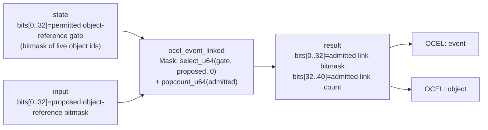

<!-- SCAFFOLDED BY ggen — fill in Context/Forces/Solution/Consequences below, then commit. -->
<!-- Source: ggen/schema/patterns.ttl (ocel_event_linked). Re-scaffold: `ggen sync`. -->

# Pattern: OcelEventLinked

> **Family:** Evidence & Replay · **Kernel:** `ocel_event_linked` · **Lowering:** `Mask` · **Id:** 6

Gate event-object link validity with select; report admitted link popcount.

---

## Context

The OCEL (Object-Centric Event Log) standard requires every game event to be linked to the set of objects it involves — a damage event links to both an attacker and a target, a spawn event links to the spawned entity, and so on. In a multiplayer game, event links arrive from multiple sources and must be checked against a validity gate before being admitted to the log; a link to an object that does not exist (a stale id, a despawned entity, a forged reference) must be silently dropped rather than admitted. Without branchless gating, the link validation loop branches on each proposed object reference bit, and the popcount of admitted links requires either a hardware instruction (available only conditionally) or a loop. This pattern gates all proposed links in a single `select_u64` over the permitted bitmask and computes the admitted count with `popcount_u64`, both in O(1) time with no per-link branch.

## Forces

- **Branch misprediction:** A loop over proposed object-reference bits with a per-bit validity check branches once per bit; an event linking to 8 objects requires 8 validity checks, all with data-dependent outcomes that the predictor cannot track across mixed-validity batches.
- **Deterministic latency:** The Mask lowering uses a single `select_u64(gate, proposed, 0)` to AND the proposed bitmask against the permitted gate in constant time, followed by `popcount_u64` for the count — O(1) for all gate and proposal values.
- **Referential integrity:** An event linked to a non-permitted object id would corrupt the OCEL log with a dangling reference; the gate bitmask (bits[0..32] of `state`) encodes which object ids are currently live, and the mask-AND ensures only live ids appear in the admitted output.
- **Popcount auditability:** The admitted link count in bits[32..40] of the result lets downstream log consumers verify at a glance that the expected number of objects were linked to each event, without re-scanning the bitmask.
- **OCEL auditability:** Event code `33` ties every link gate operation to the `event` and `object` kinds in the OCEL trace, enabling replay tools to reconstruct the full link graph for any recorded session.

## Solution

The kernel extracts the permitted object-reference bitmask from bits[0..32] of `state` (the gate) and the proposed bitmask from bits[0..32] of `input`. It computes `admitted = select_u64(gate, proposed, 0) & 0xFFFF_FFFF` — the `select_u64` here operates as a mask-AND: where `gate` is all-ones the proposal passes through, where it is all-zeros the proposal is zeroed. The admitted count is `popcount_u64(admitted) & 0xFF`. The result packs `admitted | (count << 32)`. The Mask lowering was the right choice because the operation is fundamentally a bitmask intersection: the gate is itself a bitmask of validity bits, and the admission check reduces to `proposed & gate` expressed via `select_u64` to remain on the branchless mask path used throughout the kernel family.

**Branchless primitive:** `bcinr_logic::mask::select_u64`

## Consequences

**Gains:** All 32 proposed object links are gated in a single instruction with no per-link branch. The admitted count is always consistent with the admitted bitmask — `popcount_u64` is a hardware-accelerated operation (POPCNT on x86, CNT on ARM) with no loop. Referential integrity is enforced structurally: a proposal bit can only survive if the corresponding gate bit is set, with no runtime check required.

**Costs:** The object-reference space is limited to 32 bits (32 distinct object ids per event); games with more than 32 live objects per event require a wider gate or multiple calls. The gate bitmask must be maintained externally and passed in `state` — callers are responsible for keeping it up to date as objects spawn and despawn. Proposed links outside the 32-bit window are silently ignored.

**Composes naturally with:** `receipt_appended` (admitted link bitmasks can be sealed into the rolling receipt chain to produce a tamper-evident OCEL link audit trail), `otel_span_emitted` (each OCEL event-link operation corresponds to a resolved OTEL span that records the kernel call in the distributed trace).

---

## Structure Diagram



---

## Evidence Model

| Field | Value |
|---|---|
| OCEL activity | `OcelEventLinked` |
| Event code | `33` |
| OTEL span | `33` |
| Object kinds | `event`, `object` |
| Required status | `4` |
| Refusal status | `7` |
| Authority | oracle predicate: matches ocel_event_linked_reference for all inputs |

---

## Metadata

| Field | Value |
|---|---|
| Pattern id | 6 |
| Family | Evidence & Replay |
| Lowering | `Mask` |
| State cardinality | 32 |
| Primitive | `bcinr_logic::mask::select_u64` |
| Kernel signature | `ocel_event_linked(state: u64, input: u64) -> u64` |
| Source kernel | `src/patterns/ocel_event_linked.rs` |

---

## How to Use

```rust
use wasm4games::patterns::ocel_event_linked;

// Pack state and input into u64 fields as documented in the kernel source.
let result = ocel_event_linked(state, input);
```

The kernel is a pure `fn(u64, u64) -> u64` — no side effects, no allocation, no branches.
Pair with the evidence layer to emit OCEL events, OTEL spans, and receipt folds:

```rust
use wasm4games::evidence::{ocel::OcelEvent, otel};

let result = ocel_event_linked(state, input);
otel::emit(33);
let ev = OcelEvent::new(33, logical_tick, admission_status);
```

---

## Related Patterns

- [ReceiptAppended](receipt_appended.md) — admitted link bitmasks are sealed into the rolling FNV-1a receipt chain to produce a tamper-evident audit trail of which objects were linked to which events.
- [OtelSpanEmitted](otel_span_emitted.md) — each OCEL event-link operation corresponds to a resolved OTEL span (code `0x0021`); call `otel_span_emitted` with slot `3` to emit the span accompanying this kernel's call.
