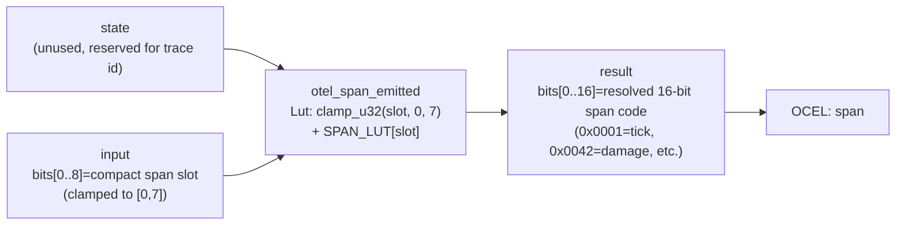

<!-- SCAFFOLDED BY ggen — fill in Context/Forces/Solution/Consequences below, then commit. -->
<!-- Source: ggen/schema/patterns.ttl (otel_span_emitted). Re-scaffold: `ggen sync`. -->

# Pattern: OtelSpanEmitted

> **Family:** Evidence & Replay · **Kernel:** `otel_span_emitted` · **Lowering:** `Lut` · **Id:** 7

Resolve a pattern slot to its runtime OTEL span code via a bounded LUT.

---

## Context

OpenTelemetry (OTEL) distributed tracing requires each kernel call to emit a numeric span code identifying which operation produced the trace event. The game loop calls dozens of distinct kernels per frame — tick advancement, input admission, damage, OCEL linking — and each must resolve its kernel-family slot to the corresponding 16-bit span code without branching on a match or switch. At 60 Hz with 200 active entities, a match over 8 span codes fires 12 000 times per second; the branch predictor cannot reliably follow the slot sequence when kernels are called in entity-dependent order. An out-of-range slot that is not clamped before indexing could also panic or return a garbage span code, corrupting the OTEL trace. This pattern resolves all span codes in O(1) time with a branchless clamped table read.

## Forces

- **Branch misprediction:** A match over 8 span codes branches once per kernel call; when the kernel call order varies by entity type (damage before status for some entities, status before damage for others), the predictor's history table cannot track the per-call pattern, causing frequent mispredicts in the observability layer.
- **Deterministic latency:** The Lut lowering clamps the slot with `clamp_u32` and performs a direct `SPAN_LUT[slot]` read, giving strict O(1) time for all slot values including out-of-range inputs.
- **Span code correctness:** Each kernel family has a fixed, stable 16-bit span code; returning the wrong code (e.g., due to off-by-one indexing or a missing clamp) silently corrupts the distributed trace and makes post-hoc debugging impossible.
- **Out-of-range safety:** Slot values above 7 must not panic; `clamp_u32(slot, 0, 7)` saturates to the last valid entry (mastery, `0x0050`) without branching, keeping the function total over all u8 inputs.
- **OCEL auditability:** Event code `34` ties every span resolution to the `span` object in the OCEL trace, so the trace itself records which span code was resolved on each kernel call.

## Solution

The kernel holds eight span codes in `SPAN_LUT: [u16; 8]` indexed by compact pattern slot: `[0x0001 (tick), 0x0002 (input admit), 0x0003 (receipt append), 0x0021 (ocel link), 0x0022 (otel span), 0x0023 (replay frame), 0x0042 (damage), 0x0050 (mastery)]`. The `state` word is unused (reserved for a trace id). The kernel extracts bits[0..8] of `input` as the raw slot, clamps it to `[0, 7]` with `clamp_u32`, and returns `SPAN_LUT[slot] as u64` in bits[0..16]. The Lut lowering was the right choice because span resolution is a pure index-to-code mapping with a small, fixed domain — the same structural property as archetype-to-initial-state in `object_spawned`, making the clamped table read the canonical branchless solution.

**Branchless primitive:** `bcinr_logic::fix::clamp_u32`

## Consequences

**Gains:** Span resolution executes in ~1 ns regardless of slot value, with no branch on the slot number. Out-of-range slot values are silently clamped to the mastery span rather than panicking. The LUT makes the mapping between pattern slots and span codes explicit and auditable as data, not hidden in branch structure.

**Costs:** The span code table has 8 entries; adding a 9th kernel family requires expanding the table and updating `clamp_u32`'s upper bound. The `state` word is unused — callers must pass a zero or reserve it for future trace-id threading. The resolved span code is 16 bits; OTEL implementations requiring 64-bit or 128-bit trace/span ids must use additional state outside this kernel.

**Composes naturally with:** `ocel_event_linked` (OCEL events and OTEL spans are emitted in tandem — span slot `3` resolves to code `0x0021` which accompanies the OCEL link operation), `receipt_appended` (span codes can be folded into the receipt chain alongside event words to link the OTEL trace to the tamper-evident audit trail).

---

## Structure Diagram



---

## Evidence Model

| Field | Value |
|---|---|
| OCEL activity | `OtelSpanEmitted` |
| Event code | `34` |
| OTEL span | `34` |
| Object kinds | `span` |
| Required status | `4` |
| Refusal status | `7` |
| Authority | oracle predicate: matches otel_span_emitted_reference for all inputs |

---

## Metadata

| Field | Value |
|---|---|
| Pattern id | 7 |
| Family | Evidence & Replay |
| Lowering | `Lut` |
| State cardinality | 8 |
| Primitive | `bcinr_logic::fix::clamp_u32` |
| Kernel signature | `otel_span_emitted(state: u64, input: u64) -> u64` |
| Source kernel | `src/patterns/otel_span_emitted.rs` |

---

## How to Use

```rust
use wasm4games::patterns::otel_span_emitted;

// Pack state and input into u64 fields as documented in the kernel source.
let result = otel_span_emitted(state, input);
```

The kernel is a pure `fn(u64, u64) -> u64` — no side effects, no allocation, no branches.
Pair with the evidence layer to emit OCEL events, OTEL spans, and receipt folds:

```rust
use wasm4games::evidence::{ocel::OcelEvent, otel};

let result = otel_span_emitted(state, input);
otel::emit(34);
let ev = OcelEvent::new(34, logical_tick, admission_status);
```

---

## Related Patterns

- [OcelEventLinked](ocel_event_linked.md) — OTEL spans and OCEL events are emitted in tandem; slot `3` of this kernel resolves to the OCEL-link span code `0x0021` that accompanies each `ocel_event_linked` call.
- [ReceiptAppended](receipt_appended.md) — span codes resolved by this kernel can be folded into the receipt chain alongside event words, tying the OTEL distributed trace to the tamper-evident FNV-1a audit trail.
