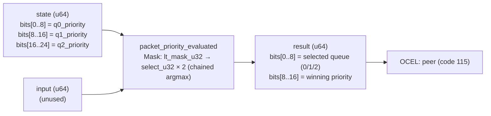

<!-- SCAFFOLDED BY ggen — fill in Context/Forces/Solution/Consequences below, then commit. -->
<!-- Source: ggen/schema/patterns.ttl (packet_priority_evaluated). Re-scaffold: `ggen sync`. -->

# Pattern: PacketPriorityEvaluated

> **Family:** Multiplayer / Network · **Kernel:** `packet_priority_evaluated` · **Lowering:** `Mask` · **Id:** 53

Evaluate packet send priority: select highest priority class among 3 pending packet queues; first index wins ties.

---

## Context

Multiplayer packet queues hold different classes of messages simultaneously: position updates (highest priority, time-sensitive), game events such as projectile spawns (medium priority), and chat messages (lowest priority). Under bandwidth pressure, the network layer must decide each tick which queue to drain first without blocking. A loop with a running maximum conditional (the canonical argmax) branches at every comparison and mispredicts each time the leader changes — which happens often during combat when high-priority queues frequently cycle.

## Forces

- **Branch misprediction** — a loop-based argmax `if p[i] > best { best = p[i]; idx = i; }` branches 2 × (N-1) times; for 3 queues this is 4 branches, all data-dependent on priority values that change tick-to-tick.
- **Deterministic latency** — the Mask lowering chains `lt_mask_u32` + `select_u32` comparisons in a fixed sequence, replacing all branches with branchless arithmetic, O(1) for any priority distribution.
- **Tie-breaking invariant** — the strict-`<` predicate (`best_val < p_i`) ensures that if two queues share the maximum priority, the lower-index queue wins; this is a statically enforceable contract that the network layer can rely on for deterministic ordering.
- **Packed dual output** — the result returns both the winning queue index (bits[0..8]) and the winning priority (bits[8..16]) so the caller can both dequeue from the correct queue and log the priority without additional reads.
- **OCEL auditability** — event code 115 ties each send-slot decision to the `peer` object trace, enabling per-client bandwidth priority reconstruction for network diagnostics.

## Solution

**Branchless primitive:** `bcinr_logic::mask::select_u32`

State bits[0..8], bits[8..16], and bits[16..24] carry q0, q1, q2 priorities respectively; the input word is unused. The kernel seeds `(best_idx=0, best_val=p0)`, then for each subsequent queue `i` computes `m_i = lt_mask_u32(best_val, p_i)` — all-ones if `best_val < p_i` — and updates both `best_idx` and `best_val` via `select_u32(m_i, i, best_idx/val)`. With two chained comparisons, all 6 possible orderings of three priorities resolve branchlessly to the correct argmax. The Mask lowering was chosen because the problem is a branchless argmax over a small fixed-length array — the canonical Mask pattern.

## Consequences

**Gains:** Queue selection is O(1) and branch-free for any priority distribution; the first-index tie-breaking rule is structural and cannot be accidentally overridden; both queue index and priority are returned in one word. **Costs:** The kernel is hard-coded to 3 queues; extending to N > 3 requires chaining N-1 comparison pairs; priorities are 8-bit fields (0..255). **Compositions:** Bounded tick delta from `tick_delta_bounded` drives queue urgency (large delta → upgrade priority); `sync_state_admitted` uses packet arrival in the SYNCING state to advance toward SYNCED; `audio_priority_selected` applies the identical 2-way strict-max Mask idiom.

---

## Structure Diagram



---

## Evidence Model

| Field | Value |
|---|---|
| OCEL activity | `PacketPriorityEvaluated` |
| Event code | `115` |
| OTEL span | `115` |
| Object kinds | `peer` |
| Required status | `4` |
| Refusal status | `7` |
| Authority | oracle predicate: matches packet_priority_evaluated_reference for all inputs |

---

## Metadata

| Field | Value |
|---|---|
| Pattern id | 53 |
| Family | Multiplayer / Network |
| Lowering | `Mask` |
| State cardinality | 2 |
| Primitive | `bcinr_logic::mask::select_u32` |
| Kernel signature | `packet_priority_evaluated(state: u64, input: u64) -> u64` |
| Source kernel | `src/patterns/packet_priority_evaluated.rs` |

---

## How to Use

```rust
use wasm4games::patterns::packet_priority_evaluated;

// Pack state and input into u64 fields as documented in the kernel source.
let result = packet_priority_evaluated(state, input);
```

The kernel is a pure `fn(u64, u64) -> u64` — no side effects, no allocation, no branches.
Pair with the evidence layer to emit OCEL events, OTEL spans, and receipt folds:

```rust
use wasm4games::evidence::{ocel::OcelEvent, otel};

let result = packet_priority_evaluated(state, input);
otel::emit(115);
let ev = OcelEvent::new(115, logical_tick, admission_status);
```

---

## Related Patterns

- [TickDeltaBounded](tick_delta_bounded.md) — large tick deltas signal high urgency, which maps to elevated queue priority in q0.
- [AudioPrioritySelected](audio_priority_selected.md) — applies the same strict-higher-wins Mask idiom over two competing audio channels.
- [SyncStateAdmitted](sync_state_admitted.md) — packet arrival (driven by this selection) is the ACK symbol that advances the sync FSM toward SYNCED.
