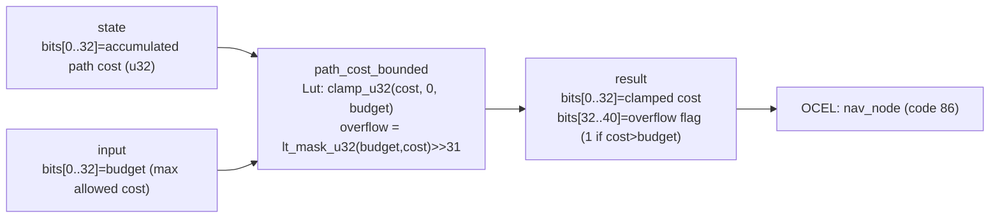

<!-- SCAFFOLDED BY ggen — fill in Context/Forces/Solution/Consequences below, then commit. -->
<!-- Source: ggen/schema/patterns.ttl (path_cost_bounded). Re-scaffold: `ggen sync`. -->

# Pattern: PathCostBounded

> **Family:** Pathfinding · **Kernel:** `path_cost_bounded` · **Lowering:** `Lut` · **Id:** 24

Clamp accumulated path cost to a maximum budget and flag if the budget was exceeded.

---

## Context

In tower-defense and strategy games, not all paths are viable — units have a movement budget and must reject paths that exceed it. As A* accumulates g-cost per expansion step, the running total must be tested against the budget and clamped before it is used downstream (e.g., as an f-cost component or as a movement-remaining counter). A naïve `if cost > budget { cost = budget; flag = true }` branch mispredicts whenever the budget is tight and cost values straddle the limit across consecutive expansions. The Lut lowering replaces that branch with `clamp_u32` plus a single-bit mask extraction, producing a bounded cost and an overflow flag in constant time.

## Forces

- **Branch misprediction** — the conditional `cost > budget` branches on the cumulative path cost, which varies with the path taken and is data-dependent; in tight-budget scenarios where many paths hover near the limit, mispredict rates are high.
- **Deterministic latency** — the Lut lowering computes `clamp_u32(cost, 0, budget)` in O(1) using branchless min/max composition; the overflow flag is extracted from the top bit of `lt_mask_u32(budget, cost)` without a separate branch.
- **Dual output** — callers need both the clamped cost (to keep accumulated state valid) and the overflow flag (to decide whether to abandon the path); both must be available in a single pass to avoid a second call.
- **Overflow safety** — without clamping, an unchecked cost accumulation can overflow u32 and silently wrap to a small value that passes budget checks it should fail.
- **OCEL auditability** — event code 86 ties each cost-bound decision to the `nav_node` object, making budget exceedances traceable in the OCEL event log.

## Solution

The kernel accepts `state` packed as `bits[0..32] = accumulated path cost (u32)` and `input` packed as `bits[0..32] = budget (max allowed cost)`. It returns `bits[0..32] = clamped cost` and `bits[32..40] = 1 if over budget, 0 if within`. The clamped cost is `clamp_u32(cost, 0, budget)`, which is equivalent to a Lut that maps any cost in `[0, budget]` to itself and any cost above `budget` to `budget`. The overflow flag is the top bit of `lt_mask_u32(budget, cost)` shifted right by 31: when `budget < cost` the mask is all-ones and bit 31 is 1; when `cost <= budget` the mask is all-zeros and bit 31 is 0. The Lut lowering was chosen because the operation is a bounded projection — a fixed mapping from an input range into a clamped output range — which is the canonical Lut use case.

**Branchless primitive:** `bcinr_logic::fix::clamp_u32`

## Consequences

**Gains:** O(1) latency per expansion step; clamped cost is always in `[0, budget]` by construction, so downstream consumers never see an overflow; the overflow flag enables callers to short-circuit path search without a branch on cost; the OCEL trail at event code 86 logs every budget exceedance against the `nav_node` object. **Costs:** the ABI binds both cost and budget to 32-bit unsigned values, limiting the maximum representable path cost to ~4 billion units; the overflow flag occupies only bit 32 of the result and callers must mask it out separately from the cost. **Natural compositions:** `path_node_expanded` accumulates the g-cost that this kernel then clamps; `heuristic_distance_estimated` provides the h-cost that is added to the clamped g-cost to form f-cost; when the overflow flag is set, `nav_state_advanced` receives an OBSTACLE event to transition the agent into BLOCKED.

---

## Structure Diagram



---

## Evidence Model

| Field | Value |
|---|---|
| OCEL activity | `PathCostBounded` |
| Event code | `86` |
| OTEL span | `86` |
| Object kinds | `nav_node` |
| Required status | `4` |
| Refusal status | `7` |
| Authority | oracle predicate: matches path_cost_bounded_reference for all inputs |

---

## Metadata

| Field | Value |
|---|---|
| Pattern id | 24 |
| Family | Pathfinding |
| Lowering | `Lut` |
| State cardinality | 8 |
| Primitive | `bcinr_logic::fix::clamp_u32` |
| Kernel signature | `path_cost_bounded(state: u64, input: u64) -> u64` |
| Source kernel | `src/patterns/path_cost_bounded.rs` |

---

## How to Use

```rust
use wasm4games::patterns::path_cost_bounded;

// Pack state and input into u64 fields as documented in the kernel source.
let result = path_cost_bounded(state, input);
```

The kernel is a pure `fn(u64, u64) -> u64` — no side effects, no allocation, no branches.
Pair with the evidence layer to emit OCEL events, OTEL spans, and receipt folds:

```rust
use wasm4games::evidence::{ocel::OcelEvent, otel};

let result = path_cost_bounded(state, input);
otel::emit(86);
let ev = OcelEvent::new(86, logical_tick, admission_status);
```

---

## Related Patterns

- [path_node_expanded](path_node_expanded.md) — node expansion accumulates g-cost per step; the running total is what this kernel clamps to the budget
- [heuristic_distance_estimated](heuristic_distance_estimated.md) — h-cost from the heuristic is added to the clamped g-cost to form the f-cost used in expansion
- [nav_state_advanced](nav_state_advanced.md) — when the overflow flag is set, the caller issues an OBSTACLE event that drives the nav FSM into BLOCKED
