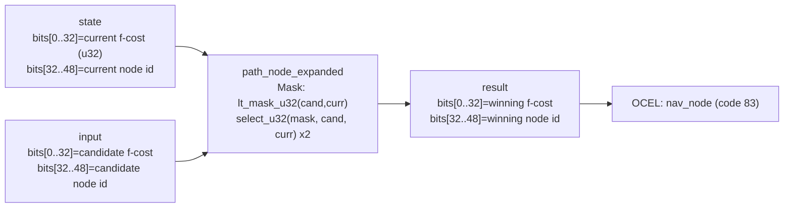

<!-- SCAFFOLDED BY ggen — fill in Context/Forces/Solution/Consequences below, then commit. -->
<!-- Source: ggen/schema/patterns.ttl (path_node_expanded). Re-scaffold: `ggen sync`. -->

# Pattern: PathNodeExpanded

> **Family:** Pathfinding · **Kernel:** `path_node_expanded` · **Lowering:** `Mask` · **Id:** 21

Select the winning A*/Dijkstra candidate node based on f-cost comparison.

---

## Context

A* pathfinding advances the search frontier by repeatedly selecting the open-set node with the lowest f-cost. In a branchless game loop running on WebAssembly, every call to a min-select that uses a conditional `if cand_cost < curr_cost` adds a data-dependent branch that the CPU cannot statically predict — mispredictions pile up with every node expansion and corrupt the deterministic latency budget. Without the Mask lowering, the time per expansion step varies with the input cost values, making tick-bounded pathfinding impossible to guarantee in a wasm4 frame budget.

## Forces

- **Branch misprediction** — a naïve `if cand_cost < curr_cost` branch mispredicts whenever the open-set order is unpredictable (which it is, by construction); each mispredict costs 10–20 pipeline cycles.
- **Deterministic latency** — the Mask lowering computes `lt_mask_u32` + two `select_u32` calls, giving exactly O(1) constant time regardless of which node wins.
- **Joint selection** — the winning f-cost and winning node id must be selected atomically with the same mask; splitting them risks inconsistency.
- **Strict less-than semantics** — ties must preserve the current node (stability), so the mask must be `cand_cost < curr_cost`, not `<=`.
- **OCEL auditability** — event code 83 ties each expansion to an object-centric trace over `nav_node`, making the expansion history inspectable without side effects.

## Solution

The kernel accepts `state` packed as `bits[0..32] = current node f-cost (u32)` and `bits[32..48] = current node id`, and `input` packed as `bits[0..32] = candidate node f-cost` and `bits[32..48] = candidate node id`. It returns `bits[0..32] = winning f-cost` and `bits[32..48] = winning node id`. The lowering calls `lt_mask_u32(cand_cost, curr_cost)` to produce an all-ones mask when the candidate wins and an all-zeros mask otherwise; `select_u32` then picks the winning cost and winning id from the two operands using that single mask. The Mask lowering was chosen because the problem is a binary selection — exactly one of two (cost, id) pairs survives — and both the cost and the id must track the same condition, so one shared mask drives both selects.

**Branchless primitive:** `bcinr_logic::mask::select_u32`

## Consequences

**Gains:** O(1) latency per expansion step with no pipeline stalls; both the cost and the id are guaranteed consistent because they are selected by the same mask; the strict `<` semantics preserve tie-stability; the OCEL trail at event code 83 gives a full per-node expansion audit log over `nav_node` objects. **Costs:** the ABI is fixed to 32-bit f-costs and 16-bit node ids packed into a u64 — a larger graph requires redesigning the packing; the state space is bounded to 2 outcomes (current wins, candidate wins). **Natural compositions:** feed `heuristic_distance_estimated` to compute the h-cost component of f, then accumulate with g-cost via `path_cost_bounded`; drive `nav_state_advanced` with the MOVE event once a path is found; use `waypoint_reached` once the agent reaches each expanded node.

---

## Structure Diagram



---

## Evidence Model

| Field | Value |
|---|---|
| OCEL activity | `PathNodeExpanded` |
| Event code | `83` |
| OTEL span | `83` |
| Object kinds | `nav_node` |
| Required status | `4` |
| Refusal status | `7` |
| Authority | oracle predicate: matches path_node_expanded_reference for all inputs |

---

## Metadata

| Field | Value |
|---|---|
| Pattern id | 21 |
| Family | Pathfinding |
| Lowering | `Mask` |
| State cardinality | 2 |
| Primitive | `bcinr_logic::mask::select_u32` |
| Kernel signature | `path_node_expanded(state: u64, input: u64) -> u64` |
| Source kernel | `src/patterns/path_node_expanded.rs` |

---

## How to Use

```rust
use wasm4games::patterns::path_node_expanded;

// Pack state and input into u64 fields as documented in the kernel source.
let result = path_node_expanded(state, input);
```

The kernel is a pure `fn(u64, u64) -> u64` — no side effects, no allocation, no branches.
Pair with the evidence layer to emit OCEL events, OTEL spans, and receipt folds:

```rust
use wasm4games::evidence::{ocel::OcelEvent, otel};

let result = path_node_expanded(state, input);
otel::emit(83);
let ev = OcelEvent::new(83, logical_tick, admission_status);
```

---

## Related Patterns

- [waypoint_reached](waypoint_reached.md) — pathfinding pipeline: expand nodes then check whether the agent has arrived at each waypoint
- [heuristic_distance_estimated](heuristic_distance_estimated.md) — heuristic h-cost feeds the f-cost compared by this kernel
- [path_cost_bounded](path_cost_bounded.md) — accumulates and clamps g-cost before it is combined with h to form f-cost
- [nav_state_advanced](nav_state_advanced.md) — the MOVE event that drives the nav FSM is issued once pathfinding produces a valid expansion
